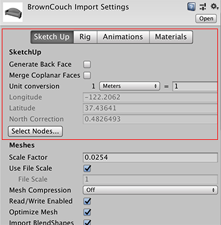
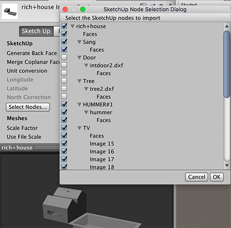

# SketchUp 设置

SketchUp 是常用于建筑结构建模的软件。
Unity 直接读取 SketchUp 文件并支持以下 SketchUp 特性：

* 纹理和材质；Unity 根据 [Materials 选项卡](FBXImporter-Materials.html)上的设置导入它们。
* 组件定义和组；它们将转换为网格，并实例化为可置于场景中的游戏对象。
* 文件中每个场景的摄像机数据。

*提示*：有关如何从 SketchUp 导出 FBX 文件的信息，请参阅[从其他应用程序导出](HOWTO-exportFBX.html)。

## 限制
* 不支持 GIF 纹理。
* 仅导入 SketchUp 场景中的有限数据。
* Unity 不支持或导入以下 SketchUp 特性：
	* 2D 组件（文本、尺寸）
	* [动画设置](http://help.sketchup.com/en/article/114452)
	* [属性](http://help.sketchup.com/en/article/114547)
	* [绘图样式](http://help.sketchup.com/en/article/117009)
	* [动态组件](http://help.sketchup.com/en/article/22496)
	* [层](http://help.sketchup.com/en/article/114598)
	* [线条](http://help.sketchup.com/en/article/94824)
	* [剖面](http://help.sketchup.com/en/article/94999)
	* [阴影设置](http://help.sketchup.com/en/article/114934)

## SketchUp 特有的导入设置
要将 SketchUp 文件直接导入 Unity，请使用 Finder (MacOS) 或文件管理器 (Windows) 将其拖动到 Assets 文件夹中。
单击 Unity 中的资源文件时，模型检视面板 (Model Inspector) 将显示在特定的 __Sketch Up__ 选项卡中：

|**属性：** ||**功能：** |
|:---|:---|:---|
|__SketchUp__|||
|__Generate Back Face__||在 Unity 中生成背向 (back-facing) 多边形。默认情况下，Unity 仅导入正向 (front-facing) 多边形以减少多边形数量，除非在 SketchUp 中将材质指定给背向多边形。 |
|__Merge Coplanar Faces__||在 Unity 中生成网格时合并共面的面。|
|__Unit Conversion__||长度测量值到单位的转换。|
||单位下拉框|选择要用于转换的单位。默认为 *Meters*。|
||要转换的值|此值决定了__缩放因子 (Scale Factor)__ 的计算方式（请参阅下面的[单位转换](#UnitConversion)）。|
|__Longitude__||来自*地理坐标*系的只读值，用于确定地理系统上的位置。|
|__Latitude__||来自*地理坐标*系的只读值，用于确定地理系统上的位置。|
|__North Correction__||来自*地理坐标*系的只读值，用于描述将北旋转到 Z 轴所需的角度。|
|__Select Nodes__||打开一个窗口，可以在其中指定要导入的节点。节点表示 SketchUp 中的实体 (Entity)、组 (Group) 或组件实例 (Component Instance)。例如，如果一个文件中包含多个沙发，可选择要导入的沙发。有关更多信息，请参阅下面的[选择 SketchUp 节点](#SelectingNodes)。 |

Inspector 窗口中的其余选项是可用于任何 3D 建模应用程序的[常规 FBX 模型导入选项](class-FBXImporter.html)。

 
## 单位转换

默认情况下，Unity 将 SketchUp 模型的 1 米（0.0254 英寸）换算为 1 个单位长度。

更改默认的 __Unit Conversion__ 值会影响所导入文件的比例尺：

 
## 选择 SketchUp 节点

Unity 支持 SketchUp 文件中针对每个节点的可见性设置。
如果一个节点在 SketchUp 文件中为隐藏状态，Unity 默认情况下不会导入该节点。
但是，可以覆盖此行为，单击 __Select Nodes__ 按钮，在 SketchUp Node Selection Dialog 窗口中显示 SketchUp 节点层级视图。

文件中的每个组和组件实例都在层级视图中显示为节点，可以选择或取消选择该节点。选择要包含的节点后，单击 OK 按钮即可仅导入选中的节点。

---

*  2018-04-25  Page amended with limited [editorial review](DocumentationEditorialReview.html)

