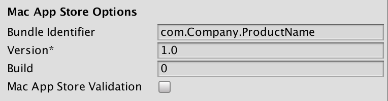

# 将应用程序提交到 Mac App Store

本页面介绍将应用程序提交到 Mac App Store 的过程。

 

首先，需要确保在密钥链中安装了正确的配置文件：“3rd Party Mac Developer Application”和“3rd Party Mac Developer Installer”配置文件。请参阅 Apple 开发者文档中的[维护签名身份和证书 (Maintaining Your Signing Identities and Certificates)](https://developer.apple.com/library/content/documentation/IDEs/Conceptual/AppDistributionGuide/MaintainingCertificates/MaintainingCertificates.html) 部分以了解如何执行此操作。

选择 __Edit__ > __Project Settings__ > __Player__。打开 __Other Settings__ 选项卡，然后导航至 __Mac App Store Options__。Unity 会自动将这些设置应用于应用程序的 *info.plist* 文件作为 CF 键（请参阅 Apple 开发者文档的 [Core Foundation 键 (Core Foundation Keys)](https://developer.apple.com/library/content/documentation/General/Reference/InfoPlistKeyReference/Articles/CoreFoundationKeys.html#/apple_ref/doc/uid/20001431-111349) 以了解更多信息）。





| __属性__| __功能__ |
|:---|:---| 
| __Bundle Identifier__| 输入 iTunesConnect 应用程序的 Bundle ID。此信息在关联的 *info.plist* 文件中显示为 `CFBundleIdentifier`。<br/><br/>请参阅 Apple 开发者文档的 [CFBundleIdentifier](https://developer.apple.com/library/content/documentation/General/Reference/InfoPlistKeyReference/Articles/CoreFoundationKeys.html#/apple_ref/doc/uid/20001431-102070) 部分以了解更多信息。 |
| __Version*__| 输入应用程序捆绑包版本（例如 1.0、2.0）。此信息在关联的 *info.plist* 文件中显示为 `CFBundleShortVersionString`。<br/><br/>请参阅 Apple 开发者文档的 [CFBundleShortVersionString](https://developer.apple.com/library/content/documentation/General/Reference/InfoPlistKeyReference/Articles/CoreFoundationKeys.html#/apple_ref/doc/uid/20001431-111349) 部分以了解更多信息。 |
| __Build__| 输入此应用版本的内部版本号。此信息在关联的 *info.plist* 文件中显示为 `CFBundleVersion`。<br/><br/>请参阅 Apple 开发者文档的 [CFBundleVersion](https://developer.apple.com/library/content/documentation/General/Reference/InfoPlistKeyReference/Articles/CoreFoundationKeys.html#/apple_ref/doc/uid/20001431-102364) 部分以了解更多信息。 |
| __Mac App Store Validation__| 通过启用此属性，可确保只有当应用程序包含来自 Mac App Store 的有效收据时才会运行。这样可以防止用户不在购买游戏的设备上而在另一台设备上运行游戏。仅当您已实施自己的收据验证时，才应禁用此设置。 |


勾选 __Mac App Store Validation__ 复选框，然后构建应用程序 (__File__ > __Build Settings…__ > __Build__)。

接下来，需要创建一个 `GAMENAME.entitlements` 文件，并将其保存在任意位置。为此，最简单的方法是创建一个空的 Mac 应用程序。要执行此操作，请打开 Xcode，使用 macOS 模板创建一个新项目，转到 Capabilities 栏，并启用 App Sandbox。这样就会自动生成基本的 .entitlements 文件。

```

 <?xml version="1.0" encoding="UTF-8"?>

  <!DOCTYPE plist PUBLIC "-//Apple//DTD PLIST 1.0//EN" "http://www.apple.com/DTDs/PropertyList-1.0.dtd">

  <plist version="1.0">

  <dict>

  <key>com.apple.security.app-sandbox</key> <true/>

  </dict>

  </plist>

```

__注意____：__Unity 不会自动更新 5.5 及更早版本中的 *info.plist* 文件。相反，您需要手动执行此操作。请参阅下面的[手动更新](#ManualUpdate)部分。

在 Xcode（或任意文本编辑器）中打开 *info.plist* 文件，并添加以下键：

```
<key>LSApplicationCategoryType</key>

<string>{VALID APP CATEGORY, e.g.: public.app-category.kids-games }</string>

<key>CFBundleSignature</key>

<string>{4 LETTER CREATOR CODE, e. g.:  GMAD }</string>
```

如果使用的是 Xcode 8.0+，还需要将以下字段添加到 *info.plist* 文件中：

```
<key>CFBundleSupportedPlatforms</key>

	<array>
	
		<string>MacOSX</string>
		
	</array> 
```

接下来，修复 .app 中所有内容的读取权限。要执行此操作，请将以下内容添加到 macOS 终端：

```
 chmod -R a+xr "/path/to/GAMENAME.app"
```

使用先前创建的 .entitlements 对 .App 进行签名。要执行此操作，请将以下内容添加到 macOS 终端：

```
 codesign -f --deep -s '3rd Party Mac Developer Application: DEVELOPER NAME' --entitlements "GAMENAME.entitlements" "/AppPath/GAMENAME.app"
```

构建安装程序/pkg。要执行此操作，请将以下内容添加到 macOS 终端：

```
 productbuild --component GAMENAME.app /Applications --sign "3rd Party Mac Developer Installer: DEVELOPER NAME" GAMENAME.pkg
```

最后，使用 Xcode ApplicationLoader 提交应用程序。

<a name="ManualUpdate"></a> 
##可选添加


### 手动进行 info.plist 更新

如果使用的 Unity 版本早于 5.6，则需要在构建应用程序后手动添加 Bundle ID 和版本字符串。

修改 `info.plist` 文件的以下部分，使其适合应用程序：

```
<key>CFBundleDevelopmentRegion</key>

<string>{YOUR REGION}</string>

<key>CFBundleGetInfoString</key>

<string>{DESCRIPTIVE INFO}</string>

<key>CFBundleIdentifier</key>

<string>com.{YOUR COMANY}.{YOUR APP NAME}</string>

<key>CFBundleName</key>

<string>{YOUR APP NAME}</string>

<key>CFBundleShortVersionString</key>

<string>{VERSION NUMBER, e.g. 1.0.0}</string>

<key>CFBundleSignature</key>

<string>{4 LETTER CREATOR CODE, e. g.:  GMAD }</string>

<key>CFBundleVersion</key>

<string>{VERSION NUMBER, e.g. 100}</string>

```

### 自定义图标

默认情况下，Unity 会缩小 __Player Settings__ > __Default Icons__ 中指定的图标图像，从而生成 .icns 文件。此文件定义了应用程序的图标在 macOS Finder 和操作系统停靠栏中的显示方式。但是，如果需要，可将其替换为自定义图标集。

* 创建一个文件夹并将其命名为 *UnityPlayer.iconset*（或者是在 *info.plist* 的 `CFBundleIconFile/Icon File` 字段中设置的任何名称），然后在其中放入以下名称的图像。请注意，此文件夹必须具有 .iconset 扩展名。

```
    icon_16x16.png

        icon_16x16@2x.png

        icon_32x32.png

        icon_32x32@2x.png

        icon_128x128.png

        icon_128x128@2x.png

        icon_256x256.png

        icon_256x256@2x.png

        icon_512x512.png

        icon_512x512@2x.png
```

确保 `@2x.png` 图像的大小是文件名中规定大小的两倍。例如，图像 `512x512@2x.png` 为 1024x1024 的图像。从 macOS 终端，导航到 .iconset 目录所在的目录，然后输入以下命令：

```
    iconutil -c icns UnityPlayer.iconset
```

最后，右键单击 .app 文件，然后选择 __Show Contents__，并将 *iconset.icns* 替换为先前创建的文件。

---

* <span class="page-edit">2017-05-18  Page published with [editorial review](DocumentationEditorialReview.html)
</span>

* <span class="page-history">5.6 版中的更新功能</span>
