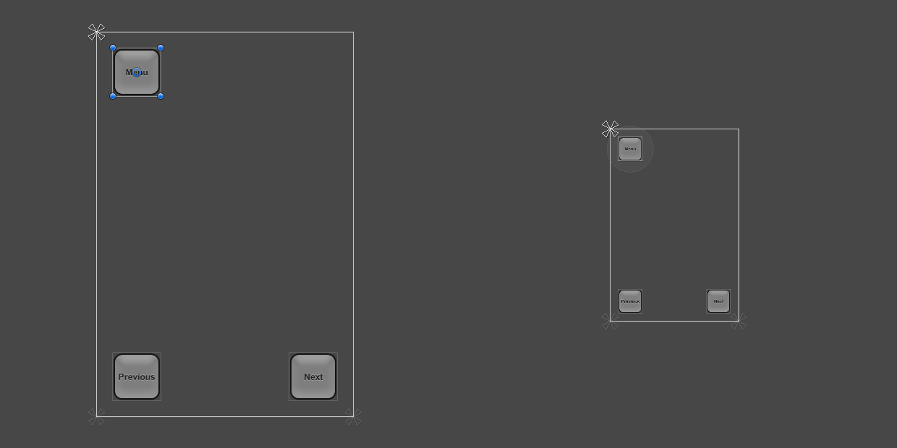

# 设计用于多种分辨率的 UI

现代游戏和应用程序通常需要支持各种不同的屏幕分辨率，特别是 UI 布局需要能够适应这种情况。Unity 中的 UI 系统包含用于此目的的各种工具，并可通过各种方式将这些工具组合起来使用。

在本操作指南中，我们将研究一个简单案例，并在此背景下了解和比较不同的工具。在我们的案例研究中，我们在屏幕角点处有三个按钮（如下所示），目标是使这种布局适应各种分辨率。

 

在本操作指南中，我们将考虑四种屏幕分辨率：手机高清 (HD) 纵向 (640 x 960) 和横向 (960 x 640) 以及手机标清 (SD) 纵向 (320 x 480) 和横向 (480 x 320)。最初的布局设置为手机高清纵向分辨率。

## 使用锚点来适应不同的宽高比

默认情况下，UI 元素锚定到父矩形的中心。这意味着它们与该中心保持恒定的偏移。

如果使用此设置将分辨率更改为横向宽高比，则按钮可能甚至不再位于屏幕的矩形内。

 

一种将按钮保持在屏幕内的方法是，通过改变布局，使按钮的位置绑定到屏幕的各个角。可使用 Inspector 中的 Anchors Preset 下拉选单或通过拖动 Scene 视图中的三角形锚点控制柄，将左上角按钮的锚点设置为左上角。如果 Game 视图中设置的当前屏幕分辨率是最初设计布局时的目标分辨率（此时的按钮位置看起来正确），那么最适合这样做。（请参阅 [UI 基本布局](UIBasicLayout.html)页面以了解有关锚点的更多信息。）同样，左下角按钮和右下角按钮的锚点可以分别设置为左下角和右下角。

一旦这些按钮锚定到各自的角点，当分辨率更改为不同的宽高比时，这些按钮会保持在相应位置。

 

当屏幕大小更改为更大或更小的分辨率时，按钮也仍然锚定到各自的角点。但是，由于按钮保持原始大小（以像素为单位），因此按钮占据屏幕的比例可能会变大或变小。这种状态可能符合需求，也可能不符合需求，具体情况取决于您希望布局在不同分辨率的屏幕上的表现方式。

 

在本操作指南中，我们知道手机标清纵向和横向布局的较小分辨率并不意味着屏幕实体较小，只是屏幕的像素密度较低而已。在这些像素密度较低的屏幕上，按钮看起来不应该大于高密度屏幕上显示的按钮，而是应该以相同的大小显示。

这意味着按钮变小的比例应该与屏幕变小的比例相同。换句话说，按钮的比例应遵循屏幕大小。这种情况下，__画布缩放器 (Canvas Scaler)__ 组件很有用。

## 随屏幕大小缩放

__画布缩放器__组件可添加到根__画布__；画布是一种带有画布组件的游戏对象，所有 UI 元素都是其子项。通过 __GameObject__ 菜单创建新的画布时，默认情况下也会添加画布缩放器。

在画布缩放器组件中，可将其 __UI Scale Mode__ 设置为 __Scale With Screen Size__。使用此缩放模式，可以指定要用作参考的分辨率。如果当前屏幕分辨率小于或大于此参考分辨率，则会相应设置画布的缩放因子，使所有 UI 元素都与屏幕分辨率一起放大或缩小。

在我们的示例中，我们将__画布缩放器__设置为手机高清纵向分辨率 640 x 960。现在，屏幕分辨率设置为手机标清纵向分辨率 320 x 480 时，整个布局将按比例缩小，从而保持与全分辨率相同的比例。一切都按比例缩小：按钮大小、按钮到屏幕边缘的距离、按钮图形以及文本元素。这意味着手机标清纵向分辨率中的布局与手机高清纵向分辨率中的布局相同；只是像素密度降低而已。

 

有一点需要注意：添加画布缩放器组件后，还要检查其他宽高比条件下的布局显示情况。通过将分辨率恢复到手机标清横向分辨率，我们可以看到按钮现在看起来比其应有大小（先前的大小）更大。

 

按钮在横向宽高比条件下变大的原因归结为画布缩放器设置的工作原理。默认情况下会将宽度或当前分辨率与画布缩放器的宽度进行比较，结果将用作缩放所有内容的缩放因子。由于目前横向分辨率 960 x 640 的宽度是纵向画布缩放器 640 x 960 的 1.5 倍，因此布局的比例增大到了 1.5。

该组件有一个名为 __Match__ 的属性，此属性值可以是 0（宽度）、1（高度）或介于两者之间的值。默认情况下设置为 0，表示将当前屏幕宽度与画布缩放器宽度进行比较，如上所述。

如果 __Match__ 属性设置为 0.5，则会将当前宽度与参考宽度做比较并将当前高度与参考高度做比较，并选择两者之间的缩放因子。由于在本示例中的横向分辨率变宽为原来的 1.5 倍，但高度也变短为原来的 1/1.5，因此综合这两个因子后得到最终缩放因子为 1，这意味着按钮将保持其原始大小。

根据前文，通过在画布上使用适当的锚定技术和画布缩放器组件相结合，布局将支持所有四种屏幕分辨率。

 

请参阅[画布缩放器](script-CanvasScaler.html)参考页面，详细了解根据不同屏幕大小缩放 UI 元素的不同方法。
