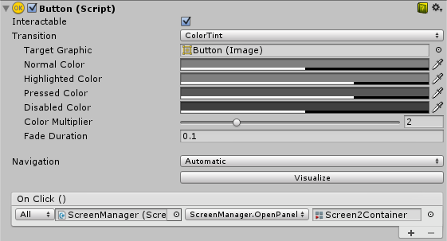

# 创建屏幕过渡

在多个 UI 屏幕之间进行过渡的需求相当普遍。在本页面中，我们将探索一种使用动画和状态机来创建和管理这些过渡以便驱动和控制每个屏幕的简单方法。

## 概述

大体思路是每个屏幕都有一个[动画控制器](class-AnimatorController.html)以及两个[状态](class-State.html)（Open 和 Closed）和一个布尔[参数](AnimationParameters.html) (Open)。要在屏幕之间过渡，只需关闭当前打开的屏幕并打开所需的屏幕。为了简化这一过程，我们将创建一个小型的 ScreenManager 类，稍后用于跟踪并处理所有已打开的屏幕。触发过渡的按钮只需要让 ScreenManager 打开所需的屏幕。

### 关于导航的注意事项

如果打算支持通过控制器/键盘对 UI 元素进行导航，必须注意几点。必须避免可选元素超出屏幕，因为这样会让玩家选择屏幕外的元素，为此我们可以停用所有屏幕外层级视图。我们还需要确保在显示新屏幕时将其中的某个元素设置为选中状态，否则玩家将无法导航到新屏幕。我们将在下面的 ScreenManager 类中处理所有这些问题。

## 设置动画控制器

让我们来看看进行屏幕过渡时所需的最常见和最小低限度的动画控制器设置。控制器需要一个布尔参数 (Open) 和两个状态（Open 和 Closed），每个状态应该有一段只有一个关键帧的动画，这样就能让状态机为我们执行过渡混合。


现在我们需要在两个状态之间创建[过渡](class-Transition.html)，让我们从 Open 到 Closed 的过渡开始，首先正确设置条件，当参数 Open 设置为 false 时，我们希望从 Open 变为 Closed。接着，我们创建从 Closed 到 Open 的过渡，并将条件设置为：当参数 Open 为 true 时，状态从 Closed 变为 Open。


## 管理屏幕

进行以上所有设置后，唯一缺少的是我们需要在要过渡到的屏幕的动画器上将参数 Open 设置为 true，并在当前打开的屏幕的动画器上将 Open 设置为 false。为此，我们将创建一个小脚本：

````
using UnityEngine;
using UnityEngine.UI;
using UnityEngine.EventSystems;
using System.Collections;
using System.Collections.Generic;

public class ScreenManager : MonoBehaviour {

	//在场景开始时自动打开的屏幕
	public Animator initiallyOpen;

	//当前打开的屏幕
	private Animator m_Open;

    //我们用来控制过渡的参数的哈希值。
	private int m_OpenParameterId;

    //在我们打开当前屏幕之前选择的游戏对象。
    //在关闭屏幕时使用，因此我们可以返回将其打开的按钮。
    private GameObject m_PreviouslySelected;

    //我们在检查时需要比对的动画器状态和过渡名称。
    const string k_OpenTransitionName ="Open";
	const string k_ClosedStateName = "Closed";

	public void OnEnable()
	{
    	//我们将哈希缓存到 "Open" 参数，因此可提供给 Animator.SetBool。
		m_OpenParameterId = Animator.StringToHash (k_OpenTransitionName);

        //现在打开初始屏幕（如果已设置）。
		if (initiallyOpen == null)
			return;
		OpenPanel(initiallyOpen);
	}

	//关闭当前打开的面板并打开提供的面板。
    //还负责处理导航，设置新的选定元素。
	public void OpenPanel (Animator anim)
	{
   	    if (m_Open == anim)
			return;

		//激活新的屏幕层级视图，以便对其进行动画化。
		anim.gameObject.SetActive(true);
        //保存当前选定的用于打开此屏幕的按钮。（CloseCurrent 会对其进行修改）
		var newPreviouslySelected = EventSystem.current.currentSelectedGameObject;
		//将屏幕移到前面。
		anim.transform.SetAsLastSibling();

		CloseCurrent();

        m_PreviouslySelected = newPreviouslySelected;

        //将新屏幕设置为打开的屏幕。
		m_Open = anim;
        //启动打开动画
		m_Open.SetBool(m_OpenParameterId, true);

        //将新屏幕中的一个元素设置为新的选定元素。
        GameObject go = FindFirstEnabledSelectable(anim.gameObject);
		SetSelected(go);
	}

	//查找提供的层级视图中的第一个可选元素。
    static GameObject FindFirstEnabledSelectable (GameObject gameObject)
	{
		GameObject go = null;
		var selectables = gameObject.GetComponentsInChildren<Selectable> (true);
		foreach (var selectable in selectables) {
			if (selectable.IsActive () && selectable.IsInteractable ()) {
				go = selectable.gameObject;
				break;
			}
		}
		return go;
	}

	//关闭当前打开的屏幕
    //还负责处理导航。
    //将选定元素还原为打开当前屏幕之前使用的可选元素。
	public void CloseCurrent()
	{
		if (m_Open == null)
			return;

		//启动关闭动画。
		m_Open.SetBool(m_OpenParameterId, false);

		//将选定元素还原为打开当前屏幕之前使用的可选元素。
        SetSelected(m_PreviouslySelected);
        //关闭动画结束时启动协程以禁用该层级视图。
		StartCoroutine(DisablePanelDeleyed(m_Open));
        //无打开屏幕。
		m_Open = null;
	}

    //协程将检测关闭动画何时结束，并会停用
    //层级视图。
    IEnumerator DisablePanelDeleyed(Animator anim)
	{
		bool closedStateReached = false;
		bool wantToClose = true;
		while (!closedStateReached && wantToClose)
		{
			if (!anim.IsInTransition(0))
				closedStateReached = anim.GetCurrentAnimatorStateInfo(0).IsName(k_ClosedStateName);

			wantToClose = !anim.GetBool(m_OpenParameterId);

			yield return new WaitForEndOfFrame();
		}

		if (wantToClose)
			anim.gameObject.SetActive(false);
	}

    //选定提供的游戏对象
    //当使用鼠标/触摸时，我们实际上想要将其设置为先前选定的对象并且
    //现在不将任何对象设置为选定状态。
    private void SetSelected(GameObject go)
	{
        //选择游戏对象。
		EventSystem.current.SetSelectedGameObject(go);

		//如果我们现在正在使用键盘，那么我们便完成了所有设置。
		var standaloneInputModule = EventSystem.current.currentInputModule as StandaloneInputModule;
		if (standaloneInputModule != null)
			return;

        //由于我们使用的是指针设备，因此我们不希望选择任何内容。
        //但是如果用户切换到键盘，我们希望从提供的游戏对象开始导航。
        //所以，此处我们将当前的选定项设置为 null，因此提供的游戏对象成为 EventSystem 中的最后选定项。
		EventSystem.current.SetSelectedGameObject(null);
	}
}
````

让我们连接此脚本，为此需要创建新的游戏对象，我们可以将其重命名为“ScreenManager”之类的名称，并将上面的组件添加到该游戏对象。您可以为其指定初始屏幕，此屏幕将在场景启动时打开。

现在，最后的工作是让 [UI 按钮](script-Button.html)生效。选择应触发屏幕过渡的按钮，并在 Inspector 的 __On Click ()__ 列表下添加一个新操作。将刚创建的 ScreenManager 游戏对象拖到 ObjectField，在下拉选单中选择 __ScreenManager &gt; OpenPanel (Animator)__，然后将用户点击按钮时要打开的面板拖放到 ObjectField。



## 注意
这种方法只要求每个屏幕有一个动画控制器 (AnimatorController) 以及一个 Open 参数和一个 Closed 状态即可发挥作用（无论屏幕或状态机的构造如何）。这种方法也适用于嵌套的屏幕，这意味着每个嵌套级别只需要一个 ScreenManager。

我们上面设置的状态机的默认状态为 Closed，因此使用此控制器的所有屏幕在开始时均为关闭状态。ScreenManager 提供了一个 initiallyOpen 属性，因此可以指定首先显示的屏幕。
