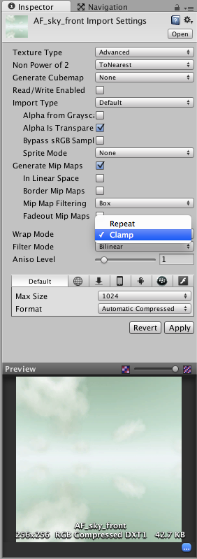
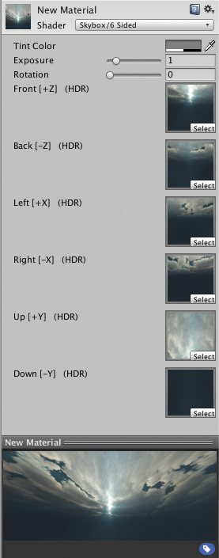

如何创建天空盒？
=======================

__天空盒 (Skybox)__ 是一个在游戏中所有图形后面绘制的 6 面立方体。创建天空盒的步骤如下：

* 创建与天空盒 6 个面相对应的 6 个纹理，并将它们放入项目的 __Assets__ 文件夹中。
* 对于每个纹理，需要将包裹模式从 __Repeat__ 更改为 __Clamp__。如果不这样做，边缘上的颜色将不匹配：

 

* 从菜单栏中选择 __Assets &gt; Create &gt; Material__ 以创建新__材质__。
* 在 __Inspector__ 的顶部选择 Shader 下拉选单，然后选择 __Skybox/6 Sided__。
* 将 6 个纹理分配给材质中的每个纹理字段。为此，可将每个纹理从 __Project 视图__拖放到相应的字段上。

 

在此截屏中，纹理取自 4.x StandardAssets/Skyboxes/Textures 文件夹。请注意，这些纹理已在天空盒中使用。

要将天空盒分配给您正在处理的场景，请执行以下操作：

* 从菜单栏中选择 __Window &gt; Lighting__。
* 在随后出现的窗口中选择 Scene 选项卡。
* 将新的天空盒材质拖放到 __Skybox__ 字段。

 

