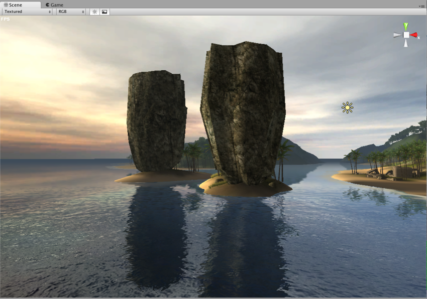
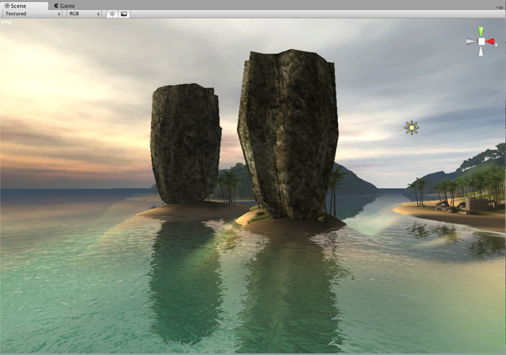
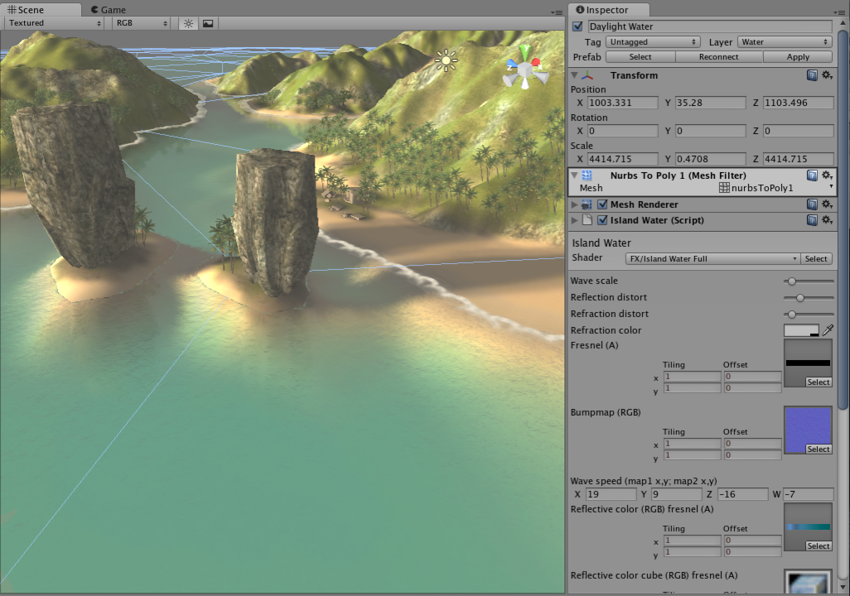

#Unity 中的水

Unity 在[标准资源包](AssetTypes.html#Standard)中包含几个水预制件（包括必要的着色器、脚本和艺术资源）。提供了单独的日间和夜间水预制件。

请注意，本文档中描述的水反射在 VR 中不适用。

##设置水

将一个现有的水预制件放入场景中。确保[已安装标准资源](AssetTypes.html#Standard)：

* __Standard Assets__ > __Water__ 中的简单 __Daylight Simple Water__ 和 __Nighttime Simple Water__。
* 高级水 - __Pro Standard Assets__ > __Water__ 中的 __Daylight Water__ 和 __Nighttime Water__（此情况下还需要 __Standard Assets__ > __Water__ 中的一些资源）。可在 Inspector 中设置水模式（Simple、Reflective、Refractive）。

预制件对水使用椭圆形网格。如果需要使用其他不同的[网格](class-Mesh.html)，请在水游戏对象的__网格过滤器 (Mesh Filter)__ 中进行更改：

 

##从头创建水（高级）

简单的水需要将脚本附加到类似平面的网格并使用水着色器：

1.具备水的网格。此网格应该是一个水平定向的平面网格。不需要 UV 坐标。水游戏对象应使用水__层__（可在 Inspector 中设置）。
1.将 __WaterSimple__ 脚本（来自于 __Standard Assets/Water/Sources__）附加到该游戏对象。
1.使用材质中的 __FX/Water (simple)__ 着色器，或调整提供的水材质之一（__Daylight Simple Water__ 或 __Nighttime Simple Water__）。

反射/折射水在从头开始设置时需要类似的步骤：

1.创建水的网格。此网格应该是一个水平定向的平面网格。不需要 UV 坐标。水游戏对象应使用水__层__（可在 Inspector 中设置）。
1.将 __Water__ 脚本（来自于 __Pro Standard Assets/Water/Sources__）附加到该游戏对象（可在 Inspector 中设置渲染模式：__Simple__、__Reflective__ 或 __Refractive__）。
1.使用材质中的 __FX/Water__ 着色器，或调整提供的水材质之一（__Daylight Water__ 或 __Nighttime Water__）。

##水材质中的属性

这些属性用在__反射 (Reflective)__ 和__折射 (Refractive)__ 水着色器中。它们中的大多数也用于__简单 (Simple)__ 水着色器。

|**_属性：_** |**_功能：_** |
|:---|:---|
|__Wave scale__ |缩放水波法线贴图。该值越小，水波越大。 |
|__Reflection/refraction distort__ |水波法线贴图会扭曲多少反射/折射。 |
|__Refraction color__ |额外的折射色调。 |
|__Environment reflection/refraction__ |实时反射和折射的渲染纹理。 |
|__Normalmap__ |定义水波的形状。通过组合这两个法线贴图产生最终水波（每个法线贴图以不同的方向、比例和速度滚动）。第二个法线贴图的大小是第一个法线贴图的一半。 |
|__Wave speed__ |第一个法线贴图（第一和第二个数字）和第二个法线贴图（第三和第四个数字）的滚动速度。 |
|__Fresnel__ |该纹理具有控制菲涅耳效应（根据视角可以看到多少反射与折射）的 Alpha 通道。 |

__反射__和__折射__着色器不使用其余属性，但仍然需要设置这些属性以防用户的显卡不支持该着色器而必须回退到更简单的着色器：

|**_属性：_** |**_功能：_** |
|:---|:---|
|__Reflective color/cube and fresnel__ |该纹理根据视角定义水颜色 (RGB) 和菲涅耳效应 (A)。 |
|__Horizon color__ |水在地平线上的颜色。此属性仅用于__简单__水着色器。 |
|__Fallback texture__ |定义用于在极旧的显卡上表示水（如果没有更好看的着色器可运行）的后备纹理。 |
