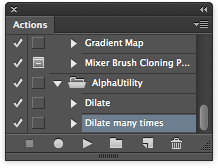
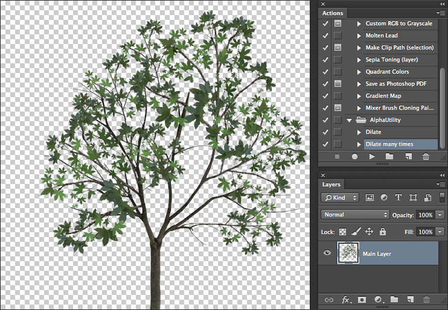
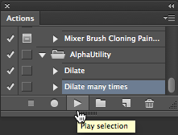
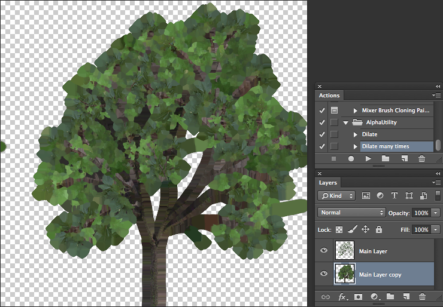
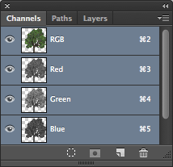

如何导入 Alpha 纹理？
===============================

Unity 使用直接的 __Alpha 混合__。因此，您需要扩展颜色层...Unity 中的 Alpha 通道将从 Photoshop 文件中的第一个 Alpha 通道读取出来。

设置
----------

在此之前，安装以下 Alpha 实用程序 Photoshop 操作程序：[AlphaUtility.atn.zip](../uploads/Examples/AlphaUtility.atn.zip)

安装后，操作面板 (Action Palette) 应该包含一个名为 AlphaUtility 的文件夹：

 

确保 Alpha 正确
-------------------

假设您在 Photoshop 内的透明层上有 Alpha 纹理。类似以下纹理：

 

1.复制该层
1.选择最低层。此层将成为背景扩张的源。
1.选择 __Layer &gt; Matting &gt; Defringe__，并应用默认属性
1.多次运行“Dilate Many”操作。这样就会将背景扩展到新层中。 

1.选择所有扩张层并用 __Command-E__ 合并它们

1.在图像栈的底部创建纯色层。此层的颜色与文档的一般颜色相匹配（在本示例中为绿色）。请注意，如果没有此层，Unity 将从所有层的合并透明度中获取 Alpha。

现在我们需要将透明度复制到 Alpha 层中。

1.通过在图层面板 (Layer Palette) 中按住 Command 键并将单击选定内容，将选定内容设置为主层的内容。
1.切换到通道面板。
1.从透明度创建新通道。

 

保存 PSD 文件；现在便准备好了。

额外信息
-----

请注意，如果图像包含透明度（合并层之后），则 Unity 将从所有层的合并透明度中获取 Alpha，并将忽略 Alpha 遮罩。变通方法是创建一个纯色层，如“确保 Alpha 正确”部分的第 6 点所述
