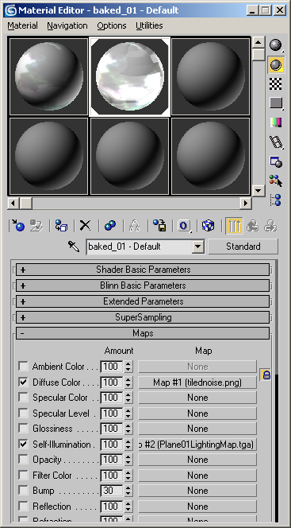
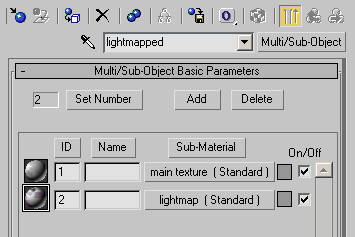
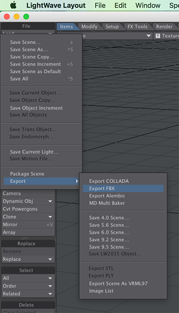
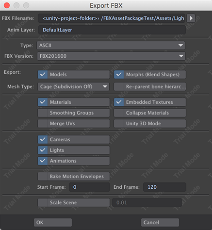

# 从其他应用程序导出

Unity 支持可能从许多 3D 建模应用程序导出的 FBX 文件。请遵循以下准则来确保获得最佳结果：

1.[选择](#Select)要在 3D 建模应用程序中导出的内容。
2.[准备](#Prepare)需要在 3D 建模应用程序中包含的内容。
3.在导出之前检查 [FBX 设置](#Export)。
4.[验证并导入](#Import) FBX 文件到 Unity。

**注意**：除了以上关于从 3D 建模应用程序执行导出操作的一般准则之外，有些 3D 建模应用程序在以下部分还有更具体的信息：

 * [Maya](#Maya)
 * [Cinema 4D](#Cinema4D)
 * [3ds Max](#Max)
 * [LightWave](#LightWave)

 
## 选择要导出的内容

对于想导出的内容：有些场景对象必不可少，而其他可能不必要。
应用程序通常允许导出**选定对象**或**整个场景**。
可以通过仅保留基本对象来优化 Unity 中的数据。

如果选择仅导出场景中的特定对象，则可以：

 * 仅导出**选定对象**（如果应用程序支持此功能）。
 * 从场景中删除不需要的数据并导出**整个场景**。
 * 制作预设或自定义场景导出器以自动化或简化选择导出过程。

 
## 准备需要包含的内容

根据以下注意事项准备要导出的资源：

|**对象：** |**准备：** |
|:---|:---|
|__网格 (Meshes)__|必须将所有 NURBS、NURMS、样条曲线、面片和细分曲面转换为多边形（三角形剖分或四边形剖分）|
|__动画 (Animation)__|选择正确的骨架。检查帧率。检查动画长度。|
|__混合形状 (Blend Shapes)__ 或__变形 (Morphing)__|确保分配了 BlendShape (Maya) 或变形目标 (Max)。正确设置导出网格。|
|__纹理 (Textures)__|确保您的纹理来自 Unity 项目，或者将它们复制到 Unity 项目中的名为 `textures` 的文件夹。  **注意：**建议不要使用 __Embed Media__ 选项在 FBX 文件中嵌入纹理。在使用纹理之前必须提取纹理，因此嵌入它们只会导致项目出现不必要的臃肿问题并减慢导入过程。|
|__平滑 (Smoothing)__|验证所有平滑组和平滑网格设置。  **重要信息：**导入混合形状法线要求在 FBX 文件中具有平滑组。|

 
## 设置 FBX 导出选项

检查 FBX 导出设置：

 * 检查 3D 建模应用程序的导出对话框中的每项设置，以便了解与 Unity 中的 FBX 导入设置的匹配情况。
 * 根据需要选择是否导出动画 (Animation)、变形 (Deformations)、皮肤 (Skins)、变体 (Morphs)。
 * 节点、标记及其变换可以导出到 Unity。
 * 选择要导入 Unity 的任何摄像机 (Cameras)、光照 (Lights) 和可见性 (Visibility) 设置。
 * 尽可能使用[最新版本的 FBX](https://www.autodesk.com/products/fbx/overview)。Autodesk 会定期更新其 FBX 安装程序。
 * 确保在将文件导入 Unity 时使用的 FBX 版本与从 3D 建模应用程序中导出时使用的版本相同。使用不同版本的软件可能产生意想不到的结果。

 
## 验证并导入到 Unity

在将 FBX 文件导入到 Unity 之前：

1.验证导出的文件的大小。对文件大小执行完整性检查（例如 &gt;10kb？）。

2.将 FBX 文件重新导入到新场景中，导回到用于生成该文件的 3D 建模软件中。检查并确保能正常工作。

要将文件导入 Unity，请遵循有关[导入操作](ImportingAssets.html)的说明，务必记住您在 3D 建模软件中的导出选项设置。

## 特定 3D 建模应用程序中的导出设置

 
### Maya

您可以使用 [FBX 导出选项](http://help.autodesk.com/view/MAYAUL/2018/ENU/?guid=GUID-FE8DBEAA-C2DD-43B3-9933-4BA4CDDEAA89)选择要在 FBX 文件中导出的内容。

#### 导出 BlendShape（变形）

从 Maya 导出 BlendShape（变形）时，请遵循以下准则：

* 将混合形状按顺序应用于导出网格及其目标。
* 如果需要 Maya 动画关键帧，可在混合形状节点上对关键帧进行动画化。
* 导出网格之前，在 Maya 中启用 __Animation__ &gt; __Deformed Models__ &gt; __Blend Shapes__ FBX 导出选项。
* 如果还想导出皮肤变形，则应在导出网格之前在 Maya 中启用 __Animation__ &gt; __Deformed Models__ &gt; __Skins__ FBX 导出选项。

将文件导入 Unity 之后，请在__项目__视图中选择该文件，然后在 [Model Importer 的 Animations 选项卡](class-AnimationClip.html)中启用 __Bake Animations__。

 
### Cinema 4D

#### 使用 IK（反向动力学）的动画角色

如果使用 IK 在 Cinema 4D 中对角色进行动画化，必须在导出之前使用 Cinema 4D 中的 __Plugins &gt; Mocca &gt; Cappucino__ 菜单烘焙 IK。
如果您在导入 Unity 之前未烘焙 IK，则只能获得动画定位器 (locator) 和动画骨骼。

#### 最大限度提高导入速度

为了加快文件导入 Unity 的速度，可在导出之前关闭 Cinema 4D 中的 __Embed Textures__ 偏好设置。请查看 [Cinema 4D 文档](https://help.maxon.net/us/#FFBXEXPORT-FBXEXPORT_GROUP)了解相关说明。

 
### 3ds Max

Autodesk 针对通常作为游戏资源导出的资源提供了一个 [Game Exporter Utility](https://help.autodesk.com/view/3DSMAX/2018/ENU/?guid=GUID-B0258B21-83AE-4DF6-B7AB-3FA7F63F371A)。您还可以使用[标准 FBX 导出实用程序](https://help.autodesk.com/view/3DSMAX/2018/ENU/?guid=GUID-EB0F5BB7-2E59-4EF6-8B16-F59CC56A4747)选择要在 FBX 文件中导出的内容。

例如，默认的 FBX Exporter 选项（基本上导出所有内容）允许将纹理作为图像映射嵌入到文件中。虽然这会使文件非常易于移植，但也增加了文件大小。

此外，如果从 Maya 导出，在处理以下内容时还有一些额外的注意事项：

* 导出四边形
* 基于骨骼的动画
* 变形目标 (Blendshape)
* 用于光照贴图的 UV 集

 
#### 导出四边形

3dsMax 的可编辑网格总是导出三角形。可编辑的多边形在导入时保留四边形和 N 边形。因此，如果要将四边形导入 Unity，必须在 3ds Max 中使用可编辑多边形。

#### 基于骨骼的动画

如果要在 3ds Max 中导出基于骨骼的动画，请遵循以下准则：

* 设置骨骼结构和动画（使用正向动力学 (FK) 或 IK）后，选择所有骨骼和/或 IK 解算器。
* 选择 **Motion** &gt; **Trajectories** &gt; **Collapse**。Unity 会生成一个关键点过滤器，因此导出的关键点数量无意义。
* 单击 Game Exporter 窗口上的 Export 按钮或 FBX Exporter 窗口上的 OK 按钮。
* 将 FBX 文件复制到 Assets 文件夹中。
* 打开 Unity 并将纹理重新分配给根骨骼中的材质。

将具有网格和动画的骨骼层级视图从 3ds Max 导出到 Unity 时，生成的游戏对象层级视图对应于您可以在 3ds Max Schematic View 中看到的层级视图。但是，Unity 使用游戏对象作为新根（包含动画），并将网格和材质信息放在根骨骼中。

如果您希望将动画和网格信息保留在同一 Unity 游戏对象中，在导出之前，请在 3ds Max 中将网格节点父级指定为骨骼层级视图中的骨骼。

#### 变形目标 (Blendshape)

如果要在 3ds Max 中导出变形目标，请遵循以下准则：

* 将变形体修改器 (Morpher Modifier) 应用于导出网格，并在通道列表 (Channel List) 中设置适当的变形目标。
* 如果需要 3ds Max 动画关键帧，可在网格/修改器上对关键帧进行动画化。
* 导出网格之前，在 3ds Max 中启用 __Animation__ &gt; __Deformed Models__ &gt; __Blend Shapes__ FBX 导出选项。
* 如果还想导出皮肤变形，则应在导出网格之前在 3ds Max 中启用 __Animation__ &gt; __Deformed Models__ &gt; __Skins__ FBX 导出选项。

#### 用于光照贴图的 UV 集

Unity 具有内置的[光照贴图功能 (lightmapper)](GIIntro.html)，但您也可以使用纹理烘焙（Rendering 菜单上的 **Render To Texture**）功能和 3ds Max 中的自动展开 (unwrapping) 功能来创建光照贴图。

通常情况下，一个 UV 集用于主纹理和/或法线贴图，另一个 UV 集用于光照贴图纹理。为确保两个 UV 集都正确，3ds Max 中的材质必须为标准材质，并且必须设置 Diffuse（用于主纹理）和 Self-Illumination（用于光照贴图）贴图字段：

**注意**：如果对象使用 Shell 类型的材质，Autodesk 的 FBX Exporter **不能正确导出 UV**。

或者，您可以使用多维/子对象 (Multi/Sub Object) 材质类型，并使用漫射贴图字段中的主纹理 (main texture) 和光照贴图 (lightmap) 设置两个子材质，如下图所示。但是，如果模型中的面使用不同的子材质 ID，这种方法会导致导入多个材质，此情况对性能而言并非最佳选择。

 
### LightWave

通过从 LightWave Layout 中的 **File** 工具栏选择 **Save** &gt; **Export** &gt; **Export FBX** 即可访问 LightWave 中的 FBX 导出设置窗口：

随后将显示 Export FBX 窗口。

|**属性：** ||**功能：** |
|:---|:---|:---|
|__FBX Filename__||设置 FBX 文件的名称和位置。应使用 Unity `Assets` 文件夹下的位置。|
|__Anim Layer__||要使用的动画层的名称。 |
|__Type__||使用 __Binary__ 来减小文件大小，或使用 __ASCII__ 生成文本可编辑的 FBX 文件。|
|__FBX Version__||从列表中选择最新的 FBX 版本，确保其与 Unity 使用的版本匹配。|
|__Export__|||
|__Models__||导出场景中的所有模型|
|__Morphs (Blend Shapes)__||导出场景中的所有 BlendShape|
|__Mesh type__|||
||__Cage (Subdivision Off)__|导出对象但不进行任何细分|
||__Subdivision__|导出网格时对其进行细分|
|__Re-parent bone hierarchy__||创建一个 null 充当骨骼层级视图的新父级。  从布局中导出骨架时，如果骨骼层级视图以网格为父级，变形网格的实际移动将是预期值的两倍。启用此新父级会使网格保持原样。|
|__Materials__||转换 LightWave 的标准表面通道和图像映射。这不包括程序化纹理和节点。|
|__Embedded Textures__||将嵌入的纹理保存为直接包含在 FBX 文件中的图像映射，而不是保存到单独的图像目录。这会创建更大但更独立的 FBX 文件。|
|__Smoothing Groups__||将 LightWave 的法线转换为平滑组。|
|__Collapse Materials__||折叠具有相同材质名称的表面，分别导出材质。但是，如果材质名称和所有表面参数都匹配，则无论此设置如何，始终都会合并两个材质。|
|__Merge UVs__||将多个 UV 贴图折叠为每个对象的单个贴图。|
|__Unity 3D Mode__||纠正 LightWave、FBX 和 Unity 的坐标系之间的转换导致的旋转错误。  LightWave 和 Unity 均使用*左手*坐标系，但 FBX 使用*右手*坐标系。当 LightWave 导出到 FBX 时，它会沿 Z 轴转换为右手坐标。当 Unity 导入 FBX 文件时，它会沿 X 轴转换回左手坐标，从而使场景旋转 180 度。使用该设置意味着，当您进入 Unity 并向下观察 Z 轴时，导入的 FBX 看起来与在 LightWave 内部完全相同。|
|__Cameras__||导出场景中的所有摄像机。|
|__Lights__||导出场景中的所有光照。|
|__Animations__||无需烘焙即可导出基于移动、旋转或缩放的简单动画。使用 IK 或动态的角色动画或其他动画仍应使用 __Bake Motion Envelopes__ 进行烘焙。
|__Bake Motion Envelopes__||当存在您不想捕获的设置帧时，设置烘焙的任意起始点和结束点。仅当选中 __Animations__ 时才可用。|
|__Start Frame__ 和 __End Frame__||仅导出此时间范围内的数据。|
|__Scale Scene__||为场景设置一个与 Unity [File Scale](FBXImporter-Model.html) 值匹配的缩放值。|

---

*  2018-04-25  Page amended with limited [editorial review](DocumentationEditorialReview.html)

