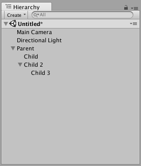
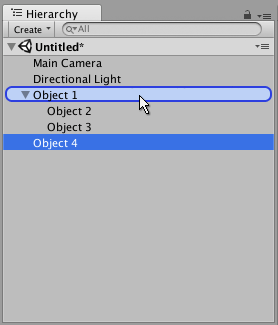
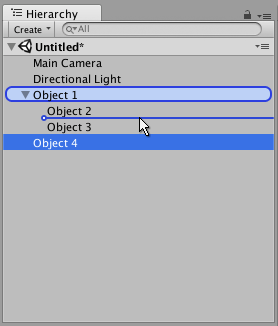

# Hierarchy 窗口

**Hierarchy** 窗口会列出当前场景中的每个游戏对象（在本指南中称为“对象”）。其中一些对象是资源文件的直接实例（如 3D 模型），其他则是预制件的实例，这是构成游戏大部分内容的自定义对象。在场景中添加和删除对象时，这些对象也会在层级视图中相应显示和消失。

默认情况下，对象在 Hierarchy 窗口中按其生成顺序列出。可以通过向上或向下拖动对象，或通过使对象成为“子”或“父”对象来对其重新排序（见下文）。

## 父子化

Unity 使用一种称为**父子化**的概念。创建一组对象时，最顶层对象或场景被称为“父对象”，而在其下面分组的所有对象被称为“子对象”或“子项”。还可以创建嵌套的父子对象（称为顶级父对象的“后代”）。

单击父对象的下拉箭头（位于其名称的左侧）可显示或隐藏其子项。在按住 Alt 键的同时单击下拉箭头可以切换父对象的所有后代对象（不仅仅包括直接子对象）的可见性。

### 设定子对象

要使任何对象成为另一对象的“子项”，请将目标子对象拖放到层级视图中的目标父对象上。

还可以将对象拖放到其他对象旁边，使这些对象成为“同级”：即同一父对象下的子对象。将对象拖到现有对象的上方或下方，直到出现水平蓝线，然后将对象放下，即可将其放在现有对象旁边。

子对象会继承父对象的移动和旋转。要了解与此相关的更多信息，请参阅关于[变换组件](class-Transform.html)的文档。

## 字母数字排序

Hierarchy 窗口中对象的顺序可以更改为字母数字顺序。在菜单栏中，选择 **Edit > Preferences**（在 Windows 中）或者选择 **Unity > Preferences**（在 OS X 中），启动 **Preferences** 窗口。选中 **Enable Alpha Numeric Sorting**。

选中此复选框时，Hierarchy 窗口的右上角会出现一个图标，允许在 **Transform** 排序（默认值）或 **Alphabetic** 排序之间切换。

 

## 多场景编辑

可以在 Hierarchy 窗口中同时打开多个场景。要查找与此相关的更多信息，请参阅[多场景编辑](MultiSceneEditing.html)页面。

