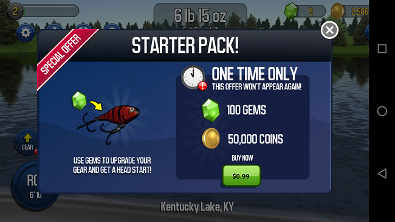
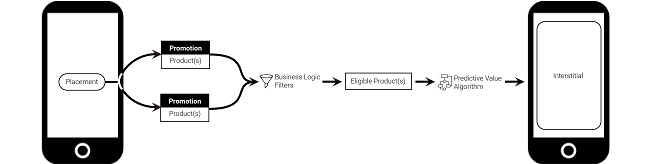

# 内购推荐 (IAP Promo)

## 概述
内购推荐 (IAP Promo) 让开发者可以轻松促进微交易。使用它可以在游戏中的不同位置向不同玩家提供独特的购买机会。

### 要求
游戏必须使用 5.4 以上的 Unity 版本，并启用以下服务：

- [Unity IAP](https://docs.unity3d.com/Manual/UnityIAP.html) SDK 1.17+
- [Unity Ads](https://docs.unity3d.com/Manual/UnityAds.html) SDK 2.2+（不使用聚合）
- 游戏必须在初始化 Unity Ads 之前先初始化 IAP（请参阅有关[集成](https://docs.unity3d.com/2018.1/Documentation/Manual/IAPPromoIntegration.html)的文档）

### 内购推荐 (IAP Promo) 组件
内购推荐 (IAP Promo) 有三个主要组件，所有这些组件都有自己相应的介绍文章：

- [广告位](https://docs.unity3d.com/Manual/IAPPromoPlacements)
- [商品](https://docs.unity3d.com/Manual/IAPPromoProducts)
- [推荐 (Promotions)](https://docs.unity3d.com/Manual/IAPPromoPromotions)

__广告位__ (Placements) 将触发填充请求，而该功能将根据请求搜索关联的__推荐__ (Promotions) 以查找要向该玩家显示的目标__商品 (Products)__。玩家可以直接从生成的插页式广告进行应用内购 (IAP)。

## 通过机器学习使收入最大化
内购推荐 (IAP Promo) 使传统 A/B 测试方法变得没有必要。其机器学习软件将会利用 Unity 网络中的汇总数据，查找数据模式，然后将它们馈送到模型中以改进游戏。因此，即使对于全新玩家，也能为他们提供个性化产品。这种完全自动化的服务将全天候运行。

### 工作原理
当__广告位__提出请求时，系统将查找所有符合显示条件的可用__商品__。它随后应用[业务条件过滤功能](https://docs.unity3d.com/Manual/IAPPromoPromotions.html#BusinessLogic)（例如，地理位置或操作系统目标），并根据给出的剩余选项使用数据科学来选择最适合用户的商品。该模型会考虑大量数据点来优化其选择结果，例如设备特征和玩家会话行为。我们将最佳商品定义为使终身价值 (LTV) 最大化的商品。

### 准备开始
要利用内购推荐 (IAP Promo) 的机器学习功能，只需将多个[商品](https://docs.unity3d.com/Manual/IAPPromoProducts)添加到[推荐 (Promotions)](https://docs.unity3d.com/Manual/IAPPromoPromotions) 中，然后让 Unity 完成工作。

例如，请考虑玩家完成关卡时提供给他们的__推荐 (Promotion)__：

* 在玩家完成关卡时，游戏调用“EndLevel”__广告位__。该广告位的填充请求将返回包含三个可能__商品__的列表：
    * 一个 1.99 美元的充值包加 10% 奖金
    * 一个 2.99 美元的充值包加 10% 奖金
    * 一个 4.99 美元的充值包加 10% 奖金
* 系统发现玩家符合所有三项优惠的目标条件。
* 算法会确定能让玩家 LTV 最大化的充值包，然后显示该优惠。

我们建议每个__推荐 (Promotion)__ 至少提供三个价格点（低、中、高），并具有适当的相应支出费用。与任何数据驱动模型一样，可用数据点越多，就越有效。可添加到一次__推荐 (Promotion)__ 的__商品__数量没有限制；甚至可以选择为游戏应用商店中的每个价格层级提供一个__商品__。

 
 

-----
* 2018-03-01  Page published with [editorial review](DocumentationEditorialReview.html)

