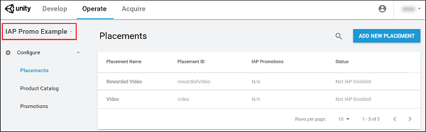
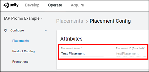

# 内购推荐 (IAP Promo) 广告位

使用__广告位__可控制__推荐 (Promotions)__ 在游戏中的显示时机和方式。应在开发者控制面板 (Developer Dashboard) 中创建__广告位__，然后在 Unity Editor 中通过代码调用它们（类似于普通的 [Unity Ads 广告位](https://unityads.unity3d.com/help/monetization/placements-and-filters)）。

## 创建广告位
从[开发者控制面板 (Developer Dashboard) 的 **内购推荐 (IAP Promo)** 部分](https://iap.unityads.unity3d.com)创建__广告位__。当前操作的项目会出现在左上角。

 
创建__广告位__步骤：

1.从左侧导航栏中选择 **Placements**。  **注意**：此情况下会从 Unity Ads 集成过程自动继承两个__广告位__（**Rewarded Video** 和 **Video**），但是两者均为禁用状态。  

2.选择右上角的 **ADD NEW PLACEMENT** 以打开 **Attributes** 菜单。   **注意**：可通过从左侧导航栏选择 **Placements**，然后从列表中选择 __Placement__ 来查看广告位的属性。  

3.填写 **Placement Name**，然后单击 **SAVE**。   

### 广告位 ID
控制面板根据广告位的名称自动填充 __Placement IDs__（广告位 ID）。即使更新了名称，也无法在创建__广告位__后编辑__广告位 ID__。使用 Unity Ads API 时可通过广告位 ID 在代码中调用__广告位__（请参阅有关[**广告位和过滤 (Placements and filters)**](https://unityads.unity3d.com/help/monetization/placements-and-filters) 的文档以了解更多信息）。

### 关联的推荐 (Promotions)
保存__广告位__后，**Placement Config** 菜单会显示与之相关的每个__推荐 (Promotion)__。__广告位__有三种可能的状态：

* **Configured**（已配置）：在__推荐 (Promotion)__ 中处于正在使用状态
* **Not Configured**（未配置）：在__推荐 (Promotion)__ 中未处于正在使用状态
* **Not IAP Enabled**（未启用 IAP）：仅与广告相关的__广告位__，无法显示 IAP 优惠

请参阅有关[内购推荐 (IAP Promotions)](https://docs.unity3d.com/Manual/IAPPromoPromotions) 的文档以了解更多详细信息。

 
 

-----
* 2018-03-01  Page published with [editorial review](DocumentationEditorialReview.html)

