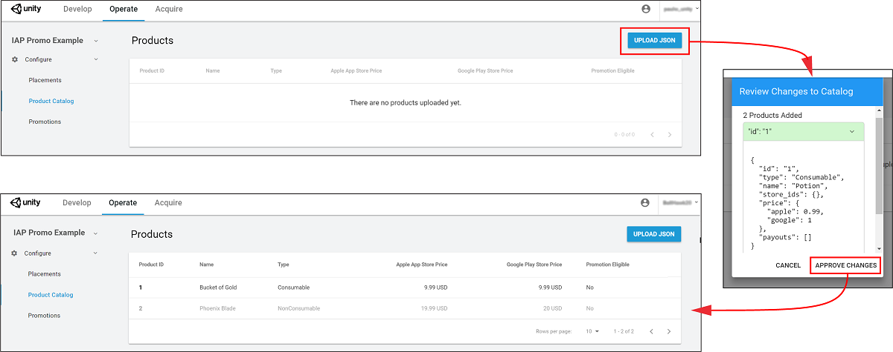
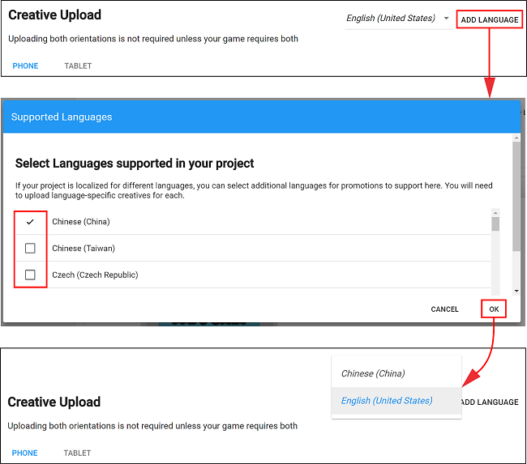

# 内购推荐 (IAP Promo) 商品目录

Unity IAP 提供快速简单的工具来创建和导出__商品目录__ (Product Catalogs)。使用 Unity Editor 的 **IAP Catalog** 窗口可填写__商品__元数据，然后将目录导出到[开发者控制面板 (Developer Dashboard)](https://iap.unityads.unity3d.com) 以配置每个商品的创意资源。请注意，必须使用 IAP Catalog 功能将商品导出到控制面板。

## 创建商品目录
### 在 IAP Catalog 窗口中添加商品
在 Editor 中，选择 **Window** > **UnityIAP** > **IAP Catalog** 以打开 **IAP Catalog** 窗口。该 GUI 列出了以前配置的所有__商品__，并允许您为每个商品定义以下属性：

* **Name**（名称）
* **Product ID**（商品 ID）
* **Type**（类型）：当前仅有 **Consumable**（消耗品）商品类型适用于内购推荐 (IAP Promo)
* **Price**（价格）：可根据各自价格层级独立指定 Google 和 Apple 商店的价格

**注意**：__商品目录__必须至少配置一个__商品__才能导出。有关设置__商品__的完整过程，请参阅有关 [Codeless IAP](https://docs.unity3d.com/Manual/UnityIAPCodelessIAP.html) 的文档。
    
您可能已经使用构建器 (builder) 脚本为 Unity IAP 填充了__商品目录__。例如：

```
var builder = ConfigurationBuilder.Instance(StandardPurchasingModule.Instance());
builder.AddProduct(product_coins, ProductType.Consumable);
builder.AddProduct(product_hat, ProductType.NonConsumable);
builder.AddProduct(product_elite, ProductType.Subscription);
```

因为内购推荐 (IAP Promo) 仅支持从 Editor **IAP Catalog** GUI 导出 JSON，所以我们建议按如下方式修改您的方法：

1.将__商品__复制粘贴到 **IAP Catalog** GUI。
2.从购买脚本中删除或注释掉现有的 ```builder.AddProduct()``` 代码。
3.在初始化 IAP 之前添加以下代码以从 **IAP Catalog** GUI 获取商品列表：
	
```
StandardPurchasingModule module	= StandardPurchasingModule.Instance();
ProductCatalog catalog = ProductCatalog.LoadDefaultCatalog();
ConfigurationBuilder builder = ConfigurationBuilder.Instance(module);
IAPConfigurationHelper.PopulateConfigurationBuilder(ref builder, catalog);

UnityPurchasing.Initialize(this, builder);
```

### 导出商品目录
在 **IAP Catalog** 窗口中，选择 **App Store Export** > **Cloud JSON** 以导出__商品目录__的本地副本。


 
### 在开发者控制面板 (Developer Dashboard) 中配置创意资源
从[开发者控制面板 (Developer Dashboard) 的**内购推荐 (IAP Promo)** 部分](https://iap.unityads.unity3d.com)的左侧导航栏中选择 **Product Catalog**。此处会显示所有的现有__商品__。

#### 上传目录
要设置新的__商品目录__或更新目录中的现有__商品__：

1.选择 **UPLOAD JSON**。
2.选择先前导出的 JSON 文件。然后会有差异日志提示您批准更改。验证文件的内容，然后选择 **APPROVE CHANGES**。



导入的__商品__将出现在 **Product Catalog**（商品目录）列表中。但是，为了符合__推荐 (Promotions)__ 的条件，每个__商品__必须具有关联的创意资源（否则__广告位__无法显示任何内容）。


#### 分配创意资源
要添加创意资源，请遵循以下步骤：

1.从 __Product Catalog__ 列表中选择一个__商品__，然后向下滚动到 **Creative Uploads** 部分。<br/><br/> **注意**：虽然每个商品的 **Product ID**（商品 ID）、**Name**（名称）、**Price**（价格）和 **Type**（类型）显示在控制面板中，但是只能从 Unity Editor 的 **IAP Catalog** 窗口中编辑这些属性。<br/><br/>

2.要为不同区域指定独特的创意资源，请选择 **ADD LANGUAGE**，然后选中要包含的语言。<br/><br/> <br/><br/> <br/>**注意**：下拉列表会显示正在编辑的当前语言。如果添加的语言没有创意资源，则会默认使用其 **English (United States)**（美国英语）创意资源。<br/><br/> 

3.按照以下准则，为手机和平板电脑设备上传**纵向** (Portrait) 或**横向** (Landscape) 创意资源：<br/><br/>
    * PNG 或 JPG 文件格式。
    * 每个__商品__要求一个创意资源至少有一种配置才符合__推荐 (Promotions)__ 的条件。为了获得更好的消费体验，请为每种设备和方向提供经过优化的创意资源。
    * **手机**创意资源尺寸为 580 x 1035 像素（纵向方向）或 1035 x 580 像素（横向方向）。
    * **平板电脑**创意资源尺寸为 900 x 1200 像素（纵向方向）或 1200 x 900 像素（横向方向）。

4.选择 **UPLOAD CREATIVE** 以便上传创意资源。左侧会显示预览。

5.按照以下准则，选择 **UPLOAD PURCHASE BUTTON** 将一个交互式按钮置于创意资源上：<br/><br/>
    * 必须上传购买按钮才能继续。
    * 按钮资源的最小文件大小为 60 x 60 像素。
    * 可以单击并拖动预览窗口上的购买按钮来放置该按钮。
    * 可以设置按钮文本的字体、颜色和大小。<br/><br/> 

6.选择 **SAVE** 以继续。返回到 **Product Catalog** 页面后，__商品__现在**符合推荐条件** (Promotion Eligible)。<br/><br/> 

**注意**：必须将__商品目录__导出并提交到相应的 Google Play 或 iTunes 应用商店，才能执行购买流程。请参阅有关 [Codeless IAP](https://docs.unity3d.com/Manual/UnityIAPCodelessIAP.html) 的文档中的**导出**部分。

<br/>
<br/>

-----
* <span class="page-edit">2018-03-01  Page published with [editorial review](DocumentationEditorialReview.html)
</span>
