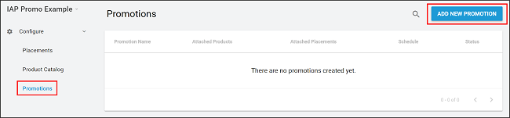
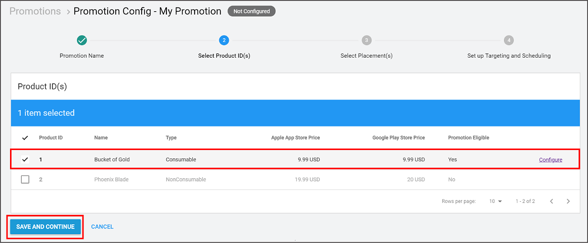
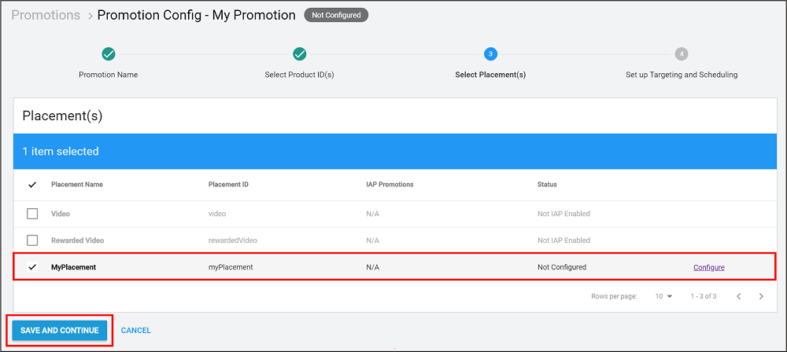
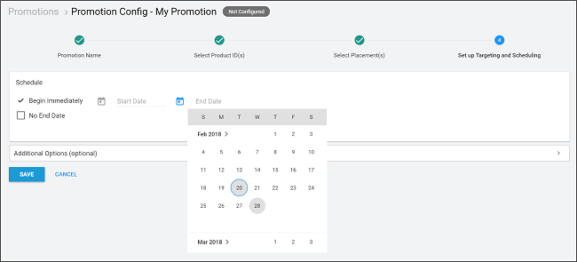

# 推荐 (Promotions)

IAP __推荐__ (Promotions) 与__广告位__ (Placements) 相结合，即可瞄准玩家以根据其独特情况精准投放量身定制的购买机会。__推荐 (Promotion)__ 有三个组件：

* 包含的__商品 (Products)__（请参阅有关[内购推荐商品目录 (IAP Promo Product Catalogs)](https://docs.unity3d.com/Manual/IAPPromoProducts) 的文档）
* 关联的__广告位__（请参阅有关[内购推荐广告位 (IAP Promo Placements)](https://docs.unity3d.com/Manual/IAPPromoPlacements) 的文档）
* 业务逻辑（[下文详述](#BusinessLogic)）

从开发者控制面板 (Developer Dashboard) 中专门创建并管理__推荐 (Promotions)__。

## 创建推荐 (Promotions)
导航至[开发者控制面板 (Developer Dashboard) 的**内购推荐 (IAP Promo)** 部分](https://iap.unityads.unity3d.com)可创建__推荐 (Promotions)__。当前操作的项目会出现在左上角。

要新建__推荐 (Promotion)__，请遵循以下步骤：

1.从左侧导航栏中选择 **Promotions**。此处会显示所有的现有__推荐 (Promotions)__。
2.选择 **ADD NEW PROMOTION**。   
3.为__推荐 (Promotion)__ 命名，然后选择 **SAVE AND CONTINUE** 以展开下一部分。

### 添加商品
下一步，选中要包含在__推荐 (Promotion)__ 中的[商品](https://docs.unity3d.com/Manual/IAPPromoProducts)。单击 **SAVE AND CONTINUE** 以展开下一部分。

**注意**：__广告位__请求会返回要显示的所有可能__商品__的列表。如果所选的__商品__缺少创意资源，则不符合推荐 (Promotion) 条件，因此会被过滤掉。请参阅[内购推荐 (IAP Promo) 概述](https://docs.unity3d.com/Manual/IAPPromo)的**机器学习**部分以了解更多信息。

### 添加广告位
下一步，选中要与__推荐 (Promotion)__ 关联的[广告位](https://docs.unity3d.com/Manual/IAPPromoPlacements)。单击 **SAVE AND CONTINUE** 以展开下一部分。

**注意**：多个__广告位__可以针对同一个__推荐 (Promotion)__，反之亦然。

 
### 定义业务逻辑
指定__推荐 (Promotion)__ 的有效期。这是必需步骤。如果是无限持续时间，请选中 **Begin Immediately** 和 **No End Date**，否则请选择日历图标以指定开始日期和结束日期。

**Note**: Selected dates trigger at midnight, according to the device’s local time zone.

展开 **Additional Options** 菜单可显示更多有针对性的推荐策略。

1.**Operating System** 按 iOS 或 Android 设备过滤目标玩家。
2.**Territory** 按国家或地区过滤目标玩家。
3.**Life-to-Date Revenue** 按目标玩家截至目前在游戏中通过应用内购 (IAP) 花费的金额来过滤目标玩家（例如，__推荐 (Promotion)__ 可以瞄准非付费玩家或花费超过 100 美元的玩家）。

选择 **SAVE** 以完成__推荐 (Promotion)__ 的配置。

You can view each Promotion’s number of __Products__, active period, and active status from the **Promotions** tab of the left navigation bar. You can also edit a __Promotion__ at any time by clicking on it, and easily navigate between configuration steps using the timeline at the top of the menu. 

 
 

-----
* 2018-03-01  Page published with [editorial review](DocumentationEditorialReview.html)

