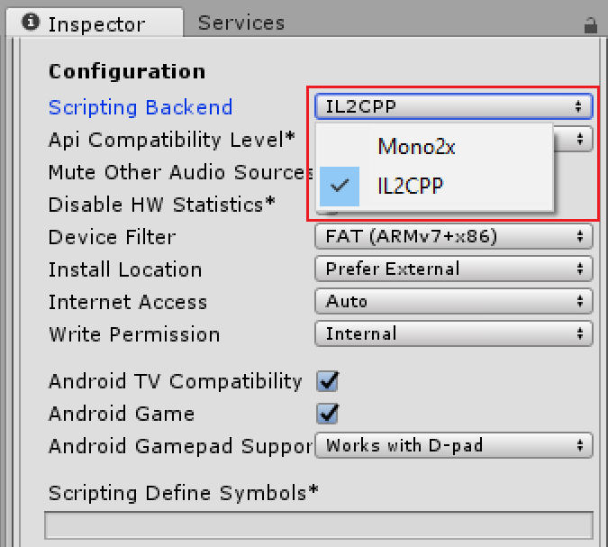

# 使用 IL2CPP 来构建项目

要使用 IL2CPP 构建项目，请打开 [Build Settings](BuildSettings.html) 窗口 (__File __> __Build Settings__)。选择要构建的目标平台，然后单击 __Player Settings...__ 在 [Inspector](UsingTheInspector.html) 中打开 [PlayerSettings](class-PlayerSettings.html) 窗口。

在[目标平台](PlatformSpecific.html)的 PlayerSettings 窗口中，向下滚动到 __Configuration__ 部分。对于 __Scripting Backend__，选择 __IL2CPP__。

在 Scripting Backend 中选择 IL2CPP 后，单击 Build Settings 窗口中的 __Build__。Unity 开始将 C# 代码和程序集转换为 C++，然后为目标平台生成二进制文件。
