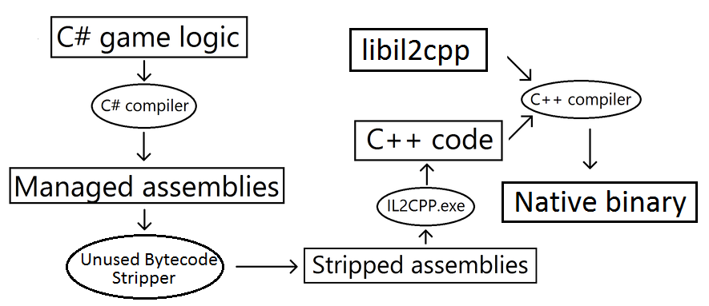

# IL2CPP 的工作原理

使用 [IL2CPP](IL2CPP.html) 开始构建时，Unity 会自动执行以下步骤：

1.Unity Scripting API 代码编译为常规 .NET DLL（托管程序集）。

2.所有不属于脚本的托管程序集（如插件和基类库）都由名为“未用字节码剥离器”(Unused Bytecode Stripper) 的 Unity 工具进行处理，该工具会查找所有未使用的类和方法，并将它们从这些 DLL（动态链接库）中删除。此步骤可显著减小构建的游戏大小。

3.所有托管程序集随后转换为标准 C++ 代码。

4.生成的 C++ 代码和 IL2CPP 的运行时部分由本机平台编译器进行编译。

5.最后，代码链接到可执行文件或 DLL，具体取决于目标平台。

IL2CPP 提供了一些有用的选项；可通过脚本中的属性来控制这些选项。请参阅有关[平台相关的编译](PlatformDependentCompilation.html)的文档以了解更多信息。
