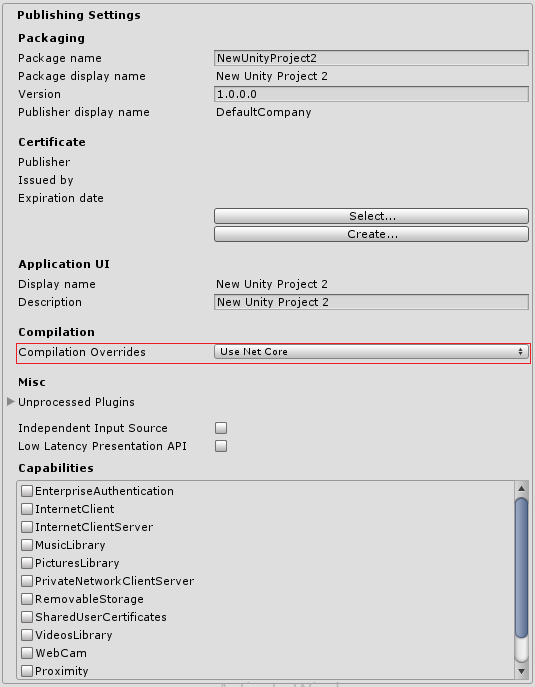

# Windows 运行时支持

Unity 包含对通用 Windows 平台和 Xbox One 平台上的 [IL2CPP](IL2CPP.html) 的 Windows 运行时支持。通过使用 Windows 运行时支持，可直接从托管代码（脚本和 DLL）调用本机系统 Windows 运行时 API 以及自定义的 .winmd 文件。

要在 IL2CPP 中自动启用 Windows 运行时支持，请访问 PlayerSettings (__Edit__ > __Project Settings__ > __Player__)，导航到 __Configuration__ 部分，并将 __Api Compatibility Level__ 设置为 __.NET 4.6__。


启用 Windows 运行时支持后，Unity 会自动引用 Windows 运行时 API（例如，通用 Windows 平台上的 _Windows.winmd_）。要使用自定义 .winmd 文件，请将它们（以及所有附带的 DLL）导入 Unity 项目文件夹。然后，使用 [Plugin Inspector](PluginInspector.html) 为目标平台配置这些文件。


在 Unity 项目的[脚本](ScriptingSection.html)中，可使用 `ENABLE_WINMD_SUPPORT` #define 指令来检查项目是否启用了 Windows 运行时支持。应在调用 .winmd Windows API 或自定义 .winmd 脚本之前使用此选项，从而确保它们可以运行并确保与 Windows 无关的所有脚本都会忽略它们。请注意，这仅在 C# 脚本中受支持。请参阅以下示例。

**示例**

**`C#`**

````
void Start() {
  #if ENABLE_WINMD_SUPPORT
    Debug.Log("Windows Runtime Support enabled");
    // 在此处放置对自定义 .winmd API 的调用
  #endif
}
````

除了在 IL2CPP 中启用 Windows 运行时支持时进行定义，也可在 .NET 中将 __Compilation Overrides__ 设置为 __Use Net Core__ 时进行定义。



---

<span class="page-edit">• 2017-05-16  Page amended with no [editorial review](DocumentationEditorialReview.html)
</span><br/>
