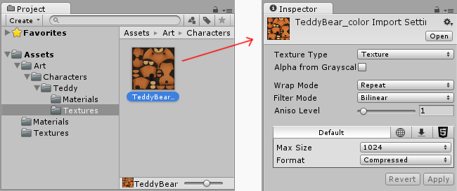
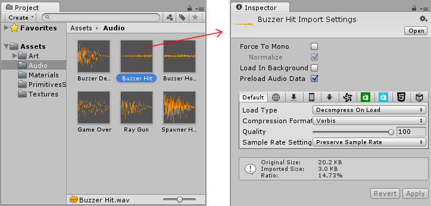

# 导入

若要将在 Unity 外部创建的资源导入 Unity 项目，可以将文件直接导出到项目下的 Assets 文件夹中，或将其复制到该文件夹中。对于许多常见格式，可以将源文件直接保存到项目的 Assets 文件夹中，Unity 可以读取它。Unity会检测到被更新的文件并重新导入。

创建 Unity 项目时将创建一个文件夹（以项目命名），其中包含以下子文件夹：

将需要在项目中使用的文件保存或复制到 Assets 文件夹中。可以使用 Unity 内的 __Project 窗口__来查看 Assets 文件夹的内容。因此，如果将文件保存或复制到 Assets 文件夹，Unity 将导入该文件并显示在 Project 窗口中。

Unity 会在文件添加到 Assets 文件夹时自动检测到这些文件，或在修改文件时检测到修改。将任何资源放入 Assets 文件夹时，该资源将显示在 __Project 视图__中。

将计算机中（从 Mac 上的 Finder 或 Windows 上的资源管理器）的文件拖入 Unity 的 Project 窗口，Unity 会将该文件*复制*到 Assets 文件夹中，然后它将显示在 Project 窗口中。

Project 窗口中显示的项（在大多数情况下）表示计算机上的实际文件，如果在 Unity 中删除它们，则也会从计算机中删除它们。

上图显示了 Unity 项目的 Assets 文件夹中的一些文件和文件夹示例。根据需要创建任意数量的文件夹用来组织资源。

上图显示了文件系统中列出的 **.meta** 文件，但这些文件在 Unity 的 Project 窗口中不可见。Unity 会为每个资源和文件夹创建这些 .meta 文件（元文件），但这些文件默认情况下为[隐藏](https://en.wikipedia.org/wiki/Hidden_file_and_hidden_directory)状态，因此在文件系统中也看不到它们。

元文件中包含有关资源在项目中的使用方式的重要信息，必须将元文件与其相关的资源文件放在一起，因此，如果在文件系统中移动或重命名资源文件，也必须移动/重命名元文件以进行匹配。

安全移动或重命名资源的最简单方法是始终在 Unity 的 Project 文件夹中执行此操作。这样，Unity 就会自动移动或重命名相应的元文件。如果需要，可以进一步了解 .meta 文件和[导入过程中的后台工作情况](BehindtheScenes.html)。

如果要将资源集合带入项目中，可使用[资源包](AssetPackages.html)。

## 检查资源

Unity 支持的每种类型的资源都有一组导入设置，这些设置会影响资源的显示或行为方式。要查看资源的导入设置，请在 __Project 视图__中选择该资源。该资源的导入设置将显示在 __Inspector__ 中。显示的选项因所选资源的类型而异。

例如，在Unity图像的导入设置中，可选择将其导入为纹理、2D 精灵还是法线贴图。在 FBX 文件的导入设置中，可调整比例、生成法线或光照贴图坐标以及拆分和修剪文件中定义的动画剪辑。

对于其他资源类型，导入设置不同。具体显示的各种设置与所选资源的类型相关。以下是音频资源的示例，其相关的导入设置显示在 Inspector 中：

对于正在开发的跨平台项目，可以覆盖“默认”设置并根据每个具体平台分配不同的导入设置。

## 另请参阅：

* [资源包](AssetPackages.html)
* [材质和着色器](Materials.html)
* [纹理和视频](Textures.html)
* [精灵编辑器 (Sprite Editor)](SpriteEditor.html)
* [精灵打包器 (Sprite Packer)](SpritePacker.html)
* [音频文件](AudioFiles.html)
* [音轨模块](TrackerModules.html)

---

*  2018-04-25  Page amended with limited [editorial review](DocumentationEditorialReview.html)

