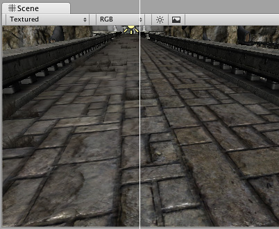

# 导入纹理

本页面将提供有关使用 Unity Editor [纹理导入器 (Texture Importer)](class-TextureImporter.html) 导入[纹理](Textures.html)的详细信息和提示。向下滚动或选择您想要了解的部分。

* [支持的文件格式](#Formats)
* [HDR 纹理](#HDRTextures)
* [纹理大小](#TextureSizes)
* [UV 贴图](#UVmapping)
* [Mipmap](#Mipmaps)
* [法线贴图](#Normalmaps)
* [细节贴图](#Detailmaps)
* [反射（立方体贴图）](#Reflections)
* [各向异性过滤](#AnisotropicFiltering)

 
## 支持的文件格式

Unity 可读取以下文件格式：

* BMP
* EXR
* GIF
* HDR
* IFF
* JPG
* PICT
* PNG
* PSD
* TGA
* TIFF

请注意，Unity 可导入多层 PSD 和 TIFF 文件；它们在导入时自动展平，但图层在资源本身中维护。这意味着在本机使用这些文件类型时，您不会丢失任何工作。这很重要，因为只需一个纹理副本即可在不同的应用程序（Photoshop、3D 建模应用程序以及 Unity）中使用纹理。

 
## HDR 纹理

从包含 HDR 信息的 EXR 或 HDR 文件导入时，[纹理导入器](class-TextureImporter.html)会自动为输出纹理选择正确的 HDR 格式。此格式会根据您要构建的目标平台自动更改。

 
## 纹理尺寸大小

理想情况下，纹理尺寸大小应该是每边为 2 的幂（即 2、4、8、16、32、64、128、256、512、1024、2048 像素 (px)，以此类推）。纹理不必是正方形；也就是宽度可与高度不同。
请注意，特定平台可能会限定最大纹理尺寸大小。对于 DirectX，不同功能级别的最大纹理大小如下：

| 图形 API/功能级别| 最大 2D 和立方体贴图纹理尺寸大小（像素） |
|:---|:---| 
| DX9 着色器模型 2（2004 年前的 PC GPU）/OpenGL ES 2.0| 2048 |
| DX9 着色器模型 3（2006 年前的 PC GPU）/Windows Phone DX11 9.3 级别/OpenGL ES 3.0| 4096 |
| DX10 着色器模型 4/GL3（2007 年前的 PC GPU）/OpenGL ES 3.1| 8192 |
| DX11 着色器模型 5/GL4（2008 年后的 PC GPU）| 16384 |

**注意：**

* 纹理导入器仅允许您选择最大为 8K 的尺寸大小（即 8192 x 8192 像素）。
* 对于立方体贴图，Mali-Txxx GPU（请参阅 [Wikipedia](https://en.wikipedia.org/wiki/Mali_(GPU))）和 OpenGL ES 3.1 ([www.opengl.org](http://www.opengl.org)) 仅支持最高 4096 像素的纹理尺寸大小。

在 Unity 中允许使用 NPOT（非 2 的幂）纹理大小；但是，NPOT 纹理大小通常需要稍微多一点的内存，并且 GPU 的采样速度可能更慢，因此，只要有可能，最好使用 2 的幂大小以提高性能。如果平台或 GPU 不支持 NPOT 纹理大小，Unity 会对纹理进行缩放和填充以达到下一个 2 的幂大小。此过程会使用更多内存并使加载速度变慢（尤其是在较旧的移动设备上）。通常，只应将 NPOT 大小用于 GUI 用途。

您可以使用纹理导入器的 __Advanced__ 部分中的 __Non Power of 2__ 选项在导入时放大 NPOT 纹理资源。

 
## UV 贴图

将 2D 纹理映射到 3D 模型上时，3D 建模应用程序会执行一种称为 UV 贴图的包裹。在 Unity 内部，可使用[材质](class-Material.html)来缩放和移动纹理。缩放法线贴图和细节贴图特别有用。

 
## Mipmap

Mipmap 是图像逐渐减小版本的列表，用于优化实时 3D 引擎的性能。远离摄像机的对象使用较小的纹理版本。使用 Mipmap 会多占用 33% 的内存，但不使用它们会导致巨大的性能损失。游戏中的[纹理](Textures.html)应当始终使用 Mipmap；唯一的例外是变小的纹理（例如，GUI 纹理、[天空盒](class-Skybox.html)、游标和剪影）。Mipmap 对于避免许多形式的纹理锯齿和闪烁也是必不可少的。

 
## 法线贴图

法线贴图由法线贴图着色器用于使简单多边形模型看起来好像包含更多细节。Unity 使用编码为 RGB 图像的法线贴图。您也可以选择从灰度高度贴图图像生成法线贴图。

 
## 细节贴图

如果您想创建地形，通常要使用主纹理来显示地形的各个区域，如草地、岩石和沙地。如果地形很大，可能会变得非常模糊。细节纹理通过在靠近主纹理时淡入小细节来隐藏这一情况。

绘制细节纹理时应注意，中性灰色不可见，白色使主纹理变亮两倍，黑色使主纹理完全变黑。

请参阅有关[辅助贴图（细节贴图）](StandardShaderMaterialParameterDetail.html)的文档以了解更多信息。

 
## 反射（立方体贴图）

要将纹理用于反射贴图（例如在[反射探针](class-ReflectionProbe.html)或立方体贴图的[天空盒](class-Skybox.html)中），请将 __Texture Shape__ 设置为 __Cube__。请参阅有关[立方体贴图纹理](class-Cubemap.html)的文档以了解更多信息。

 
## 各向异性过滤

各向异性过滤可提高从掠射角观察时的纹理质量。此渲染在显卡上非常消耗资源。提高各向异性水平通常对于地面和地板纹理而言是一种很好的做法。请使用[质量设置 (Quality Settings)](class-QualitySettings.html) 强制对所有纹理进行各向异性过滤或完全禁用该功能。

