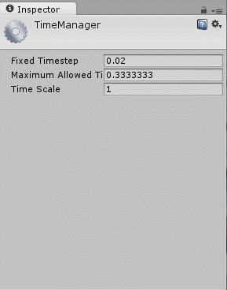
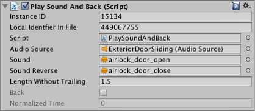

#Inspector 选项

Inspector Lock 和 Inspector Debug 模式是两个有助于完成工作流程的选项。

##Lock

通常，Inspector 显示当前所选对象的详细信息，但有时需要在使用其他对象时将一个对象保留在 Inspector 中。为实现此目的，Inspector 提供了 _Lock_ 模式，使用 Inspector 窗口右上角的小挂锁图标即可激活该模式。

请注意，可以同时打开多个 Inspector（菜单：Inspector 选项卡菜单的 __Add Tab__），这样就可以保持一个 Inspector 锁定并使用第二个 Inspector 来显示当前选择的对象。下面的示例演示了如何添加新选项卡并将其锁定以使其保留所需视图（在本例中为 Time Manager 编辑器设置）。结果是两个 Inspector 窗口都可见，每个窗口显示不同的内容。

##Debug/Normal 模式

选项卡菜单上的另一个选项是在 _Normal_ 模式和 _Debug_ 模式之间选择。通常，Inspector 会显示资源或组件的自定义编辑器（如有），但有时直接查看属性会很方便。Debug 模式只显示属性而不显示自定义编辑器，对于脚本，该模式还显示私有变量（但是这些变量的值不能像公共变量的值那样进行编辑）。

与 Lock 模式一样，Debug/Normal 模式分别应用于每个 Inspector，因此可以同时打开两个 Inspector 来查看两个视图。
