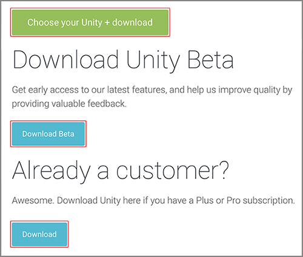
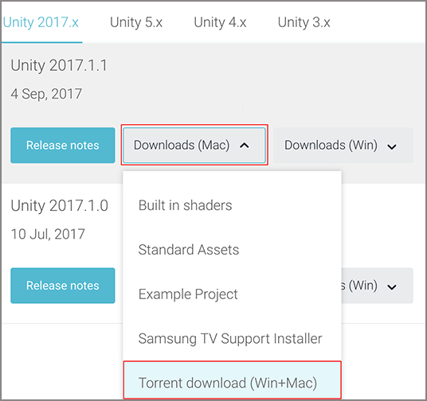

# 在没有 Hub 的情况下安装 Unity

从 [Unity 下载页面](https://unity3d.com/get-unity/download).下载并安装 Unity Editor。本页面针对最新完整发行版以及最新测试版的 Unity 提供了 Unity 安装程序下载链接。如果需要 Unity Plus 或 Pro 许可证，首先需要确认许可证的详细信息（席位数、付款计划等）。

[Unity 下载页面](https://unity3d.com/get-unity/download)提供以下选项：





在 Unity 下载页面上，选择所需的 Unity 安装程序版本。

## Unity 安装程序

Unity 安装程序是一个小型的可执行程序（大小约为 1 MB），可选择要下载和安装 Unity Editor 的哪些组件。

如果不确定要安装哪些组件，请保留默认选择，单击 **Continue**，并遵循安装程序的说明。


**注意**：在 PC 上还有一个 Microsoft Visual Studio Community 2017 的额外选项。

## 在没有 Unity 安装程序的情况下安装 Unity

如果您愿意，可以单独下载并安装所有组件，而无需使用 Unity 安装程序。这些组件是普通的安装程序可执行程序和软件包，因此可能会发现使用安装程序其实更加简单（尤其如果您是 Unity 新用户的情况下）。某些用户（例如希望在组织中自动部署 Unity 的用户）可能更喜欢从命令行安装。

### 在 Windows 上从命令行安装 Unity

如果要在组织中自动部署 Unity，可以从命令行安装 Editor。

从 Windows 上的命令行安装 Editor 和其他组件时，请使用以下选项。

**注意**：安装程序命令行参数区分大小写。

#### Unity Editor 安装

| 命令| 详细信息 |
|:---|:---|
|__/S__|执行静默（不提出问题）安装。|
|__/D=PATH__|设置默认安装目录。与静默安装选项结合使用时很有用。默认文件夹是 **C:\Program Files (x86)\Unity**（32 位）或 **C:\Program Files\Unity**（64 位）。|

**示例**：

````
UnitySetup64.exe /S /D=E:\Development\Unity
````

此示例将 Unity 静默安装到 **E:\Development\Unity** 文件夹，这将是 Unity 安装的根文件夹。在此情况下，Editor 可执行文件将安装在 **E:\Development\Unity\Editor\Unity.exe** 中。`/D` 参数必须在最后且没有引号（即使路径包含空格）。

#### Unity Editor 卸载

要执行静默卸载，请从命令行或脚本中运行 `Uninstall.exe /S`。

**注意**：虽然该过程立即完成，但是实际删除文件需要几秒钟。这是因为卸载程序会被复制到临时位置以便能够自行删除。此外，请确保工作目录不在 Unity 安装位置内，因为如果在其中，将无法删除该文件夹。

#### 标准资源 (Standard Assets) 安装

要静默安装标准资源，请执行以下命令：

````
UnityStandardAssetsSetup.exe /S /D=E:\Development\Unity
````

**注意**：如果指定文件夹，请使用 Unity 根文件夹（即，包含 Editor 文件夹的文件夹，而不是 __Unity.exe__ 的安装文件夹）。

#### 示例项目安装

要静默安装示例项目，请使用：

````
UnityExampleProjectSetup.exe /S /D=E:\Development\Unity
````

**注意**：默认文件夹是 `C:\Users\Public\Documentation\Unity Projects\Standard Assets Example Project`。

### 在 OS X 上从命令行安装 Unity

各 Unity 安装程序均以 .pkg 文件形式提供，可以使用 `installer` 命令来进行安装，如下所述。

#### Unity Editor 安装

要将 Editor 安装到指定目标卷上的 `/Applications/Unity` 文件夹中，请输入：

````
sudo installer [-dumplog] -package Unity.pkg -target /
````

#### 标准资源 (Standard Assets) 安装

要将标准资源安装到指定卷上的 `/Applications/Unity/Standard Assets` 文件夹中，请输入：

````
sudo installer [-dumplog] -package StandardAssets.pkg -target /
````

#### 示例项目安装

要将示例项目安装到指定卷上的 `/Users/Shared/Unity/Standard-Assets` 文件夹中，请输入：

````
sudo installer [-dumplog] -package Examples.pkg -target /
````

<a name="#TorrentDownload"></a> 
## Torrent 下载

如果希望通过 BitTorrent 客户端下载 Unity，可从 [Unity 下载存档页面](http://unity3d.com/get-unity/download/archive)获取 Torrent 链接。并非所有版本都支持 Torrent 下载。如果某个版本能以 torrent 方式下载，__Downloads__ 下拉菜单中将显示 __Torrent download (Win+Mac)__ 选项。



## 一次安装多个版本

可以在同一台计算机上安装任意数量的 Unity 版本。

在 Mac 上，安装程序创建一个名称为 __Unity__ 的文件夹，并用此名称覆盖任何现有文件夹。如果在 Mac 上需要多个版本的 Unity，请在安装其他版本之前重命名现有的 __Unity__ 文件夹。

在 PC 上，将安装文件夹始终命名为 __Unity X.Y.Z[fp]W__，其中 __f__ 表示正式版，而 __p__ 用于标记补丁版本。

强烈建议在重命名 Unity 文件夹时以合乎逻辑的命名方式指定新文件夹的名称（例如，将版本号添加到名称的末尾）。请注意，指向脱机文档的任何现有快捷方式、别名和链接可能不再指向旧版本的 Unity。这对脱机文档而言尤其令人困惑；如果突然发现脱机文档的浏览器书签不再有效，请检查书签是否在 URL 中具有正确的文件夹名称。

---

* <span class="page-edit">2018-06-12 Page amended with [editorial review](DocumentationEditorialReview.html)
</span>

* <span class="page-history">在 Unity 2017.2 版中更新了安装建议</span>

* <span class="page-history">在 Unity 2017.4 版中更新了安装建议</span>
