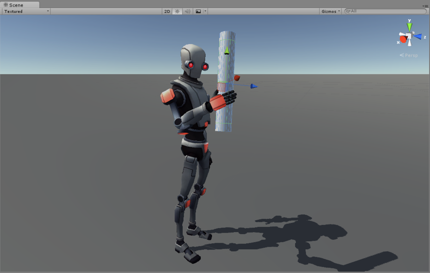
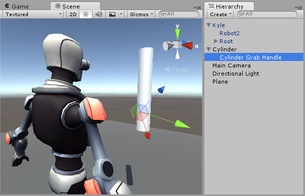
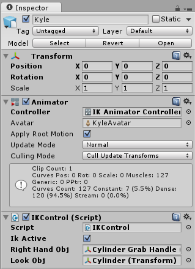

反向动力学
==================


大多数动画是通过将骨架中的关节角度旋转到预定值来生成的。子关节的位置根据父关节的旋转而改变，因此可从父关节包含的各个关节的角度和相对位置来确定关节链的终点。这种构建骨架的方法被称为**正向动力学**。

然而，从相反视角看待构建关节的任务通常很有用：在空间中选择一个位置后，向后找到一种有效的关节定位方法，使终点落在该位置。如果您希望角色触摸位于用户选定位置的对象或让角色的双脚牢牢扎入不平坦的表面，这种方法可能很有用。此方法称为__反向动力学__ (IK)，可在 Mecanim 中用于_已正确配置的任何人形Avatar骨骼。


 

要为角色设置 IK，通常要在场景周围放置与角色互动的对象，然后通过脚本（尤其是，诸如
[SetIKPositionWeight](../ScriptReference/Animator.SetIKPositionWeight.html)、
[SetIKRotationWeight](../ScriptReference/Animator.SetIKRotationWeight.html)、
[SetIKPosition](../ScriptReference/Animator.SetIKPosition.html)、
[SetIKRotation](../ScriptReference/Animator.SetIKRotation.html)、
[SetLookAtPosition](../ScriptReference/Animator.SetLookAtPosition.html)、
[bodyPosition](../ScriptReference/Animator-bodyPosition.html)、
[bodyRotation](../ScriptReference/Animator-bodyRotation.html)之类的 Animator 函数）来设置 IK

在上图中，我们展示了一个抓住圆柱形物体的角色。我们如何将其实现？

我们从拥有有效的 Avatar角色开始。

下一步创建 Animator Controller，使其包含该角色的至少一个动画。然后，在 Animator 窗口的 Layers 面板中，单击层的齿轮设置图标，并选中弹出框中的 IK Pass 复选框。


确保已将 Animator Controller 分配给角色的 Animator 组件 (Animator Component)：


接下来，为其附加一个实际处理 IK 的脚本，将此脚本命名为 __IKControl__。此脚本为角色的右手设置 IK 目标，并设置角色的观察位置以使其观看所持物体：


````
using UnityEngine;
using System;
using System.Collections;

[RequireComponent(typeof(Animator))] 

public class IKControl : MonoBehaviour {
	
	protected Animator animator;
	
	public bool ikActive = false;
	public Transform rightHandObj = null;
	public Transform lookObj = null;

	void Start () 
	{
		animator = GetComponent<Animator>();
	}
	
	// 用于计算 IK 的回调
	void OnAnimatorIK()
	{
		if(animator) {
			
			// 如果 IK 处于活动状态，请将位置和旋转直接设置为目标。
			if(ikActive) {

				// 设置观察目标位置（如果已分配）
				if(lookObj != null) {
					animator.SetLookAtWeight(1);
					animator.SetLookAtPosition(lookObj.position);
				}    

				// 设置右手目标位置和旋转（如果已分配）
				if(rightHandObj != null) {
					animator.SetIKPositionWeight(AvatarIKGoal.RightHand,1);
					animator.SetIKRotationWeight(AvatarIKGoal.RightHand,1);  
					animator.SetIKPosition(AvatarIKGoal.RightHand,rightHandObj.position);
					animator.SetIKRotation(AvatarIKGoal.RightHand,rightHandObj.rotation);
				}        
				
			}
			
			// 如果 IK 未处于活动状态，请将手和头部的位置和旋转设置回原始位置
			else {          
				animator.SetIKPositionWeight(AvatarIKGoal.RightHand,0);
				animator.SetIKRotationWeight(AvatarIKGoal.RightHand,0); 
				animator.SetLookAtWeight(0);
			}
		}
	}    
}


````

因为我们不打算让角色的手伸到物体内部中心（圆柱的轴心点），所以放置一个空的子对象（在此情况下，命名为“Cylinder Grab Handle”（圆柱抓握把手）），确保手应该放在圆柱上，并将其相应旋转。然后，这只手瞄准此子对象。



然后，应将此“抓握把手”游戏对象分配为 IKControl 脚本的“Right Hand Obj”属性

在此示例中，我们把观察目标设置为圆柱本身，因此即使把手靠近底部，角色也会直接看向物体的中心。


 

进入播放模式，然后应该会看到 IK 变为现实。单击 __IKActive__ 复选框时，观察角色抓取和放开物体，并尝试在播放模式中四处移动圆柱以观察手臂和手跟随物体移动的情况。

