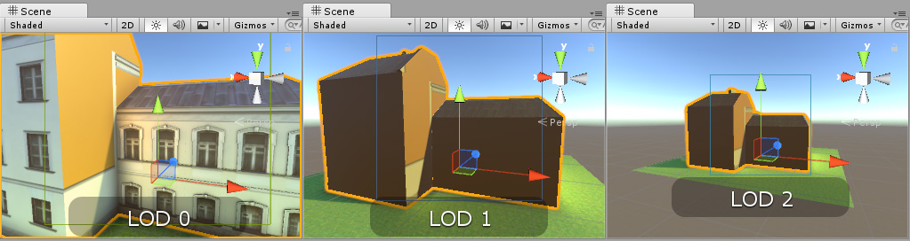
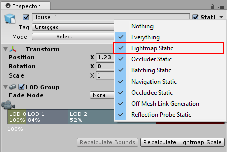
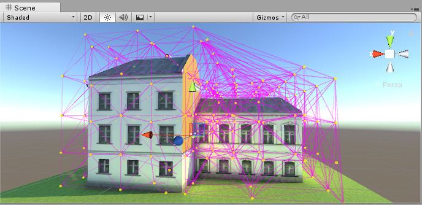

# 烘焙光照贴图的 LOD（细节级别）

本页面提供关于如何将光照烘焙到采用 Unity [LOD（细节级别）](LevelOfDetail.html)系统的模型上的相关建议。

在支持烘焙光照的场景中使用 Unity 的 LOD 系统时，该系统会将细节级别组 (LOD Group) 中细节级别最高的模型按照普通静态模型的方式照亮。系统采用光照贴图来进行直接光照和间接光照，并对实时 GI（全局光照）采用不同的光照贴图。

使用 Enlighten 光照贴图时，系统只烘焙直接光照，而 LOD 系统依靠[光照探针](LightProbes.html)对间接光照进行采样。

要确保 LOD 较低的模型在烘焙光源下看起来正确无误，必须将光照探针置于模型周围，从而在烘焙过程中捕捉间接光照。否则，LOD 较低的模型就只接受直射光，显得不真实：

要正确设置烘焙光照的 LOD 模型，应将 LOD 游戏对象标记为 __Lightmap Static__。为此，请选择游戏对象，然后在 Inspector 窗口顶部选择 __Static__ 复选框旁边的下拉菜单：

使用[光照探针组件](LightProbes.html)将光照探针置于 LOD 游戏对象周围。

**注意**：只有细节级别最高的模型会影响周围几何体的光照（比如，周围建筑的阴影或者反射光）。大部分情况下，这应该不是问题，因为较低细节级别的模型与最高细节级别的模型应该是高度相似的。

使用 __Progressive Lightmapper（渐进光照贴图）__时，无需在 LOD 组周围放置光照探针来产生烘焙的间接光照。但是，要让实时 GI 影响 LOD 组中的渲染器，就必须使用光照探针。

---

* 2017-10-20  Page amended with [editorial review](DocumentationEditorialReview.html)

* 5.6 版更新

* 2017.3 版更新
