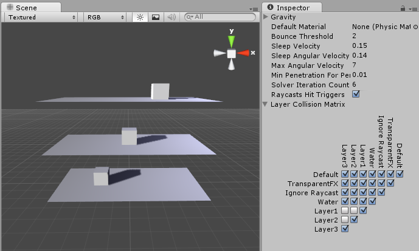

#基于层的碰撞检测

通过基于层的碰撞检测，可以让某个游戏对象与另一个设置为特定层或多个层的游戏对象发生碰撞。

上图显示了 Scene 视图中的六个游戏对象（3 个平面，3 个立方体），窗口右侧显示了 __Layer Collision Matrix（层碰撞矩阵）__。Layer Collision Matrix 定义了哪些游戏对象与哪些层碰撞。

在此示例中，Layer Collision Matrix 设置为只有属于相同层的游戏对象才能碰撞：

* 层 1 仅选中层 1
* 层 2 仅选中层 2
* 层 3 仅选中层 3

可更改此设置以适合您的需求：例如，如果您希望层 1 与层 2 和 3 碰撞，而不是与层 1 碰撞，请找到 __Layer 1__ 的行，然后选中 __Layer 2__ 和 __Layer 3__ 列的框，并将 __Layer 1__ 列的复选框留空。

##设置基于层的碰撞检测

1.要选择游戏对象所属的层，请选择该游戏对象，找到 Inspector 窗口，选择顶部的 __Layer__ 下拉选单，然后选择一个层，或者添加新层。针对每个游戏对象重复以上操作，直到全部将游戏对象分配到层。

1.在 Unity 菜单栏中，选择 __Edit__ > __Project Settings__ > __Physics__ 以打开 __Physics Manager__ 窗口。
1.选择碰撞矩阵中的哪些层将与其他层交互（勾选相应层即可）。
  
