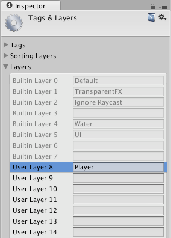

层
======


__层__主要有两种用途：由__摄像机__用来仅渲染场景的某一部分；由__光源__用来仅照亮场景的某些部分。但是，层也可以供射线投射用于选择性地忽略碰撞体或创建[碰撞](LayerBasedCollision.html)。


创建层
---------------


第一步是创建一个新层，随后我们可以将这个层分配给__游戏对象__。要创建新层，请打开 Edit 菜单，然后选择 __Project Settings &gt; Tags and Layers__。

我们可以在某个空用户层中创建一个新层。我们选择第 8 层。


 


分配层
----------------


创建新层后，必须将该层分配到某个游戏对象。


 

在标签管理器中，我们将 Player 层分配到了第 8 层中。


通过摄像机的剔除遮罩功能仅绘制场景的某一部分
---------------------------------------------------------------


利用摄像机的剔除遮罩，您可以选择性地渲染位于某一特定层中的对象。
为此，请选择需要部分渲染对象的摄像机。

通过在剔除遮罩属性中选中或取消选中某些层来修改剔除遮罩。


 

请注意，不会剔除 UI 元素。屏幕空间画布子项会不受摄像机的剔除遮罩影响。


选择性投射光线
------------------------


通过使用层，您可以投射光线并忽略特定层中的碰撞体。
例如，您可能希望仅对玩家层投射光线并忽略所有其他碰撞体。

Physics.Raycast 函数获取位掩码，在位掩码中，每个位确定该层是否将被忽略。
如果 layerMask 中的所有位都启用，那么将可以对所有碰撞体进行碰撞。
如果 layerMask = 0，则投射光线不会发生任何碰撞。


````
// JavaScript 示例。

// 对层的索引进行移位以获取位掩码
var layerMask = 1 << 8;
// 光线是否与玩家层中的任何对象交叉。
if (Physics.Raycast (transform.position, Vector3.forward, Mathf.Infinity, layerMask))
    print ("The ray hit the player");


// C# 示例。

int layerMask = 1 << 8;
		
//光线是否与玩家层中的任何对象相交。
if (Physics.Raycast(transform.position, Vector3.forward, Mathf.Infinity, layerMask))
    Debug.Log("The ray hit the player");


````


然而，在现实世界中，您希望相反的效果。我们想要对玩家层中碰撞体之外的所有碰撞体投射光线。


````
// JavaScript 示例。
function Update () {
  // 对第 8 层的索引进行移位以获取位掩码
  var layerMask = 1 << 8;
  // 这将仅对第 8 层中的碰撞体投射光线。
  // 但我们希望是对第 8 层以外的层进行碰撞。~ 运算符可以执行此操作，此运算符可反转位掩码。
  layerMask = ~layerMask;

  var hit : RaycastHit;
  // 光线是否与玩家层之外的任何对象相交。
  if (Physics.Raycast (transform.position, transform.TransformDirection (Vector3.forward), hit, Mathf.Infinity, layerMask)) {
    Debug.DrawRay (transform.position, transform.TransformDirection (Vector3.forward) * hit.distance, Color.yellow);
    print ("Did Hit");
  } else {
    Debug.DrawRay (transform.position, transform.TransformDirection (Vector3.forward) *1000, Color.white);
    print ("Did not Hit");
  }
}


// C# 示例。
void Update () {
    // 对第 8 层的索引进行移位以获取位掩码
    int layerMask = 1 << 8;
		
    //  这将仅对第 8 层中的碰撞体投射光线。
    // 但我们希望是对第 8 层以外的层进行碰撞。~ 运算符可以执行此操作，此运算符可反转位掩码。
    layerMask = ~layerMask;
	
    RaycastHit hit;
    // 光线是否与玩家层之外的任何对象相交。
    if (Physics.Raycast(transform.position, transform.TransformDirection (Vector3.forward), out hit, Mathf.Infinity, layerMask)) {
        Debug.DrawRay(transform.position, transform.TransformDirection (Vector3.forward) * hit.distance, Color.yellow);
        Debug.Log("Did Hit");
    } else {
        Debug.DrawRay(transform.position, transform.TransformDirection (Vector3.forward) *1000, Color.white);
        Debug.Log("Did not Hit");
    }
}

````

如果您不将 layerMask 传递到 Raycast 函数，则仅忽略使用 IgnoreRaycast 层的碰撞体。
这是在投射光线时忽略某些碰撞体最简单的方法。

__注意__：第 31 层为 Editor 的预览窗口内部机制使用。为了防止冲突，请勿使用此层。

---

* <span class="page-edit">2017-05-08  Page amended with limited [editorial review](DocumentationEditorialReview.html)
</span>

* <span class="page-history">在 Unity 2017.1 版中更新了剔除遮罩信息</span>
