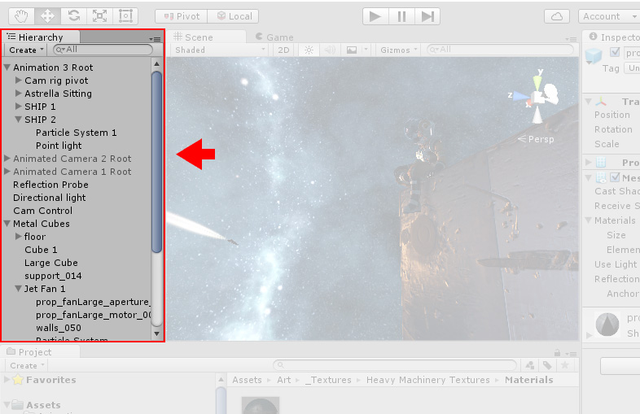

#了解界面

请花一些时间查看并熟悉 Editor 界面。Editor 主窗口由选项卡式窗口组成，这些窗口可重新排列、分组、分离和停靠。

因此，Editor 的外观可能因项目和开发者而异，具体取决于个人偏好以及正在进行的工作类型。

Windows 的默认布局目标是便于实际访问最常用的窗口。如果还不熟悉 Unity 中的不同窗口，可通过选项卡中的名称识别它们。最常见和最有用的窗口显示在默认位置，如下所示：

 

  
  &nbsp;
    
-------
  
  &nbsp;
    
##Project 窗口
 

**Project 窗口**显示可在项目中使用的资源库。将资源导入项目时，它们会显示在此处。
请了解有关 [Project 窗口](ProjectView.html)的更多信息。
  
  &nbsp;
    
-------
  
  &nbsp;
     
##Scene 视图
 

**Scene 视图**可用于直观导航和编辑场景。根据正在处理的项目类型，Scene 视图可显示 3D 或 2D 透视图。
请了解有关 [Scene 视图](UsingTheSceneView.html)和 [Game 视图](GameView.html)的更多信息。
  
  &nbsp;
    
-------
  
  &nbsp;
    
##Hierarchy 窗口
 

**Hierarchy 窗口**是场景中每个对象的分层文本表示形式。场景中的每一项都在层级视图中有一个条目，因此这两个窗口本质上相互关联。层级视图显示了对象之间相互连接的结构。
请了解有关 [Hierarchy 窗口](Hierarchy.html)的更多信息。
  
  &nbsp;
    
-------
  
  &nbsp;
    
##Inspector 窗口
 

**Inspector 窗口**可用于查看和编辑当前所选对象的所有属性。由于不同类型的对象具有不同的属性集，因此 Inspector 窗口的布局和内容会有所不同。
请了解有关 [Inspector 窗口](UsingTheInspector.html)的更多信息。
  
  &nbsp;
    
-------
  
  &nbsp;
   
工具栏   

**工具栏**提供对最基本工作功能的访问。左侧包含用于操作 Scene 视图及其中对象的基本工具。中间是播放、暂停和步进控制工具。右侧的按钮用于访问 Unity 云服务和 Unity 帐户，然后是层可见性菜单，最后是 Editor 布局菜单（提供一些备选的 Editor 窗口布局，并允许保存自定义布局）。

工具栏不是窗口，是 Unity 界面中唯一无法重新排列的部分。

请了解有关[工具栏](Toolbar.html)的更多信息。
