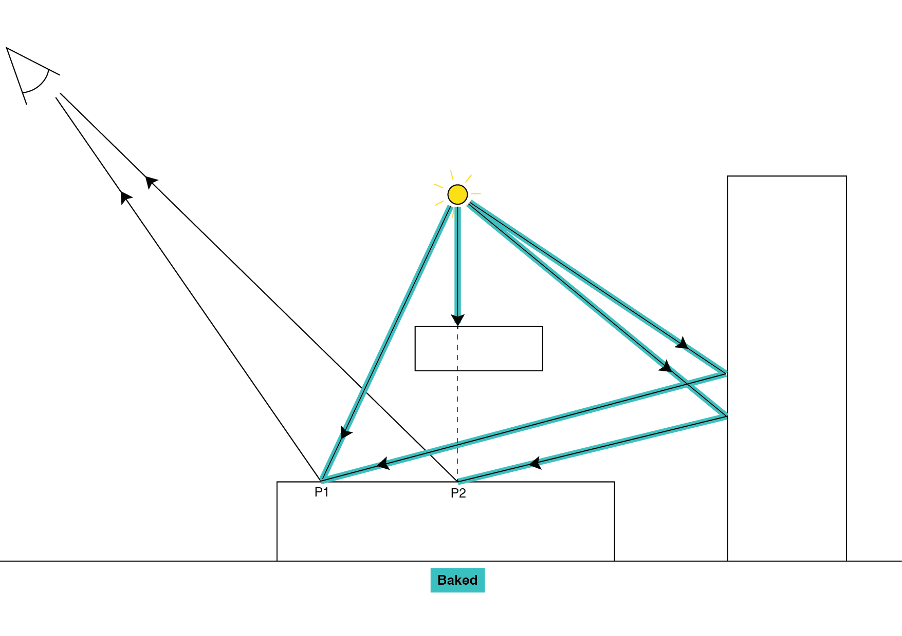

# 烘焙光照

烘焙光源是 __Mode__ 属性设置为 __Baked__ 的[光源组件](class-Light.html)。

如果光源用于烘托局部氛围，则应使用__烘焙 (Baked)__ 模式光源，而非全功能光源。Unity 在运行时之前预先计算这些光源产生的光照，而不会将这些光源包括在任何运行时光照计算中。这意味着烘焙光源没有运行时开销。

Unity 会将烘焙光源的直射光照和间接光照烘焙到[光照贴图](LightmappingDirectional.html)（用于照亮静态游戏对象）和[光照探针](LightProbes.html)（用于照亮动态光照游戏对象）。即使在动态游戏对象上，烘焙光源也无法发出镜面光照（请参阅 [Wikipedia：镜面高光 (Specular highlight)](https://en.wikipedia.org/wiki/Specular_highlight) 以了解更多信息）。烘焙光源不会因为玩家所采取的动作或场景中发生的事件而更改。它们主要用于增加暗区的亮度，而无需调整场景中的所有光照。

烘焙光源也是唯一的一种无法让动态游戏对象在其他动态游戏对象上投射阴影的光源类型。

## 烘焙光照的优点

* 在光照贴图中，静态游戏对象可在静态游戏对象上投射高质量阴影，无需额外成本。

* 提供间接光照。

* 仅凭从着色器中的光照贴图获取的一个纹理即可形成静态游戏对象的所有光照。

## 烘焙光照的缺点

* 没有实时直接光照（即没有镜面反射光照效果）。

* 动态游戏对象不会在静态游戏对象上产生阴影。

* 只能通过光照探针从静态游戏对象向动态游戏对象投射低分辨率阴影。

* 与光照贴图纹理集的实时光照相比提高了内存需求，因为光照贴图需要更高的细节级别以包含直射光照信息。

## 技术细节

对于烘焙光源，Unity 会预先计算整个光路，但从摄像机到表面的路径段除外。请参阅[光照模式](LightModes.html)相关文档以了解更多有关光路的信息。

Unity 还预先计算直接烘焙光照，这意味着 Unity 在运行时无法获取光照方向信息。相反，由少量纹理操作处理场景区域中的烘焙光源的所有光照计算。没有此信息，Unity 无法计算镜面反射和光泽反射。如果需要镜面反射，请使用[反射探针](class-ReflectionProbe.html)，也可使用[混合](LightMode-Mixed.html)或[实时](LightMode-Realtime.html)光源。请参阅有关[方向光照贴图](LightmappingDirectional.html)的文档以了解更多信息。

烘焙光源绝不会在运行时照亮动态游戏对象。[光照探针](LightProbes.html)是动态游戏对象接受烘焙光源光照的唯一方式。这一点也是烘焙光源与任意 [Subtractive 模式混合光源](LightMode-Mixed-Subtractive.html)（主方向光除外）之间的唯一区别（后者在运行时计算动态游戏对象上的直接光照）。

---

*  2017-06-08  Page published with limited [editorial review](DocumentationEditorialReview.html)

* 在 5.6 版中添加了“光照模式”
