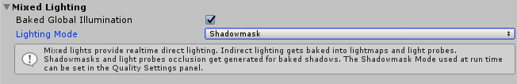
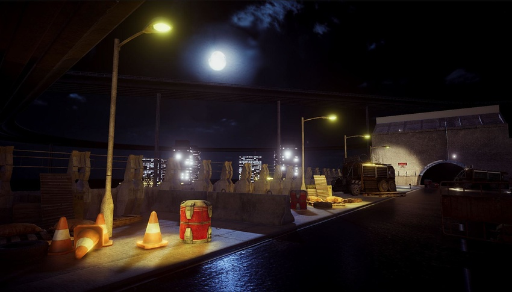
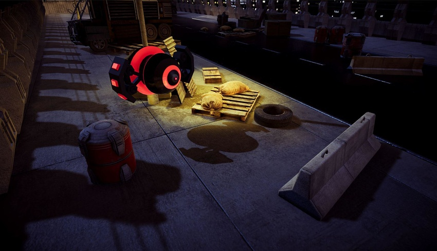
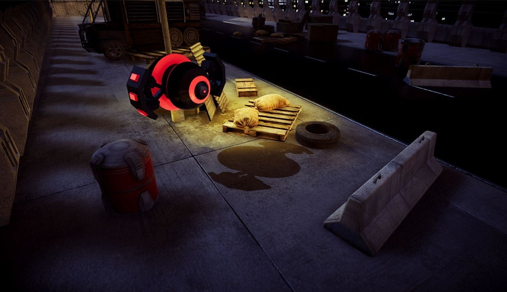
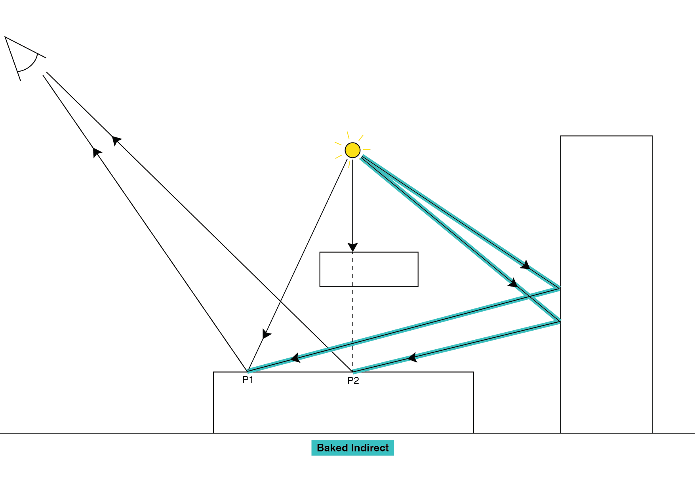
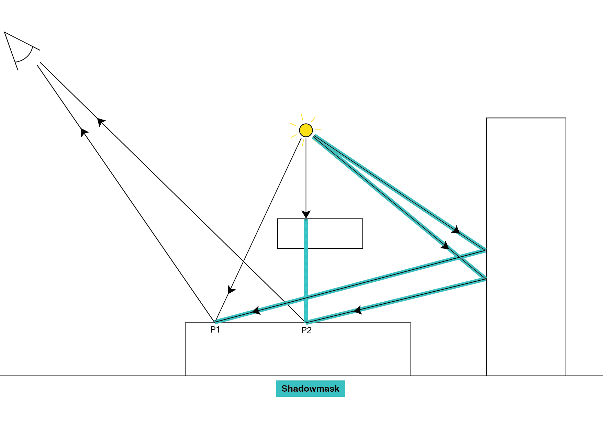
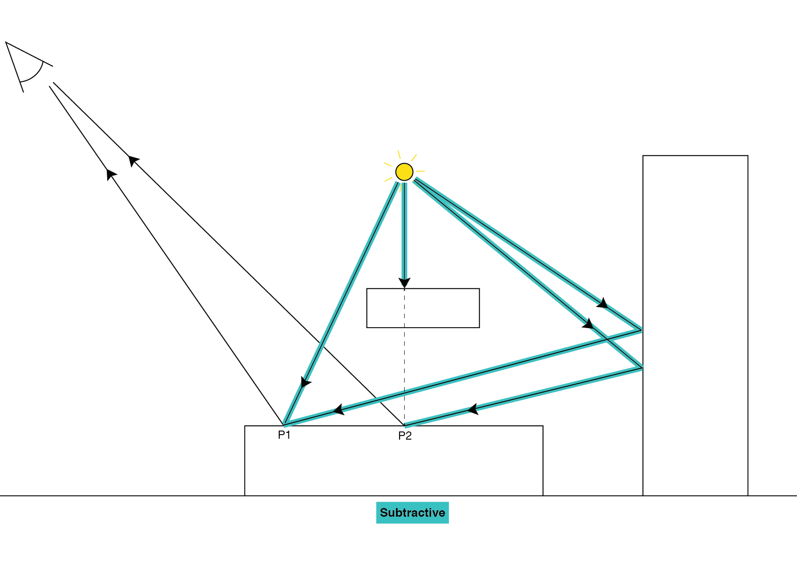

### 混合光照

__混合__光源是 __Mode__ 属性设置为 __Mixed__ 的[光源组件](class-Light.html)。

__混合__光源可在运行时更改其变换和视觉属性（例如颜色或强度），但仅限于严格的限制范围内。它们同时照亮静态和动态游戏对象，总是提供直接光照，也可选择提供间接光照。接受__混合__光源光照的动态游戏对象总是在其他动态游戏对象上投射实时阴影。

场景中的所有__混合__光源都使用相同的__混合____光照模式__。要设置__光照模式 (Lighting Mode)__，请打开 Lighting 窗口（菜单：__Window__ > __Lighting__），单击 __Scene__ 选项卡，然后导航至 __Mixed Lighting__ 部分。

可用模式有：

* [Baked Indirect](LightMode-Mixed-BakedIndirect.html)
* [Shadowmask](LightMode-Mixed-ShadowmaskMode.html)
* [Subtractive](LightMode-Mixed-Subtractive.html)

#### 使用混合光源

混合光照对于不属于游戏但可照亮静态环境的光源（例如天空中不动的太阳）非常有用。混合光源的直接光照仍需在运行时计算，因此静态网格上的材质将保持其视觉保真度，包括完整的[基于物理着色 (PBS)](shader-StandardShader.html) 支持。

__Shadowmask__ 模式的 [Distance Shadowmask](LightMode-Mixed-DistanceShadowmask.html) 是资源最密集的选项，但可提供最出色效果：此选项可在__阴影距离 (Shadow Distance)__ (__Edit__ > __Project Settings__ > __Quality__ > __Shadows__) 内产生高质量阴影，并在超出此距离后提供烘焙的高质量阴影。例如，只要太阳不穿过天空，就可以创建具有延伸到地平线的逼真阴影的大型景观。

__Subtractive__ 模式提供最低质量的结果：仅为一个光源实时渲染阴影，并将阴影与烘焙的直接和间接光照进行合成。只有目标平台无法使用任何其他模式时（例如，应用程序需要在低端移动设备上运行，但内存限制会阻止使用 __Shadowmask__ 和 __Distance Shadowmask__ 模式）才应使用此模式作为后备解决方案。

请参阅 [Unity 光照模式参考卡 (Unity Lighting Modes Reference Card)](https://docs.google.com/spreadsheets/d/18R663xpccuyRns1kOvGAiqj0qU9QFMbbXyrOCQMsU5w/edit#gid=1748986211) 了解各种模式的集中比较。

所有平台都支持所有混合光照模式。但是，有一些渲染限制：

* __Subtractive__ 模式会回退到[前向渲染](RenderTech-ForwardRendering.html)（无延迟或光照 prepass 支持）。

* __Shadowmask__ 模式在仅支持四个渲染目标的平台上（例如许多移动端 GPU）会回退到[前向渲染](RenderTech-ForwardRendering.html)（无延迟或光照 prepass 支持）。

请参阅[渲染通道](RenderingPaths.html)相关文档以了解有关前向渲染和延迟渲染的更多信息。

#### 高级用途

__混合__光源可在运行时更改其变换和视觉属性（例如颜色或强度），但仅限于严格的限制范围内。实际上，由于某些光照是烘焙的（因此是预先计算的），在运行时更改任何参数都会导致在组合实时光照和预计算光照时出现不一致的结果。

在使用 __Baked Indirect__ 和 __Shadowmask__ 的情况下，直接光照的影响就像__实时__光源一样，因此您可以更改光源的颜色、强度甚至变换等参数。但是，烘焙值是预先计算的，在运行时无法更改。

例如：如果将红色__混合__光源烘焙到光照贴图中，但在运行时将其颜色从红色变为绿色，则所有直接光照都会切换为绿色。但是，所有间接光照都被烘焙到光照贴图中，因此它仍然是红色的。此情况同样适用于在运行时移动混合光源：直接光照将跟随光源，但间接光照将保持在光源烘焙位置。

如果仅对直接光照引入细微的变化（例如，仅稍微修改光源的色调或强度），则可以获得间接光照的优点并使光源看起来有一定程度的动态效果，但无需__实时__光源所需的额外处理时间。间接光照仍然不正确，但错误可能很细微，不会令人不适。这种方案对于没有预计算阴影信息的光源特别有效。为实现此方案，需要为光源禁用阴影，也可使用具有实时阴影的 Baked Indirect 模式。由于阴影遮罩是直接光照计算的一部分，因此移动此类光源会导致视觉上不一致，使阴影不能正确排列。

以下视频举例说明了当混合光源移动到离开烘焙位置太远时会发生的情况。请注意，尽管对象移动很远，墙壁上的红色间接光仍保持原位：[https://youtu.be/o6pVBqrj8-s](https://youtu.be/o6pVBqrj8-s)

以下视频举例说明了如何略微修改混合光源而不会导致间接光照出现明显不一致问题：[https://youtu.be/XN6ya31gm1I](https://youtu.be/XN6ya31gm1I)

#### 技术细节

在使用混合光源的情况下，光路的最后一段（即从光源到表面的路径）也成为预计算的一部分。但是，Unity 仍然分别处理直接光照和间接光照。它将间接光照烘焙到光照贴图和光照探针中，然后在运行时对光照贴图和光照探针进行采样。间接光照通常为低频率，这意味着它看起来很平滑，但不包含高度细节化的阴影或光线过渡。因此，当阴影会产生高度可见的影响时，通过直接光照处理这些阴影。

预计算和存储阴影的方式的差异反映在混合光源的各种子模式中：

* [Baked Indirect](LightMode-Mixed-BakedIndirect.html)
* [Shadowmask](LightMode-Mixed-ShadowmaskMode.html)
* [Subtractive](LightMode-Mixed-Subtractive.html)

阴影信息可预计算并存储在阴影遮罩中。阴影遮罩是一种纹理，它与相应的光照贴图共享相同的 UV 布局和分辨率。它存储每个纹理像素的最多四个光源的遮挡信息（因为纹理在当前 GPU 上限制为最多四个通道）。值的范围是 0 到 1，中间的值标记柔和阴影区域。

如果启用了阴影遮罩，光照探针还会存储最多四个光源的遮挡信息。如果超过四个光源相交，则多余的光源会回退到烘焙光源。可使用[阴影遮罩重叠可视化](GIVis.html)模式来检查此行为。此信息是预先计算的，因此 Unity 在阴影遮罩中存储的唯一阴影是从静态游戏对象投射到其他静态游戏对象上的阴影。这些阴影可能具有更平滑的边缘，提供比实时阴影贴图更好的质量，具体取决于光照贴图分辨率。由于每个混合光源在运行时保留其阴影遮罩通道贴图，因此动态游戏对象通过阴影贴图投射的阴影可与来自静态游戏对象的预计算阴影正确合成，从而避免诸如双阴影之类的不一致问题。

静态游戏对象的阴影与动态游戏对象的阴影之间唯一可察觉的差异是预计算的阴影遮罩与运行时阴影贴图的分辨率和过滤差异，此外，预计算的阴影支持各种形式的面光源，因此柔和阴影可能具有更逼真的半影。

__Baked Indirect__ 和 __Shadowmask__ 的共同之处在于，直接光照总是实时计算得出并添加到光照贴图中存储的间接光照，因此需要光照方向的所有材质效果都能继续工作。如果为该光源启用了阴影，则动态游戏对象总是在__阴影距离 (Shadow Distance)__ (__Edit__ > __Project Settings__ > __Quality__ > __Shadows__) 内通过阴影贴图在其他动态游戏对象上投射阴影。

---

*  2017-09-18  Page amended with limited [editorial review](DocumentationEditorialReview.html)

* 在 5.6 版中添加了“光照模式”
