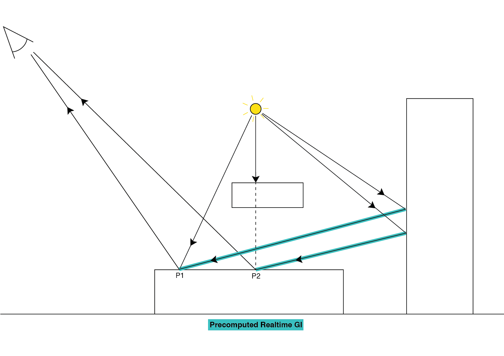

# 实时光照

实时光源是 __Mode__ 属性设置为 __Realtime__ 的[光源组件](class-Light.html)。

对于需要更改属性或在游戏过程中通过脚本生成的光源，请使用 __Realtime__ 模式。Unity 在运行时每帧计算并更新这些光源的光照。这些光源不会因为玩家所采取的动作或场景中发生的事件而更改。例如，您可以将这些光源设置为打开和关闭（如闪烁光源），更改其变换（如带着穿过暗室的火炬），或更改其视觉属性（如颜色和强度）。

实时光源在静态和动态游戏对象上产生光照并投射逼真的阴影。这些光源在__阴影距离 (Shadow Distance)__（在 __Edit__ > __Project Settings__ > __Quality__ 中定义）内投射阴影。

还可将实时光源与__实时全局光照__（__实时 GI__）组合在一起，从而为静态和动态游戏对象提供间接光照。

## 实时光照与实时 GI 结合使用

实时光照与__实时 GI__ 的组合是 Unity 中最灵活且逼真的光照方案。要启用实时 GI，请打开 [Lighting 窗口](GlobalIllumination.html)（菜单：__Window__ > __Lighting__ > __Settings__），然后勾选 __Realtime Global Illumination__。

When __Realtime GI__ is enabled, real-time Lights contribute indirect lighting into the Scene, as well as direct lighting. Use this combination for light sources which change slowly and have a high visual impact on your Scene, such as the sun moving across the sky, or a slowly pulsating light in a closed corridor. You don’t need to use __Realtime GI__ for Lights that change quickly, or for special effects, because the latency of the system does not make it worth the overhead. 

请注意，与不太复杂的__烘焙 GI__ 相比，__实时 GI__ 将使用大量的系统资源。全局光照由 Unity 中的一个名为 Enlighten 的中间件进行管理；此中间件有其自身的开销（系统内存和 CPU 周期）。请参阅有关[全局光照](GlobalIllumination.html)的文档以了解更多信息。

__实时 GI__ 适用于面向中端到高端 PC 系统的游戏以及面向 PS4 和 Xbox One 等最新款游戏主机的游戏。一些高端移动设备也可能足够强大到能够使用此功能，但应保持场景较小且实时光照贴图的分辨率较低，从而节省系统资源。

要禁用__实时 GI__ 对特定光源的影响，请选择光源游戏对象，然后在光源组件中将 __Indirect Multiplier__ 设置为 0。这意味着该光源不会提供任何间接光。要完全禁用__实时 GI__，请打开 Lighting 窗口（菜单：__Window__ > __Lighting__ > __Settings__），然后取消勾选 __Realtime Global Illumination__。

### 实时光照与实时 GI 结合使用的缺点

* 由于需要使用额外的一组低分辨率实时光照贴图来存储由 Enlighten 光照系统计算的实时间接反弹光线，因此增加了内存需求。

* 由于需要采样额外的一组实时光照贴图并使用探针来存储由 Enlighten 光照系统计算的实时间接反弹光线，因此增加了着色器计算需求。

* 间接光照会随着时间的推移而收敛，因此属性变化不能太突然。自适应 HDR 色调映射可能有助于隐藏此问题；要了解更多信息，请参阅 Unity 后期处理栈 ([Asset Store](https://www.assetstore.unity3d.com/en/#!/content/83912))。

## 技术细节

对于实时光源（即 __Mode__ 设置为 __Realtime__ 的光源组件），不会预先计算从表面到光源的最后一段发射光线（或路径段）。这意味着光源可在场景中移动，并改变颜色和强度等视觉属性。请参阅[在 Unity 中使用 Enlighten (Using Enlighten in Unity)](../uploads/ExpertGuides/Using_Enlighten_with_Unity.pdf) 的相关文档，了解有关路径段的更多信息。

如果光源也投射阴影，则场景中的动态和静态游戏对象都会渲染到光源的[阴影贴图](Shadows.html)中。此阴影贴图由静态和动态游戏对象的[材质着色器](Shaders.html)进行采样，以便它们相互投射实时阴影。__阴影距离 (Shadow Distance)__（菜单：__Edit__ > __Project Settings__ > __Quality__ > __Shadows__）控制阴影开始淡出和完全消失的最大距离，从而影响性能和图像质量。

如果未启用__实时 GI__，则实时光源仅计算动态和静态游戏对象上的直接光照。如果启用__实时 GI__，则 Unity 将使用 Enlighten 预先计算静态游戏对象的表面到表面光路。

 

预计算实时 GI (Precomputed __Realtime GI__) 模式：Unity 仅预先计算表面到表面的信息

最后一个路径段（即从表面到光发射器的路径段）不是预计算的一部分。存储的唯一信息是，如果表面接受光照，则随后的表面和探针也接受光照，还有各种光照的强度。有一组独立的低分辨率实时光照贴图由 Enlighten 在运行时使用实时光源的信息在 CPU 上进行迭代更新。因为这一迭代过程是计算密集型任务，所以分成多个帧。换句话说，此过程需要多个帧，直到光线完全反射到场景中的静态元素上，并且实时光照贴图和[光照探针](LightProbes.html)已经收敛到最终结果。

对于属性缓慢变化的光源（例如在天空中移动的发光的太阳），这不会造成问题。但是，对于属性快速变化的光源（例如闪烁的灯泡），__实时 GI__ 的迭代特性可能证明不合适。属性快速变化不会明显记录到发射光系统中，因此将它们包含在计算中是没有意义的。

有几种方法可以解决这个问题。一种方法是降低实时光照贴图分辨率。因为这样做会使运行时计算量减少，所以光照会收敛得更快。另一种方法是为__实时 GI__ 运行时增大 [CPU 使用率 (CPU Usage)](https://docs.google.com/document/d/1SEkozSX298iM6N1MONyss8IA2B5rtrfTStE72Tul2Y0/edit) 设置。通过增加 CPU 时间，运行时收敛得更快。副作用当然是其他系统完成工作的 CPU 时间减少。这是否可以接受取决于每个项目。请注意，由于这是根据每个场景而定的设置，因此可根据项目中每个场景的复杂程度来专门指定或多或少的 CPU 时间。

即使__实时 GI__ 是根据每个场景针对所有实时光源启用的，仍然可以在__实时 GI__ 中单独排除个别实时光源。要实现此目的，请将光源组件的 __Mode__ 设置为 __Realtime__，并将其[间接乘数 (indirect multiplier)](https://docs.google.com/document/d/1vmBiK2Ez-A7Z1OpJjWB1IJ4_OSDIVwPgmq8xNhMUMfk/edit) 设置为 0，从而消除所有间接光贡献。

---

*  2017-06-08  Page published with limited [editorial review](DocumentationEditorialReview.html)

* 在 5.6 版中添加了“光照模式”
