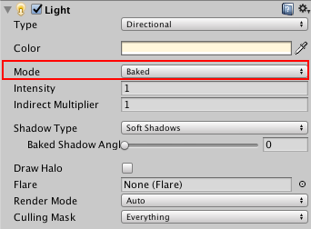

# 光照模式

本页面假定您已阅读有关 [Unity 中的光照](LightingInUnity.html)的文档。

要在 Unity 中控制光照预计算和合成，必须为光源指定__光照模式 (Light Mode)__。此__光照模式__将定义光源的目标用途。要指定光照模式，请在场景中选择光源，然后在[光源检视面板 (Light Inspector) 窗口](GlobalIllumination.html)中选择 __Mode__。

 

模式及其可能的贴图包括：

* [Realtime](LightMode-Realtime.html)
* [Mixed](LightMode-Mixed.html) - 混合光源有其自身的子模式。在 Lighting 窗口中设置这些子模式：
    * [Baked Indirect](LightMode-Mixed-BakedIndirect.html)
    * [Shadowmask](LightMode-Mixed-DistanceShadowmask.html)
    * [Distance Shadowmask](LightMode-Mixed-Shadowmask.html)
    * [Subtractive](LightMode-Mixed-Subtractive.html)
* [Baked](LightMode-Baked.html)

有关更多信息，请参阅[光照模式的参考卡](https://drive.google.com/open?id=1v-LnDOJcsSsa0ViF7kBs6xgY9Q_z-1k6h95LE0lf46U)。

上面的模式是按照所需的光路预计算工作量从最少到最多的顺序列出的（请参阅下面的*模式的工作机制*）。请注意，此顺序不一定与实际预计算所需的时间量相关。

## 模式的工作机制

Light Inspector 窗口中的每个__模式__对应于 Lighting 窗口（菜单：__Window__ > __Lighting__ > __Settings__ > __Scene__）中的一组设置。

| __Light Inspector__| __Lighting 窗口__ | __功能__ |
|:---|:---|:---| 
| __Realtime__| __Realtime Lighting__ | Unity 在运行时每帧计算并更新__实时 (Realtime)__ 光源的光照。此模式下不会预先计算实时光源。 |
| __Mixed__| __Mixed Lighting__ | Unity 可在运行时计算__混合 (Mixed)__ 光源的一些属性，但仅限于严格的限制范围内。此模式下会预先计算一些混合光源。 |
| __Baked__| __Lightmapping Settings__ | Unity 在运行时之前预先计算__烘焙 (Baked)__ 光源产生的光照，而不会将这些光源包括在任何运行时光照计算中。此模式下会预先计算所有烘焙光源。 |

请使用这些设置调整每种模式。您所做的调整适用于所有已分配到该模式的光源。例如，如果打开 Lighting 窗口，导航到 __Realtime Lighting Settings__，并勾选 __Realtime Global Illumination__，则所有将 __Mode__ 设置为 __Realtime__ 模式的光源都将使用 __Realtime Global Illumination__。

预计算产生两组结果：

* Unity 将静态游戏对象的结果存储为 UV 纹理坐标空间中的纹理图集。Unity 提供了多种设置来[控制这种布局](GlobalIllumination.html)。

* [光照探针](LightProbes.html)将光的表示结果存储在空白空间（从探针的特定位置观察）中。通过这部分空白空间的动态游戏对象将使用此信息来接受预计算的光照。

---

*  2017-06-08  Page published with limited [editorial review](DocumentationEditorialReview.html)

* 5.6 版更新
