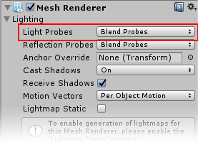
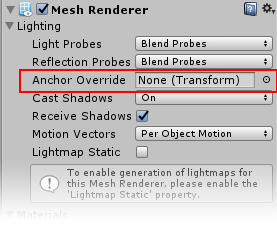

# 光照探针和网格渲染器

要在移动的游戏对象上使用光照探针 (Light Probes)，必须正确设置该移动游戏对象上的__网格渲染器 (Mesh Renderer)__ 组件。Mesh Renderer 组件具有 *Light Probes* 设置，此设置在默认情况下设为 __Blend Probes__。这意味着，在默认情况下，所有游戏对象都将使用光照探针，并在场景中改变位置时在最近的探针之间进行混合。

您可以将此设置更改为“关闭”或“使用代理体”。将光照探针设置切换为关闭状态将禁用光照探针对此游戏对象的影响。

光照探针代理体 (Light Probe Proxy Volumes) 是一种特殊设置；如果__大型移动对象__可能太大而无法通过光照探针组的单个四面体获得明显光照，而是需要在模型的整个长度上由多组光照探针进行光照，则可使用这种设置。有关更多信息，请参阅“光照探针代理体”。

Mesh Renderer 检视面板中与光照探针相关的另一个设置是 __Anchor Override__ 设置。如先前所述，当游戏对象在场景中移动时，Unity 会根据光照探针组定义的体积计算该游戏对象所在的四面体。默认情况下，这是从网格包围盒的中心点开始计算的，但是您可以通过将其他不同的游戏对象分配给 __Anchor Override__ 字段来覆盖使用的点。
 

如果为此项分配了其他不同的游戏对象，则可按照网格上的光照需求自由移动该游戏对象。

当游戏对象包含两个单独的相邻网格时，锚点覆盖 (Anchor Override) 可能很有用；如果这两个网格都根据自身的包围盒位置而单独获得光照，则光照在它们的连接处将不是连续的。为防止该问题，可使用相同的变换（例如父对象或子对象）作为两个网格渲染器的插值点，或者使用光照探针代理体。

---

*  2017-06-08  Page published with no [editorial review](DocumentationEditorialReview.html)

* 在 5.6 版更新了光照探针
