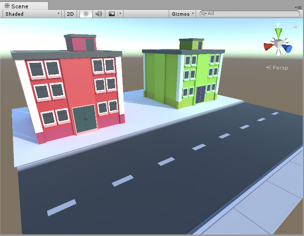
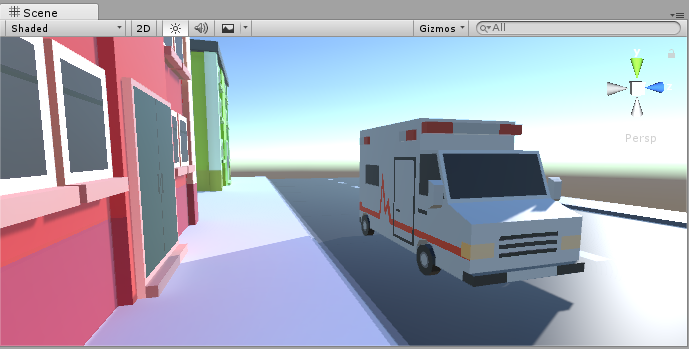
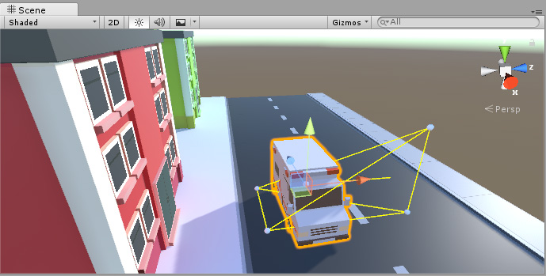
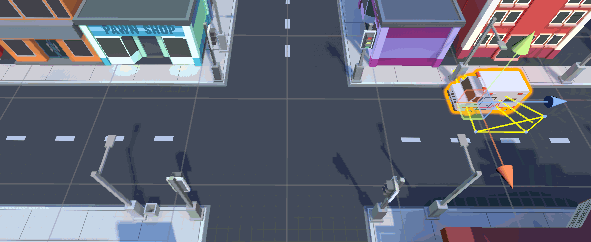

# 用于移动对象的光照探针

[光照贴图](Lightmapping.html)通过捕获逼真的反射光作为纹理（这些纹理将“烘焙”到__静态__对象的表面上）来显著增加场景的真实感。但是，由于光照贴图的性质，光照贴图只能应用于标记为 [Lightmap Static](StaticObjects.html) 的非移动对象。

虽然实时和混合模式光照可在移动对象上投射*直射*光，但除非使用__光照探针__，否则移动对象不会从静态环境接受反射光。光照探针存储关于光在场景中如何反射的信息。因此，当对象在游戏环境中的空间内移动时，它们可以使用光照探针中存储的信息来显示反射光在当前位置处的近似值。

在上述场景中，当方向光照射到作为静态景物的红色和绿色建筑物时，*反射光*被投射到场景中。反射光在每个建筑物正前方的地面上显示为红色和绿色。由于所有这些模型都是__静态的__，因此所有这些光照都存储在__光照贴图__中。

将移动对象引入场景中时，它们不会自动接受反射光。在下图中，您可以看到救护车（动态移动对象）不受建筑物反射的红色光影响。实际上，它的侧面是单调的灰色。这是因为救护车是一种动态对象，可在游戏中四处移动，因此不能使用光照贴图（由于光照贴图本质上是静态的）。该场景需要光照探针，以便移动的救护车可接受反射光。

要使用光照探针功能将反射光投射到动态移动对象上，必须将光照探针放置在整个场景中，以便它们覆盖移动对象在游戏中可能通过的所有空间区域。

放置在场景中的探针定义了 3D 体积。然后，通过在烘焙到最近探针中的信息之间进行插值，位于该体积内任何位置处的光照将在估算后投射到移动对象上。

添加探针并在场景中烘焙光照后，动态移动对象将根据场景中最近的探针接收反射光。同样以上面的示例为例，动态对象（救护车）现在接受来自静态景物的反射光，使车辆的侧面呈现红色，因为它位于投射反射光的红色建筑物的前方。

选择动态对象后，Scene 视图将显示出正在使用的用于反射光插值的光照探针。最接近动态对象的探针用于形成四面体，而动态对象的光照便从该四面体的四个点的值进行插值。

当一个对象在场景中移动时，它从一个四面体移动到另一个四面体，并根据其在当前四面体内的位置计算出光照。

---

*  2017-06-08  Page published with no [editorial review](DocumentationEditorialReview.html)

* 在 5.6 版更新了光照探针
