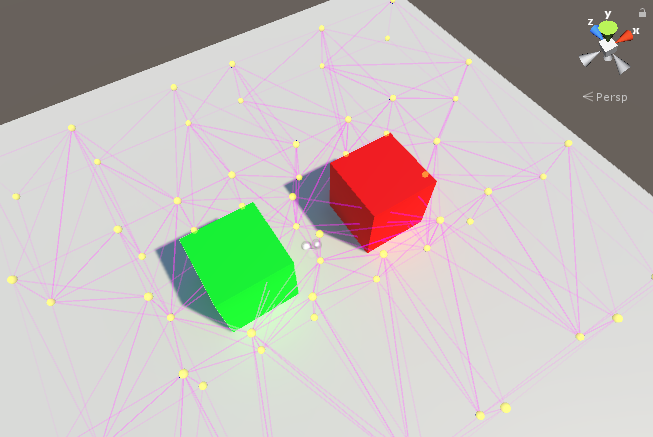

# 光照探针

通过__光照探针__可以捕获并使用穿过场景空白空间的光线的相关信息。

与光照贴图类似，光照探针存储了有关场景中的光照的“烘焙”信息。不同之处在于，光照贴图存储的是有关光线照射到场景中的*表面*的光照信息，而光照探针存储的是有关光线穿过场景中的*空白空间*的信息。

光照探针有两个主要用途：

光照探针的主要用途是为场景中的移动对象提供高质量的光照（包括间接反射光）。

光照探针的次要用途是在静态景物使用 Unity 的 __LOD（细节级别）系统__时提供该景物的光照信息。

将光照探针用于这两个不同目的时，需要使用的许多技术都是相同的。了解光照探针的工作原理非常重要，这样才能正确选择将探针放置在场景中的位置。

---

*  2017-06-08  Page published with no [editorial review](DocumentationEditorialReview.html)

* 在 5.6 版更新了光照探针
