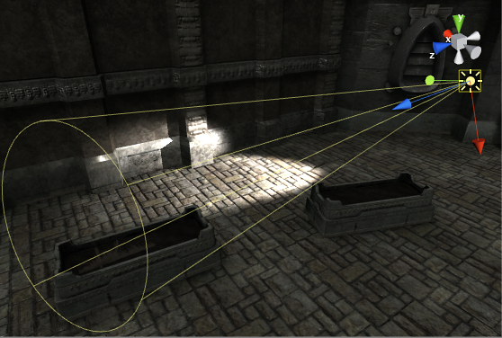
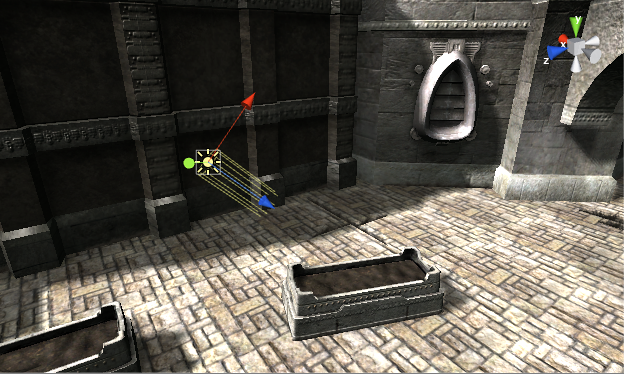
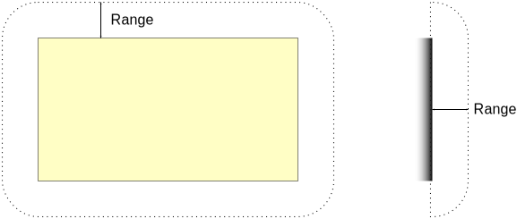
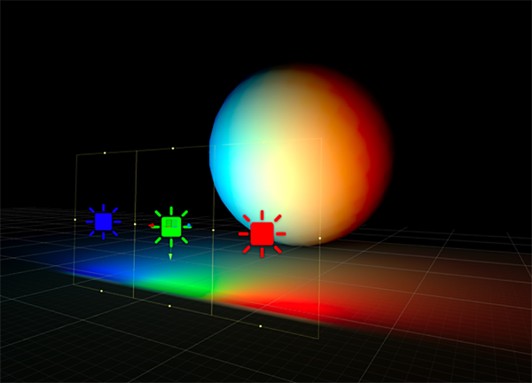
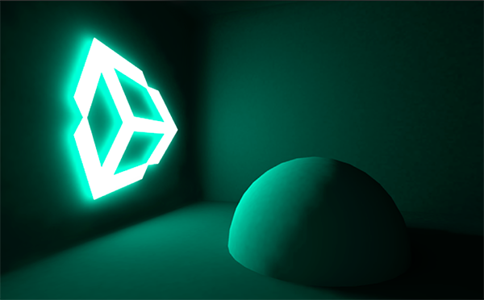

#光源类型

本部分详细介绍在 Unity 中创建光源的多种不同方法。

##点光源

点光源位于空间中的一个点，并在所有方向上均匀发光。照射到表面的光线的方向是从接触点返回到光源对象中心的线。强度随着远离光源而衰减，在到达指定距离时变为零。光照强度与距光源距离的平方成反比。这被称为“平方反比定律”，类似于光在现实世界中的情况。

 

点光源可用于模拟场景中的灯和其他局部光源。您还可以用点光源逼真地模拟火花或爆炸照亮周围环境。

##聚光灯

像点光源一样，聚光灯具有指定的位置和光线衰减范围。不同的是聚光灯有一个角度约束，形成锥形的光照区域。锥体的中心指向光源对象的发光 (Z) 方向。聚光灯锥体边缘的光线也会减弱。加宽该角度会增加锥体的宽度，并随之增加这种淡化的大小，称为“半影”。

 

聚光灯通常用于人造光源，例如手电筒、汽车前照灯和探照灯。通过脚本或动画控制方向，移动的聚光灯将照亮场景的一小块区域并产生舞台风格的光照效果。

##方向光

方向光对于在场景中创建诸如阳光的效果非常有用。方向光在许多方面的表现很像太阳光，可视为存在于无限远处的光源，。方向光没有任何可识别的光源位置，因此光源对象可以放置在场景中的任何位置。场景中的所有对象都被照亮，就像光线始终来自同一方向一样。光源与目标对象的距离是未定义的，因此光线不会减弱。

 

方向光代表来自游戏世界范围之外位置的大型远处光源。在逼真的场景中，方向光可用于模拟太阳或月亮。在抽象的游戏世界中，要为对象添加令人信服的阴影，而无需精确指定光源的来源，方向光是一种很有用的方法。

默认情况下，每个新的 Unity 场景都包含一个方向光。在 Unity 5 中，此光源已关联到 Lighting 面板的 Environment Lighting 部分定义的程序化天空系统中 (Lighting > Scene > Skybox)。您可以更改此设置，方法是删除默认的方向光并创建新光源，或者直接通过“Sun”参数 (Lighting > Scene > Sun) 指定不同游戏对象。

旋转默认方向光（或“太阳”）会导致“天空盒”更新。使光线与侧面成一定角度，与地面平行，便可以实现日落效果。此外，将光源指向上方会使天空变黑，就好像是夜晚一样。如果光线从上到下成一定角度，天空将像白昼。

如果选择天空盒作为环境光源，那么环境光照将根据这些颜色进行更改。
##面光源

面光源是通过空间中的矩形来定义的。光线在表面区域上均匀地向所有方向上发射，但仅从矩形的所在的面发射。无法手动控制面光源的范围，但是当远离光源时，强度将按照距离的平方呈反比衰减。由于光照计算对处理器性能消耗较大，因此面光源不可实时处理，只能烘焙到光照贴图中。

 

由于面光源同时从几个不同方向照亮对象，因此阴影趋向于比其他光源类型更柔和、细腻。您可以使用这种光源来创建逼真的路灯或靠近玩家的一排灯光。小的面光源可以模拟较小的光源（例如室内光照），但效果比点光源更逼真。

##发光材质

 

与面光源一样，发光材质在其表面区域发光。它们有助于在场景中反射光线，并且在游戏过程中可以更改颜色和强度等相关属性。虽然预计算实时 GI 不支持面光源，但使用发光材质仍可实现类似的实时柔和光照效果。

“Emission”是标准着色器的属性，它允许场景中的静态对象发光。默认情况下，“Emission”的值设置为零。这意味着使用标准着色器指定材质的对象不会发光。

发光材质没有范围值，但发出的光同样将以方差速率衰减。只有 Inspector 中标记为“Static”或“Lightmap Static”的对象才会接受发光材质的光。同样，应用于非静态或动态几何体（例如角色）的发光材质将不会影响场景光照。

然而，即使发光量高于零的材质对场景光照没有影响，它们仍然会在屏幕上明亮发光。通过从标准着色器的“Global Illumination”Inspector 属性中选择“None”，也可以获得这种效果。像这样的自发光材质可用于产生诸如氖灯或其他可见光源之类的效果。

发光材质仅直接影响场景中的静态几何体。如果您需要动态或非静态几何体（如角色）接受发光材质发出的光，则必须使用光照探针。

##环境光

环境光是在场景周围存在的光，并且不来自任何特定的光源对象。它可以是场景整体外观和亮度的重要影响因素。

环境光在许多情况下都很有用，具体取决于您选择的艺术风格。一个例子是明亮的卡通风格渲染，其中可能不需要暗阴影，或者可能要将光照手绘成纹理。如果您需要在不调整单个光源的情况下增加场景的整体亮度，环境光也很有用。

可在 [Lighting 窗口](GlobalIllumination.html)中找到环境光设置。
