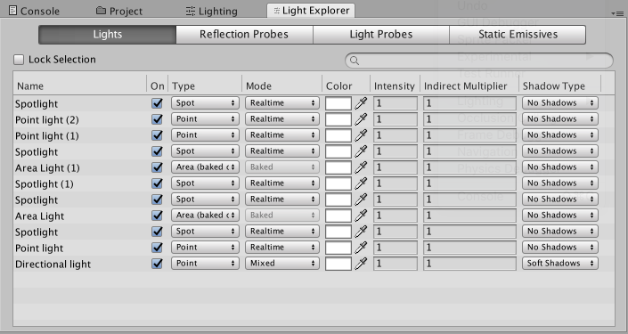

# 光源资源管理器 (Light Explorer)

在光源资源管理器中可选择和编辑光源。要从菜单中打开光源资源管理器，请导航至 __Window__ > __Lighting__ > __Light Explorer__。

 

使用面板顶部的四个选项卡可以查看当前场景中的[光源 (Lights)](LightSources.html)、[反射探针 (Reflection Probes)](class-ReflectionProbe.html)、[光照探针 (Light Probes)](LightProbes.html) 和静态发射 (Static Emissives) 的设置。可编辑参数是每种组件类型最常用的字段。

使用搜索字段可在每个表中筛选名称。您也可以选择要处理的光源，然后勾选 __Lock Selection__ 复选框。即使在场景中选择了不同的光源，也只有勾选复选框时选择的光源才会保留在光源资源管理器中。

---

*  2017-06-08  Page published with limited [editorial review](DocumentationEditorialReview.html)

* 5.6 版更新
