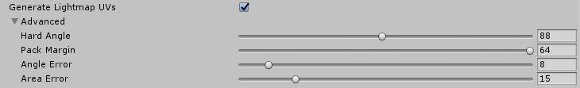

# 生成光照贴图 UV

Unity 可以展开网格以便生成光照贴图 UV。要访问用于生成光照贴图 UV 的设置，请打开[模型的导入设置 (Import Settings)](FBXImporter-Model.html)，找到 __Meshes__，然后勾选 __Generate Lightmap UVs__ 复选框。如果存在 UV2 通道，此选项会将光照贴图 UV 生成为 UV2。如果不存在 UV2 通道，Unity 将使用主 UV。

单击 __Advanced__ 折叠三角形以打开设置。

 

Generate Lightmap UVs 的设置：

| __属性：__| __功能：__ |
|:---|:---| 
| __Hard Angle__| 相邻三角形之间的角度（以度为单位），Unity 根据此角度将其视为硬边缘并创建接缝。您可以将角度设置为 0 到 180 之间的值。默认情况下设置为 88 度。  如果将此角度设置为 180 度，Unity 会认为所有边缘都是平滑的，这适用于生物模型。默认值（88 度）适用于机械模型。 |
| __Pack Margin__| 在假设网格占据整个 1024x1024 光照贴图的前提下，相邻图表之间的边距（以像素为单位）。您可以将此值设置为 1 到 64 之间的值。较大的值会增加边距，但也会增加图表所需的空间量。默认情况下，此值设置为 4。  有关更多信息，请参阅下面的 [Pack Margin](#PackMargin)。 |
| __Angle Error__| UV 角度与源几何体中角度的最大可能偏差（百分比形式，范围从 0 到 100）。默认情况下，此值设置为 8%。  此属性控制 UV 空间中三角形与原始几何体中三角形的差异程度。通常，为避免在应用光照贴图时出现瑕疵，此数值应该相当低。  |
| __Area Error__| UV 面积与源几何体中面积的最大可能偏差（百分比形式，范围从 0 到 100）。默认情况下，此值设置为 15%。  此属性控制 Unity 保留相对三角形面积的程度。增大此值可以创建更少的图表。但是，增大该值可能会改变三角形的分辨率，因此请确保产生的失真不会降低光照贴图的质量。 |

您还可以为光照贴图提供自己的 UV。光照贴图的合理 UV 集应遵循以下规则：

* 应在 [0,1] x [0,1] UV 空间内。

* 在各个图表之间应有足够宽的边距。有关更多信息，请参阅有关 [UV 重叠反馈](ProgressiveLightmapper-UVOverlap.html)的文档。

* 不得有任何重叠面。

* UV 中的角度与原始几何体中的角度之间差异不大。请参阅下面的__角度失真__。

* 除非您希望某些区域具有更高的光照贴图分辨率，否则 UV 中三角形的相对比例与原始几何体中三角形的相对比例之间应该存在较小差异。请参阅下面的__区域失真__。

 

## Pack Margin

为允许过滤，光照贴图包含图表边缘附近的纹理像素中的光照信息，因此应在图表之间始终包含一定的边距，以免在应用光照贴图时出现光渗。

光照贴图分辨率定义了光照贴图的纹理像素分辨率。光照贴图工具 (Lightmapper) 会扩大光照贴图中的一些图表纹理像素以避免黑色边缘，因此网格的 UV 图表必须至少相距两个完整的纹理像素，从而避免光渗。使用 __Pack Margin__ 设置可确保几何体的 UV 图表之间有足够的边距。

 

在光照贴图 UV 空间中，图表之间的填充需要至少两个完整纹理像素，以免出现 UV 重叠和意外光渗。在此图中，黑色空白表示图表之间的空隙。

## 角度失真

以下截屏显示了相同的分辨率，但具有不同的 UV。第一张图的 __Angle Error__ 较高，结果中包含意料之外的失真。第二张图使用 __Angle Error__ 默认值 (8%)。在具有较多三角形的网格中，角度失真会让形状显著失真。

 

## 区域失真

在下图中，两个具有相同参数的聚光灯照亮圆柱体的两侧。圆柱体右侧的 __Area Error__ 值较高，导致三角形失真并且分辨率降低，从而在光照中产生瑕疵。

 

---

 2018-03-28  Page published with limited [editorial review](DocumentationEditorialReview.html)

在 [2018.1](https://docs.unity3d.com/2018.1/Documentation/Manual/30_search.html?q=newin20181) 版中添加了渐进光照贴图 NewIn20181
