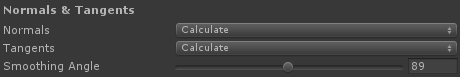
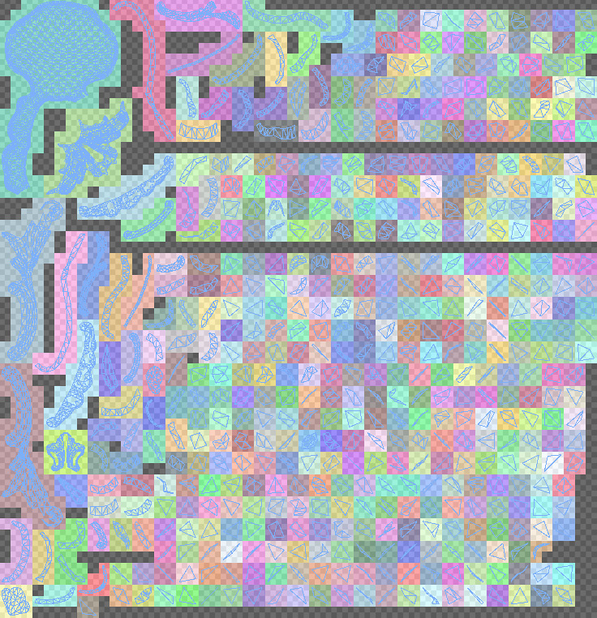
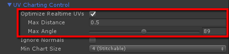
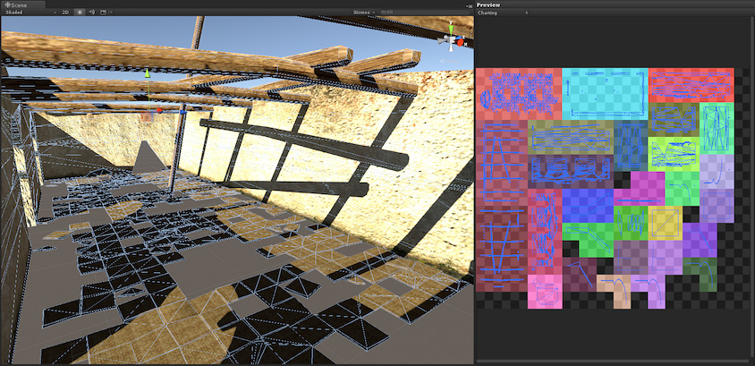
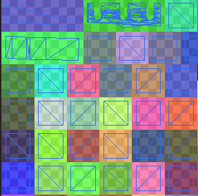
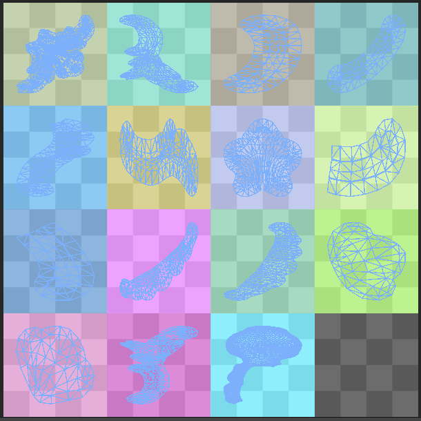
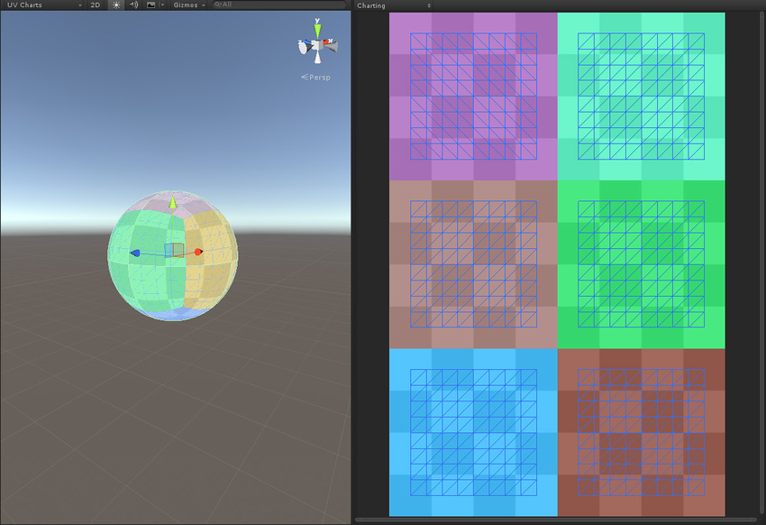

# 将 UV 从 Maya 导入到 Unity

Maya 是 Autodesk 推出的 3D 计算机动画软件，具有强大的建模、渲染、模拟、纹理和动画工具，适用于视觉效果美术师、建模师和动画师（请参阅 [www.autodesk.co.uk](http://www.autodesk.co.uk/products/maya/overview)）。Unity 开发人员经常使用该软件来完成高级图形处理工作，然后再导入到 Unity 中。请务必注意，从 Maya 导入时，即使取消选中 __Optimize Realtime UVs__ 复选框，UV 也可能看起来不完全相同。本章节将解释原因。

由于实时 UV 由 Enlighten 重新打包，因此了解如何检测 UV 图表非常重要。默认情况下，图表由一组连接的顶点定义。但是，DCC 或 Unity 网格导入器可能会在网格具有硬边的位置引入额外的顶点。这些重复的顶点会在 UV 中创建额外的孤岛（未连接的顶点组）。但是，当您烘焙光照贴图时，这些切割通常不会被注意到，因为 UV 将直接使用而不会重新打包。下图展示了这种情况下的一个例子。

高平滑角不会保留模型中的硬切割，因此着色和 GI 看起来都发生了变化。

与此相关的[网格导入器](class-FBXImporter.html)设置包括 __Normals__、__Tangents__ 和 __Smoothing Angles__：

 

如果将 __Normals__ 设置为 __Calculate__，则在相邻三角形之间的角度超过 __Smoothing Angle__ 值的任何地方都会中断。

为避免这种情况，您可以选择创建和导入法线（请参阅有关[法线贴图](StandardShaderMaterialParameterNormalMap.html)的文档以了解关于表面法线的更多信息）。为了使用导入的法线获得良好的结果，您需要手动沿着硬边缘进行切割，并注意 DCC 如何插入重复的顶点。否则，GI 和常规着色都可能产生不可预见的光照效果。

### 示例

使用 40 度__平滑角 (Smoothing Angle)__ 打包时，将保留模型中的硬角度，并创建额外的图表：

](../uploads/Main/LightingGiUvs-5.png)

 

如果 __Smoothing Angle__ 设置为 180 度，则不会进行切割，并且 UV 与在 Maya 中相同。唯一不同是图表打包：

](../uploads/Main/LightingGiUvs-7.png)

 

## 优化实时 UV

[网格渲染器](class-MeshRenderer.html)包含名为 __Optimize Realtime UVs__ 的选项。

 

__Optimize Realtime UVs__ 可以启用 Enlighten 的 UV 优化功能。请注意，如果禁用此选项，则不允许原创的 UV 直接流向 Enlighten；仍会应用重新打包。

该功能仅用于优化实时 GI 的图表，不会影响烘焙 UV。该功能旨在简化 UV 展开，从而减少图表数量（进而减少纹理数量）。这样将使光照在整个模型中更加一致，让纹理像素分布更均匀，并避免在小细节上浪费纹理像素。执行预计算阶段所需的时间与您输入的纹理像素数量成正比。例如，一个高度细节化的瓷砖地板上每块瓷砖的单独图表会占用大量不必要的纹理像素，但将它们加入到单个图表中可大幅降低纹理像素数量。这种做法之所以有效是因为实时光照贴图仅存储间接光照（意味着没有明显的直接阴影）。

该过程不能改变模型中的顶点数量，因此该过程不能在已存在中断的 UV 中引入中断。这意味着生成的图表布局相同，但某些图表可能会重叠或合并到不太可能对间接光照产生负面影响的区域。

合并图表时可使用以下设置进行定义：

* __Max Distance__：如果图表之间的世界空间距离小于此值，则会简化图表。
* __Max Angle__：如果图表之间的角度小于此值，则会合并图表。

这些设置旨在避免合并相距很远或指向大致不同的方向的图表。

### 优化实时 UV：示例

以下示例使用 Asset Store 中的[沙漠遗址 (Desert Ruins)](https://www.assetstore.unity3d.com/en/#!/content/4162) 资源：

](../uploads/Main/LightingGiUvs-10.jpg)

此示例使用默认参数，且实时光照贴图分辨率为每单位 1 个纹理像素。此模型的长度大约是 9 个单位。下图显示了使用自动 UV (Auto UV) 功能为此模型生成的实时 UV：

 

请注意，地板上的瓷砖已打包到单个图表中，并且分辨率也依照所选纹理像素密度和实例大小进行了调整：

 

在未使用 Auto UV 功能打包时，生成的 UV 如下所示：

 

由于图表会在模型提供的已生成的 UV 中分割，这会生成大量小图表。由于未启用 __Auto UVs__，因此无法合并其中任何图表，并且无论大小如何，每个不相连的独立 UV 图都会获得自己的 4x4 像素块。下图显示了 UV 的一部分：

 

墙的贴图仍然获得 10x4 纹理像素的合理分辨率，但每块小瓷砖都有不成比例的 4x4 纹理像素。之所以最小图表大小为 4x4，是因为我们希望能够在所有 4 个边上拼接图表，同时仍然可在图表上获得光照渐变。

## 进一步优化图表

还有两个选项可用于进一步优化 UV 布局的图表绘制：

* __Ignore Normals__
* __Min Chart Size__

### Ignore Normals

 

勾选 __Ignore Normals__ 复选框可将由于法线硬中断而具有重复顶点的所有图表链接在一起。当顶点位置和顶点光照贴图 UV 相同但是法线不同时，Enlighten 中可能会出现图表拆分。对于小细节，没有必要使用多个 4x4 纹理图表来代表间接光照，而且这会影响预计算和烘焙性能。在此类情况下，请启用 __Ignore Normals__。

#### 示例

在以下示例中，禁用了 __Optimize Realtime UVs__，用于独立演示 __Ignore Normals__ 的效果。

](../uploads/Main/LightingGiUvs-16.jpg)

左图显示了未启用 __Ignore Normals__ 的结果。右图显示了启用 __Ignore Normals__ 的结果。

 

启用 __Ignore Normals__ 时，此模型的 24x24 Enlighten 展开降低到 16x16 展开。

### Min Chart Size

 

__Min Chart Size__ 可解除图表最小大小为 4x4 的限制。拼接并非总是有效，但对于小细节，这通常是可以接受的。

#### 示例

在此示例中，__Min Chart Size__ 设置为 __2 (Minimum)__。

 

如果将此 __Min Chart Size__ 选项和 __Ignore Normals__ 选项应用于上述模型，则展开将降低到 10x10。

## 为实时 GI 获取用于拼接的图表边缘

设置为 __Realtime__ 的光照贴图支持图表拼接。图表拼接可确保不同图表中相邻纹理像素的光照一致。这有助于避免沿图表边界出现明显接缝。在纹理大小较大的情况下，接缝两侧的光照可能大相径庭。因为纹理像素不相邻，这种差异不会通过过滤自动平滑掉。

在以下示例中，即使在纹理化后，右侧球体上也可以看到接缝，因为它尚未拼接：

 

Stitching is on by default. If you think it is causing some unwanted issues, you can disable it; Apply [Lightmap Parameters](class-LightmapParameters.html) to the instance in question and untick the __Edge Stitching__ checkbox.

要使图表顺利拼接，边缘必须符合以下标准：

* 必须启用 __Preserve UVs__，这样 Auto UV 功能便不会简化图表。
* 图表必须在同一个网格中。
* 边缘必须共享顶点。
* 边缘在 UV 空间中必须处于水平或垂直方向。
* 边缘必须具有相同数量的纹理像素（这通常是由前两个条件推断得出）。

这也是 Unity 的内置球体、胶囊体和圆柱体的生成方式。注意图表是如何排列的：

 

 

---

*  2017-07-04  Page published with limited [editorial review](DocumentationEditorialReview.html)

* 2017-07-04 仅更新文档，Unity 功能无变化

