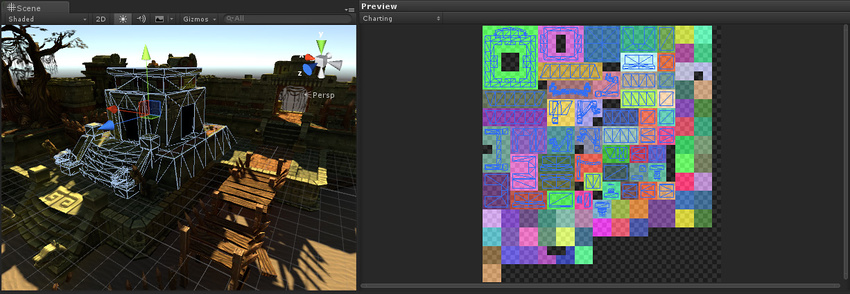
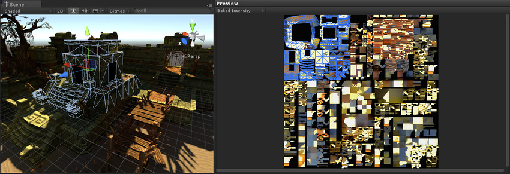

# 全局光照 UV

有两套 GI 光照贴图：__烘焙 (Baked)__ 和__实时 (Realtime)__。决定要使用哪套光照贴图取决于您使用的是环境光照还是特定光源：

* [Global illumination](GlobalIllumination.html)（环境光照）可以设置为 __Realtime__ 或 __Baked__。选择 __Window__ > __Lighting__，然后从 __Ambient GI__ 下拉菜单中选择一个选项。

* [Lights](class-Light.html) 可以设置为 __Realtime__、__Baked__ 或 __Mixed__。前往 Inspector 窗口，然后从 __Baking__ 下拉菜单中选择一个选项。

* 材质包含发光控件，这些控件可以设置为 __Realtime__ 或 __Baked__。请参阅有关[标准着色器材质发光参数](StandardShaderMaterialParameterEmission.html)的文档以了解更多信息。

| __光照贴图__| __属性__ |
|:---|:---| 
| __烘焙 (Baked)__| 烘焙光照贴图主要用于在运行时一直不变的光源（例如，点亮的街灯），因此在光照贴图中存储为静态渲染。功能包括直接光照、间接光照和环境光遮挡。 |
| __实时 (Realtime)__| 实时光照贴图主要用于在运行期间有动画效果的光源（例如，闪烁的街灯），因此需要实时渲染。功能仅包括间接光照，通常分辨率较低。直射光不在光照贴图中，而是实时渲染。 |
| __混合 (Mixed)__| 将光照设置为“混合”模式时，会产生烘焙光照贴图，同时还会为非静态对象提供直接的实时光照。 |

您可以使用其中一个光照贴图或同时使用这些光照贴图来对场景进行光照。您的选择决定了光源影响因素和产生的 GI 将添加到哪些光照贴图。

## 可视化 UV

能够查看正在使用的 UV 非常重要，Unity 有一个可视化工具来帮助您执行此操作。首先，打开 Lighting 窗口（菜单：__Window__ > __Lighting__），然后勾选底部的 __Auto__ 复选框。这可确保您的烘焙和预计算是最新的，并输出查看 UV 所需的数据。等待该过程完成（对于大型或复杂的场景，这可能需要一些时间）。

### 可视化实时 UV

要查看预计算实时 GI UV，请执行以下操作：

* 在场景中选定一个包含网格渲染器的游戏对象
* 打开 Lighting 窗口，然后选择 __Object__ 选项卡
* 在 __Preview__ 区域中，从下拉选单中选择 __Charting__。

这将显示所选网格的实例的实时光照贴图的 UV 布局。

* 图表由预览中的不同颜色区域表示（显示在上图中的右侧）。
* 所选实例的 UV 放置在图表上，同时网格的线框表示了相应的游戏对象。
* 深灰色纹理像素显示了光照贴图的未使用区域。

可以将多个实例打包到实时光照贴图中，因此您看到的某些图表可能实际上属于其他游戏对象。

**注意：**实时和烘焙光照贴图之间的实例分组没有直接对应关系。同一实时光照贴图中的两个实例也可能位于两个不同的烘焙光照贴图中，反之亦然。

### 可视化烘焙 UV

要查看烘焙 UV，请执行以下操作：

* 选择一个实例。
* 打开 Lighting 窗口（菜单：__Window__ > __Lighting__），然后选择 __Object __选项卡。
* 在 __Preview__ 区域中，从下拉选单中选择 __Baked Intensity__。

 

如您所见，烘焙 UV 与预计算实时 UV 大不相同。这是因为烘焙和预计算实时 UV 的要求不同。

## 实时 UV

必须注意，即使勾选 __Preserve UVs__，也无法使预计算实时 GI 获得与烘焙 GI 相同的 UV。

如果可以，您会在不起眼的地方看到明显锯齿（例如浅色或深色边缘）。这是因为实时光照贴图的分辨率有意被降低，这样实时更新它们才变得切实可行。这不会影响图形质量，因为它只存储通常为低频率（也就是说通常情况下不会突然改变强度或细节图案）的间接光照。直射光和阴影将使用标准实时光照和阴影贴图单独渲染。直射光通常频率更高（也就是说它更可能突然改变强度或细节图案，例如阴影的锐边），因此需要更高分辨率的光照贴图来获取这些信息。

当图表共享纹理像素时，低分辨率光照贴图会产生渗色问题。这会对光照质量产生不利影响，但可以通过重新打包 UV 图表来包含它们周围的半像素边界，从而解决此问题。这样，即便使用双线性插值，也绝不要*跨越*图表（在细节最高的 Mip 上）进行采样。采用保证半像素边界的图表的另一个好处是，您可以将图表放在彼此旁边，从而节省光照贴图空间。

 

总之，用于预计算实时 GI 光照贴图的 UV 始终会重新打包。

由于重新打包可确保图表周围的半像素边界，因此 UV 取决于实例的比例和光照贴图分辨率。如果放大 UV 以获得更高分辨率的光照贴图，则无法保证此半像素边界。UV 单独打包，并会考虑实例的比例和分辨率。因此，实时 UV 与*每个实例*有关。请注意，如果 1000 个对象具有相同比例和分辨率，则这些对象共享 UV。

---

*  2017-07-04 Page published with limited [editorial review](DocumentationEditorialReview.html)

 
* 2017-07-04 仅更新文档，Unity 功能无变化

