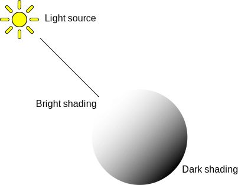
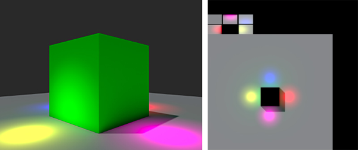
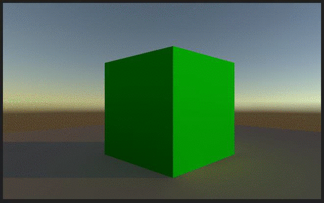

#光照概述

为了计算 3D 对象的阴影效果，Unity 需要知道落在对象上的光的强度、方向和颜色。

 

这些属性是由场景中的 Light 对象提供。不同类型的光以不同的方式发出其指定的颜色；一些光的强度可能随着与光源的距离而衰减，并且对于从光源处获得的光角度有不同规则。[光源类型](Lighting.html)中详细介绍了 Unity 中提供的不同类型的光源。

Unity 可通过各种不同的方式计算复杂的高级光照效果，每种方式适合不同的使用情况。

## 选择光照技术
从广义上讲，Unity 中的光照在某种方式上可以被视为“实时”或“预计算”光照，并且两种技术可以组合使用以带来沉浸式场景光照。

在本部分中，我们将简要概述不同技术提供的可能性、相对优势和各自的特性。

## 实时光照

默认情况下，Unity 中的光源（方向光、聚光灯和点光源）是实时的。这意味着它们为场景提供直射光并每帧都更新。如果光源和游戏对象在场景中发生移动，光照效果也会随之更新。在场景和游戏视图中都可以观察到这一效果。

![实时光源单独呈现的效果。请注意，阴影是完全黑色的，因为没有反射光。只有落在聚光灯锥体内的表面才会受到影响。]
(../uploads/Main/RealtimeSpotlight.png)

实时光照是场景中对象光照的最基本方式，对于照亮角色或其他可移动的几何体非常有用。

遗憾的是，在单独使用 Unity 实时光源的光线时，这些光线不会自动进行反射。为了使用全局光照等技术创建更逼真的场景，我们需要启用 Unity 的预计算光照解决方案。

 
## 烘焙光照贴图

Unity 可以计算复杂的静态光照效果（使用称为全局光照（简称 GI）的技术）并将它们存储在称为光照贴图的纹理贴图中作为参考。这一计算过程称为烘焙。

对光照贴图进行烘焙时，会计算光源对场景中静态对象的影响，并将结果写入纹理中，这些纹理覆盖在场景几何体上以营造出光照效果。

这些光照贴图既可以包括照射到表面的直射光，也可以包括从场景内其他物体或表面反射的间接光。该光照纹理可与颜色（反照率）和浮雕（法线）之类的对象表面信息材质相关联的着色器一起使用。

使用烘焙光照时，这些光照贴图在游戏过程中无法改变，因此称为“静态”。实时光源可以重叠并可在光照贴图场景上叠加使用，但不能实时改变光照贴图本身。

通过这种方法，我们可在游戏中移动我们的光照，通过降低实时光计算量潜在提高性能，适应性能较低的硬件，如移动平台。

有关更多信息，请参阅 [Lighting 窗口参考](GlobalIllumination.html)和[使用预计算光照](UsingPrecomputedLighting.html)。

## 预计算实时全局光照

虽然静态光照贴图无法对场景中的光照条件变化作出反应，但预计算实时 GI 确实为我们提供了一种可以实时更新复杂场景光照的技术。

通过这种方法，可创建具有丰富全局光照和反射光的光照环境，能够实时响光照变化。这方面的一个典型例子是一天的时间系统：光源的位置和颜色随时间变化。如果使用传统的烘焙光照，这是无法实现的。

为了以流畅帧率提供这些效果，我们需要将一些冗长的数字运算从实时处理变为预先计算处理。

预计算负责将计算复杂光照行为所产生的负担从游戏运行过程中转移到有宽松的时间进行计算的时候。我们将此过程称为“离线”过程。

有关更多信息，请参阅[光照和渲染教程](http://unity3d.com/learn/tutorials/topics/graphics/unity-5-lighting-and-rendering?playlist=17102)。

## 优势和代价

虽然可以同时使用烘焙 GI 光照和预计算实时 GI，但要注意，同时渲染两个系统的性能开销也是各自开销的总和。我们不仅需要在视频内存中存储两组光照贴图，而且还要在着色器中进行解码的处理。

在什么情况下选择什么光照方法取决于项目的性质和目标硬件的性能。例如，在视频内存和处理能力局限性更大的移动端，烘焙 GI 光照方法可能具有更高性能。在具有专用图形硬件的独立计算机或最新款的游戏主机上，很可能可以使用预计算实时 GI，甚至同时使用这两个系统。

必须根据特定项目和所需目标平台的性质来决定采用哪种方法。请记住，在面向一系列不同硬件时，通常情况下，性能最低的硬件将决定选取哪种方法。

另请参阅：[光照故障排除和性能](LightPerformance.html)
