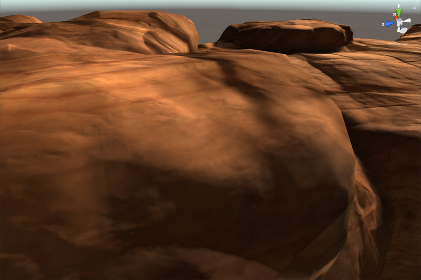
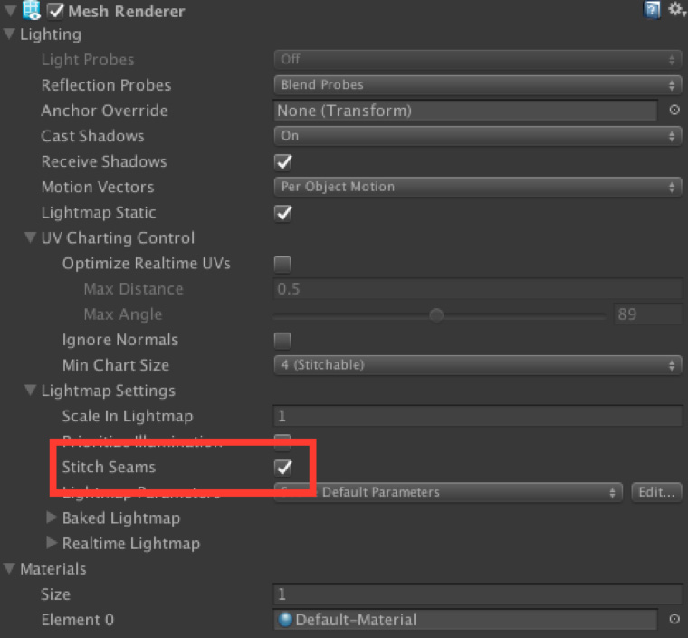

# 光照贴图接缝缝合

光照贴图接缝缝合技术可在使用烘焙光照贴图渲染的游戏对象中平滑不需要的硬边缘。

接缝缝合与[渐进光照贴图 (Progressive Lightmapper)](ProgressiveLightmapper.html) 配合来实现光照贴图烘焙。接缝缝合仅对单个游戏对象有效；多个游戏对象无法平滑地缝合在一起。

[光照贴图](Lightmapping.html)要求 Unity 将 3D 游戏对象展开到平面光照贴图上。在光照贴图空间中，Unity 将靠近在一起但彼此分开的网格面识别为单独个体；这些网格的边缘称为“接缝”。理想情况下，应该看不见接缝，但根据光源的不同，它们有时看起来有硬边缘。这是因为 GPU 无法在光照贴图中分开的图表之间混合纹理像素值。

接缝缝合方法便可以解决这些问题。启用接缝缝合后，Unity 会执行额外计算来修改光照贴图，从而改善每个接缝的外观。缝合方法并不完美，但通常会极大改善最终结果。默认情况下，Unity 会禁用接缝缝合，这是因为 Unity 需要进行额外计算，导致烘焙期间接缝缝合要花费额外时间。您可以在游戏对象的网格渲染器 (MeshRenderer) 上启用缝合。

要在游戏对象上启用接缝缝合，请找到游戏对象的网格渲染器 (Mesh Renderer) 组件，打开 __Lightmap Settings__ 部分（仅当使用渐进光照贴图时才能访问），然后勾选 __Stitch Seams__。

 

---

* 2017-09-04  Page published with limited [editorial review](DocumentationEditorialReview.html)

* 在 [2017.2](https://docs.unity3d.com/2017.1/Documentation/Manual/30_search.html?q=newin20172) 版中添加了接缝缝合 NewIn20172
