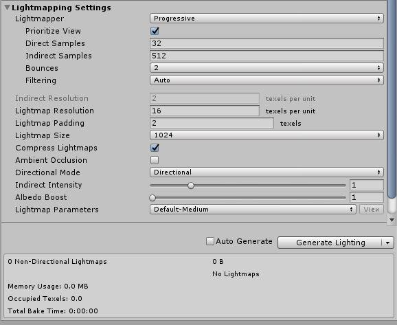
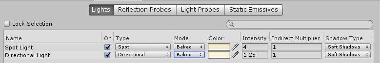
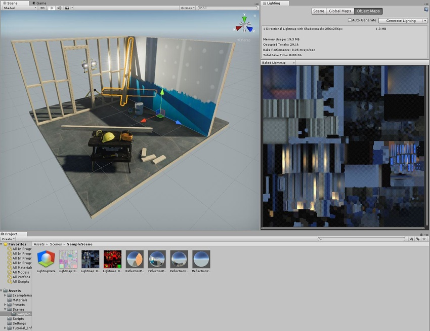
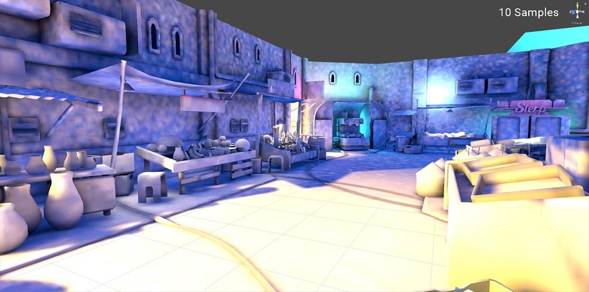
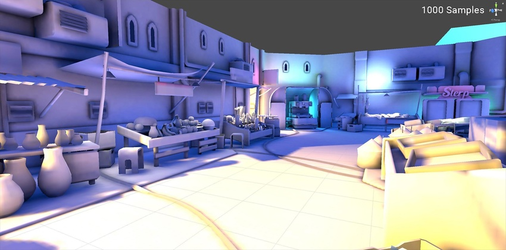
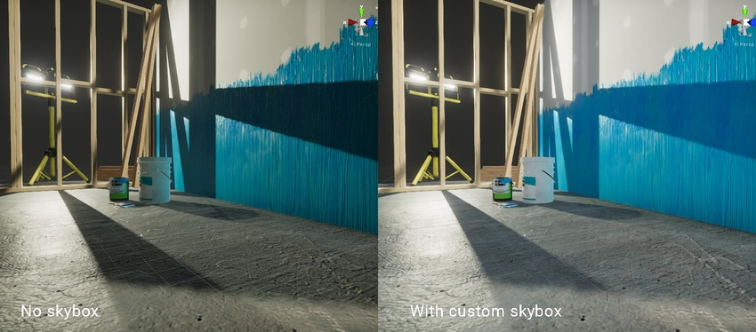
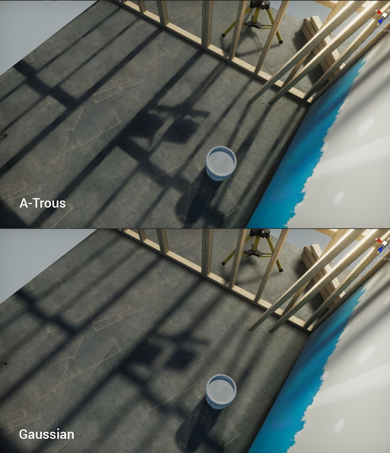

# 光照贴图：入门

本页将介绍 Unity 中的光照贴图。光照贴图过程将预先计算场景中表面的亮度，并将结果存储在图表或“光照贴图”中供以后使用。

Unity 使用一个名为[渐进光照贴图 (Progressive Lightmapper)](ProgressiveLightmapper.html) 的系统，该系统根据 Unity 中的场景设置来为场景烘焙光照贴图，同时考虑网格、材质、纹理和光源。光照贴图是渲染引擎不可或缺的一部分；在创建光照贴图后，游戏对象会自动使用它们。

有关与特定光照贴图相关的设置的信息，请参阅[全局光照](GlobalIllumination.html)的文档。

## 准备场景并烘焙光照贴图

从 Unity Editor 菜单中选择 __Window__ &gt; __Lighting__ &gt; __Settings__ 以打开 Lighting 窗口。确保要应用光照贴图的网格具有适当的 UV 以进行光照贴图。最简单的方法是打开[网格导入设置](FBXImporter-Model.html)并启用 __Generate Lightmap UVs__ 设置。

接下来，要控制光照贴图的分辨率，请前往 __Lightmapping Settings__ 部分并调整 __Lightmap Resolution__ 值。

__注意：__为了更好地理解如何使用光照贴图纹理像素，请在 __Scene 视图__中找到__Shaded[调试场景可视化模式](GIVis.html)，切换到 __Baked Lightmap__，并勾选 __Show Resolution__ 复选框。

 

在游戏对象的 __Mesh Renderer__ 和 __Terrain__ 组件中，启用 __Lightmap Static__ 属性。这将告知 Unity，这些游戏对象不会移动和变化，因此 Unity 可以将它们添加到光照贴图中。在 __Mesh Renderer__ 组件中，还可以使用 __Scale In Lightmap__ 参数来调整光照贴图的静态__网格__或__地形__的分辨率。

此外，还可在 [Light Explorer](LightingExplorer.html) 中调整光源设置。

 

要为场景生成光照贴图，请执行以下操作：

1.在 [Lighting 窗口](GlobalIllumination.html)中的 __Scene__ 选项卡底部，单击 __Generate Lighting__（或者确保勾选了 __Auto Generate__）。

2.Unity Editor 状态栏中将显示一个进度条（在右下角）。

3.烘焙完成后，您可以在 Lighting 窗口的 __Global Maps__ 和 __Object Maps__ 选项卡中查看所有烘焙光照贴图。

当光照贴图完成时，Unity 的 Scene 和 Game 视图会自动更新。

 

要查看网格的 UV 图表，请单击启用了 __Lightmap Static__ 的游戏对象，然后导航到 Inspector 窗口并选择 __Object Maps__ 选项卡。在此处，您可以切换不同的光照贴图可视化模式。手动生成光照时，Unity 将向 [Assets](SpecialFolders.html) 文件夹中添加[光照数据资源](LightmapSnapshot.html)、[烘焙光照贴图](GlobalIllumination.html)和[反射探针](ReflectionProbes.html)。

## 调整烘焙设置

场景的最终外观取决于光照设置和烘焙设置。我们来看一些可以提高光照质量的基本设置的示例。

样本计数：
渐进光照贴图生成由单个光线产生的颜色值以便消除噪点。这些颜色值称为样本。有两种设置可控制渐进光照贴图用于直接和间接光照计算的样本数：__Direct Samples__ 和 __Indirect Samples__。要找到这两个设置，请打开 Lighting 窗口 (__Window__ &gt; __Lighting__ &gt; __Settings__)，然后选择 __Lightmapping Settings__ &gt; __Lightmapper__。

较高的采样值可降低噪点并可提高光照贴图的质量，但也会增加烘焙时间。下面的图像显示了更多样本如何在不使用滤波的情况下提高光照贴图的质量，并产生噪点较小的结果。

### 环境光照

除了所有[光源](LightSources.html)之外，[环境光照](GlobalIllumination.html#Environment)也会影响全局光照。您可以分配一个自定义天空盒材质 (Skybox Material) 来代替默认的__程序化天空盒 (Procedural Skybox)__ 并调整强度。下面的图像分别显示了在包含和不含__环境光照__的场景中光照如何变化，并提供了较柔和的结果。两个场景中的光源设置相同。Unity 在 [Asset Store](https://assetstore.unity.com/packages/essentials/beta-projects/unity-hdri-pack-72511) 中提供了一些自定义的 HDRI 资源。

 

### 滤波

滤波可以模糊噪点效果。渐进光照贴图提供了两种不同类型的滤波：__Gaussian__ 和 __A-Trous__。启用 __Advanced__ 设置后，可单独对 __Direct__、__Indirect __ 和 __Ambient Occlusion__ 应用这些过滤器。有关更多信息，请参阅有关[渐进光照贴图](ProgressiveLightmapper.html)的文档。

 

---

 2018-03-28  Page amended with limited [editorial review](DocumentationEditorialReview.html)

在 [2018.1](https://docs.unity3d.com/2018.1/Documentation/Manual/30_search.html?q=newin20181) 版中添加了渐进光照贴图 NewIn20181
