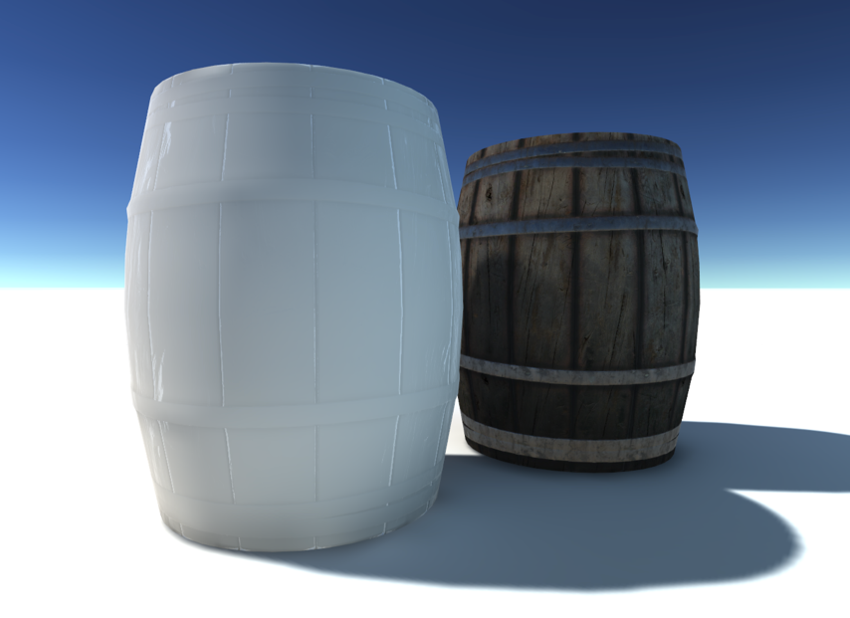

# 光照贴图定向模式

光照贴图可以使用两种__定向模式__：__定向 (Directional)__ 和__非定向 (Non-Directional)__。要为光照贴图设置__定向模式 (Directional Mode)__，请打开 Lighting 窗口 (__Window__ > __Lighting__ > __Settings__)，单击 __Scene__，导航到 __Lightmapping Settings__，确保 __Lightmapper__ 设置为 __Enlighten__，然后使用 __Directional Mode__ 下拉菜单。这两种模式可以以实时和烘焙光照贴图形式提供。

__定向__光照贴图存储的有关光照环境的信息量要多于__非定向__光照贴图。着色器可以使用这些关于入射光的额外数据来更好地计算出射光，也就是材质在屏幕上呈现的外观。此过程的代价是增加了纹理内存使用量和着色时间。

__非定向__：平面漫射。此模式仅使用单个光照贴图，存储有关表面发光量的信息，同时假设表面是纯漫射的。以这种方式照射的对象将显示为平面（不会使用法线贴图）和漫射（即使材质是高光），但除此之外，将获得正确光照。这些木桶现在使用了烘焙光照贴图。唯一的细节定义来自于反射探针和遮挡贴图。

 

__定向__：法线贴图漫射。此模式会添加辅助光照贴图，可存储入射主导光方向以及一个系数。系数与第一张光照贴图中主导光同方向的光的数量成比例。然后，假定其余光均匀来自整个半球。该信息允许材质进行法线贴图，但仍显示为纯漫射。

 

## 性能

__定向__模式使用的纹理内存量是__非定向__模式的两倍，因此着色成本略高。

* __非定向：__一个纹理、一次纹理采样、一些额外的着色器指令。

* __定向：__两个纹理、两次纹理采样、更多一些的额外着色器指令。

实时光照贴图利用相同的方法，并受制于相同的着色质量/成本权衡。

实际用于间接光（烘焙的间接部分）的 BRDF 是成本略低的版本。`UNITY_BRDF_PBS_LIGHTMAP_INDIRECT` 在 *UnityPBSLighting.cginc* 中进行定义。

## 光照贴图上的镜面光照

要在光照贴图静态资源中实现镜面光照，请对烘焙光源使用光照模式 [Shadowmask](LightMode-Mixed-Shadowmask.html) 或 [Distance Shadowmask](LightMode-Mixed-DistanceShadowmask.html)。这可以确保光照兼具实时和高质量。请参阅有关[光照模式](LightModes.html)的文档以了解更多信息。

---

*  2017-06-08  Page published with limited [editorial review](DocumentationEditorialReview.html)

* 在 5.6 版中删除了“直接镜面反射”(Direct Specular)

* 在 5.6 版中添加了“光照模式”
