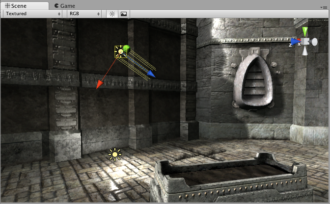
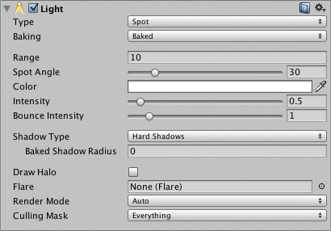
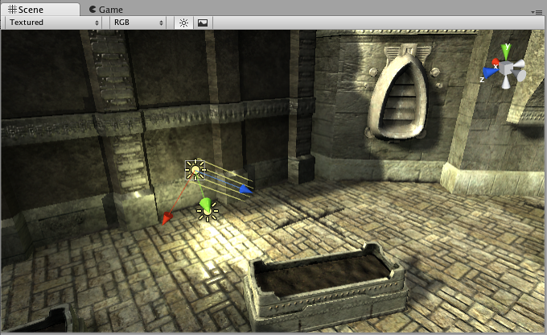
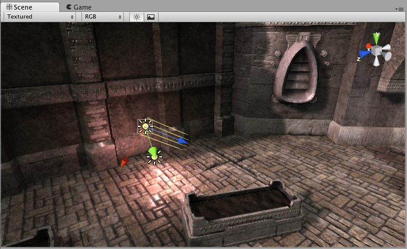
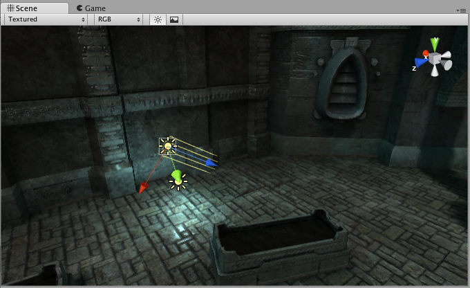

光源
======

__光源__是每个场景必不可少的部分。虽然网格和纹理定义了场景的形状和外观，但光源定义了 3D 环境的颜色和氛围。在每个场景中可能会使用多个光源。让这些光源协同工作需要一些精力，但可能会带来非常令人惊叹的结果。

可通过 __GameObject &gt; Light__ 菜单将光源添加到场景中。然后从出现的子菜单中选择所需的光源格式。添加光源后，可以像任何其他游戏对象一样操作光源。此外，可使用 __Component &gt; Rendering &gt; Light__ 将光源 (Light) 组件添加到任何选定的游戏对象。

光源组件在 __Inspector__ 中提供了许多不同的选项。

只需更改光源的 __Color__，即可为场景提供完全不同的氛围。

渲染路径
---------------

Unity 支持不同的__渲染路径__。这些路径主要影响光源和阴影，因此根据游戏要求选择正确的渲染路径可以提高项目的性能。
有关渲染路径的更多信息，可访问[渲染路径部分](RenderingPaths.html)。

更多信息
----------------

有关光源工作原理的更多信息，请参阅[光照概述](Lighting.html)页面。有关如何使用光源组件的更多信息，请查看[光照参考](class-Light.html)。
