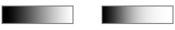
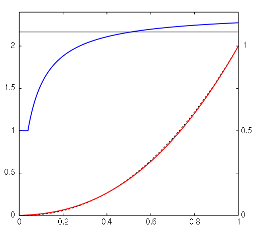

# 线性渲染概述

Unity Editor 允许您使用传统的伽马颜色空间以及线性颜色空间。伽马颜色空间是历史悠久的标准格式，但线性颜色空间渲染可提供更精确的结果。

如需进一步阅读这方面的信息，请参阅以下相关文档：

* [线性或伽马工作流程](LinearRendering-LinearOrGammaWorkflow.html)，介绍应该选用线性颜色空间还是伽马颜色空间。
* [采用线性渲染的伽马纹理](LinearRendering-GammaTextures.html)，介绍线性工作流程中的伽马纹理。
* [线性纹理](LinearRendering-LinearTextures.html)，介绍如何使用线性纹理。

## 线性和伽马颜色空间

人眼对光强的反应不呈线性。我们在观察光时会发现一些亮度比另一些亮度更容易看到，即从黑到白的线性渐变在我们人眼中不是线性渐变的。

由于历史原因，监视器和显示器具有相同的特性。向监视器发送线性信号会导致看起来像上图右侧的渐变，人眼观察感觉是错误的。为了弥补这一点，需要发送经校正的信号来确保监视器能够呈现出看起来自然的图像。这种校正称为伽马校正。

伽马和线性颜色空间同时存在的原因是，光照计算应该在线性空间中进行，以便确保数学上的正确性，但结果应该在伽马空间中呈现以便让人眼看起来正确。

在帧缓冲格式限制为每通道 8 位的旧硬件上，计算光照时使用伽马曲线可在人类可感知的范围内提供更高的精度。在人眼最敏感的范围内，使用的位数最多。

即使当今的监视器是数字显示器，它们仍然采用伽马编码信号作为输入信号。图像文件和视频文件显式编码到伽马空间（这意味着它们带有伽马编码值，而不是线性强度）。这便是标准；一切数值都在伽马空间内。

伽马空间的公认标准称为 sRGB（请参阅 [Wikipedia](https://en.wikipedia.org/wiki/SRGB)）。该标准定义了它与线性空间之间的一个映射，使得人眼能充分利用 8 位/通道的精度。下面是此映射的图表。

线性渲染指的是渲染场景的过程，此情况下的所有输入都是线性的，也就是说，没有经过伽马校正以适合人眼观察或输出到显示器。
