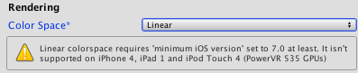

# 采用线性渲染的伽马纹理

Unity Editor 允许您使用传统的伽马颜色空间以及线性颜色空间。即使[纹理](Textures.html)位于伽马颜色空间内，也可使用线性颜色空间。

如需进一步阅读这方面的信息，请参阅以下相关文档：

* [线性渲染概述](LinearLighting.html)，介绍线性和伽马颜色空间的背景信息。
* [线性或伽马工作流程](LinearRendering-LinearOrGammaWorkflow.html)，介绍应该选用线性颜色空间还是伽马颜色空间。
* [线性纹理](LinearRendering-LinearTextures.html)，介绍如何使用线性纹理。

**注意：**如果纹理位于线性颜色空间内，需要禁用 sRGB 采样。请参阅有关[线性纹理](LinearRendering-LinearTextures.html)的文档以了解更多信息。

线性渲染为渲染的场景提供不同的外观。如果创作的项目在伽马空间中渲染时看起来很好，那么更改为线性渲染时，视觉效果不太会仍然保持良好。因此，如果从伽马渲染更改为线性渲染，您可能需要一些时间来调整项目，使其看起来像以前一样好。不过，这种转变最终可实现更加一致和逼真的渲染，因此在这上面花些时间可能是值得的。您可能需要调整纹理、材质和光照。

##光照贴图

光照贴图中的光照计算始终在线性空间中完成（请参阅有关 [Lighting 窗口](GlobalIllumination.html)的文档以了解更多信息）。光照贴图始存储在伽马空间中。这意味着，无论是在伽马还是线性颜色空间中，光照贴图纹理都是相同的。

位于线性颜色空间时，纹理样本在纹理采样时会从伽马空间转换为线性空间。位于伽马颜色空间时则不需要转换。因此，在更改颜色空间设置后，必须重新烘焙光照贴图：当 Unity 的光照设置为自动烘焙（默认设置）时，此过程会自动激活。

###导入光照贴图

Unity 创建的光照贴图 EXR 文件中的数据位于线性空间内。导入过程中它将被转换到伽马空间。从外部光照贴图中引入光照贴图时，请在[纹理导入器 (Texture Importer)](class-TextureImporter.html) 中将光照贴图的 __Texture Type__ 设置为 __Lightmap__。此设置可确保在导入时绕过 sRGB 采样。

## 线性渲染支持的平台

并非所有平台都支持线性渲染。支持该功能的构建目标平台有：

* Windows、Mac OS X 和 Linux（独立平台）
* Xbox One
* PlayStation 4
* Android
* iOS
* WebGL

当设备不支持线性渲染时，不会回退到伽马空间。在这种情况下，播放器将退出。通过在脚本中查找 [QualitySettings.activeColorSpace](../ScriptReference/QualitySettings-activeColorSpace.html) 即可核实有效的颜色空间。

在 Android 上，线性渲染至少需要 OpenGL ES 3.0 图形 API 和 Android 4.3。

在 iOS 上，线性渲染需要 Metal 图形 API。

在 WebGL 上，线性渲染至少需要 WebGL 2.0 图形 API。

在满足最低要求之前，Editor 会阻止您构建播放器并显示通知。这是为了避免将那些在用户设备上会错误渲染的游戏部署到数字商店。

## 线性颜色空间和 HDR

使用 HDR 时，渲染在线性空间中执行到浮点缓冲区。这些缓冲区具有足够的精度，无论何时访问缓冲区，都不需要转换到伽马空间或从伽马空间转换。这意味着，在线性模式下渲染时，您使用的帧缓冲区会将颜色存储在线性空间中。因此，所有混合效果和后处理效果均在线性空间中隐式执行。当写入最终后备缓冲区时，将应用伽马校正。

##线性颜色空间和非 HDR

启用线性颜色空间但未启用 HDR 时，将使用一种特殊的帧缓冲类型，它支持 sRGB 读取和 sRGB 写入（读取时从伽马转换为线性，而写入时从线性转换为伽马）。当此帧缓冲区用于混合，或将其绑定为纹理时，值在使用前将转换为线性空间。写入这些缓冲区时，所写入的值将从线性空间转换为伽马空间。如果在线性模式和非 HDR 模式下进行渲染，则所有后处理效果都会创建其源缓冲区和目标缓冲区并启用 sRGB 读写权限，以便在线性空间中进行后处理和后处理混合。

---

*  2017-06-19  Page amended with no [editorial review](DocumentationEditorialReview.html)

* 在 [2017.2](https://docs.unity3d.com/2017.2/Documentation/Manual/30_search.html?q=newin20172) 中添加了适用于 WebGL 的线性渲染 NewIn20172
