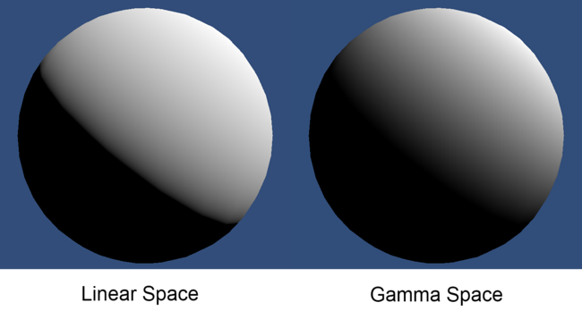

# 线性或伽马工作流程

Unity Editor 提供线性和伽马两种工作流程。线性工作流具有颜色空间交叉地带，此情况下在伽马颜色空间中创作的[纹理](Textures.html)可在线性颜色空间中正确且精确地渲染。请参阅有关[线性渲染概述](LinearLighting.html)的文档，了解伽马和线性颜色空间的更多信息。

如需进一步阅读这方面的信息，请参阅以下相关文档：

* [线性渲染概述](LinearLighting.html)，介绍线性和伽马颜色空间的背景信息。
* [采用线性渲染的伽马纹理](LinearRendering-GammaTextures.html)，介绍线性工作流程中的伽马纹理。
* [线性纹理](LinearRendering-LinearTextures.html)，介绍如何使用线性纹理。

纹理倾向于保存在伽马颜色空间中，而着色器期望使用线性颜色空间。因此，在着色器中对纹理进行采样时，基于伽马的值会导致不准确的结果。为了解决此问题，可将 Unity 设置为使用 RGB 采样器从伽马采样跨越到线性采样。这样确保了线性工作流程中的着色器的所有输入和输出都在正确的颜色空间中，从而产生正确的结果。

要指定伽马或线性工作流程，请选择 __Edit__ > __Project Settings__ > __Player__，然后打开 __Player Settings__。选择 __Other Settings__ > __Rendering__ 并将 __Color Space__ 更改为 __Linear__ 或 __Gamma__（具体根据偏好而定）。

## 伽马颜色空间工作流程

虽然线性工作流程可确保更精确的渲染，但有时您可能需要伽马工作流程（例如，在某些平台上，硬件仅支持伽马格式）。

为此，请在 Player Settings 窗口中将 __Color Space__ 设置为 __Gamma__（菜单：__Edit__ > __Project Settings__ > __Player__）。选择此选项后，渲染管线将使用伽马颜色空间中存储的所有颜色和纹理；在着色器中使用纹理时不会从纹理中移除伽马校正。

请注意，通过在纹理的 [Inspector 窗口](UsingTheInspector.html)中取消选中 __sRGB (Color Texture)__ 复选框，即可选择在 __Color Space: Gamma__ 模式下绕过 sRGB 采样。

**注意**：即使这些值在伽马空间中，Unity Editor 的所有着色器计算仍然按照在线性空间中的方式处理它们的输入。为了确保获得可接受的最终结果，Editor 在将着色器输出写入帧缓冲区时进行调整以处理不匹配的格式，并且不对最终结果应用伽马校正。

## 线性颜色空间工作流程

使用线性颜色空间比使用伽马颜色空间提供更准确的渲染。

为此，请在 Player Settings 窗口中将 __Color Space__ 设置为 __Linear__（菜单：__Edit__ > __Project Settings__ > __Player__）。

如果纹理是在线性或伽马颜色空间中创建的，则可使用线性颜色空间。向线性颜色空间着色器程序提供的伽马颜色空间纹理将在移除伽马校正后输入给着色器。

### 线性纹理

* 选择 __Color Space:__ __Linear__ 将假设纹理位于伽马颜色空间内。Unity 在默认情况下使用 GPU 的 sRGB 采样器从伽马颜色空间跨越到线性颜色空间。如果纹理是在线性颜色空间内创建的，则需要绕过 sRGB 采样。请参阅有关[使用线性纹理](LinearRendering-LinearTextures.html)的文档以了解更多信息。

### 伽马纹理

* 从伽马颜色空间跨越到线性颜色空间需要进行一些调整。请参阅有关[采用线性渲染的伽马纹理](LinearRendering-GammaTextures.html)的文档以了解更多信息。

#### 注意

对于颜色，此转换是隐式应用的，因为 Unity Editor 在将值作为常量传递给 GPU 之前已将值转换为浮点数。在对纹理进行采样时，GPU 会自动移除伽马校正，将结果转换为线性空间。

这些输入随后传递给着色器，光照计算与正常情况下一样在线性空间中进行。将结果值写入帧缓冲区时，可直接对其执行伽马校正，也可将其保留在线性空间中稍后进行伽马校正，具体做法取决于当前的渲染配置。例如，在高动态范围 (HDR) 中，渲染结果保留在线性空间中稍后进行伽马校正。

## 线性和伽马颜色空间之间的差异

使用线性渲染时，光照方程式的输入值与伽玛空间中的输入值不同。这意味着根据不同颜色空间得出不同结果。例如，光线照射表面具有不同的响应曲线，并且图像效果的表现不同。

### 光衰减

基于距离和基于法线的光照在发生衰减时存在两个方面的差异：

* 在线性模式下渲染时，执行的额外伽马校正会使光源半径变大。

* 光照边缘也显得更清晰。这更准确地模拟了表面上的光照强度衰减。

### 线性强度响应

使用伽马渲染时，提供给着色器的颜色和纹理已经应用了伽马校正。在着色器中使用它们时，高亮度的颜色实际上比预期亮度值更亮（相对于线性光照）。这意味着，随着光照强度的增加，表面会以非线性方式变亮。这将导致许多位置的光照亮度过高。此外还可能给模型和场景带来褪色的感觉。使用线性渲染时，在表面上产生的响应随着光照强度增加仍保持线性。因此，带来的表面着色真实得多，表面产生的颜色响应也好得多。

下面的无限 3D 头部扫描图像展示了在线性光照和伽马光照模式下人体头部模型上的不同光照强度。

### 线性和伽马混合

当混入帧缓冲区时，混合发生在帧缓冲区的颜色空间中。

使用伽马空间渲染时，非线性颜色会混合在一起。这种混合颜色的方法在数学上不正确，并可能得出不符合期望的结果，但这种方法是在某些图形硬件上进行混合的唯一方法。

使用线性空间渲染时，混合发生在线性颜色空间中：这在数学上是正确的，并提供精确的结果。

下图显示了不同类型的混合：

