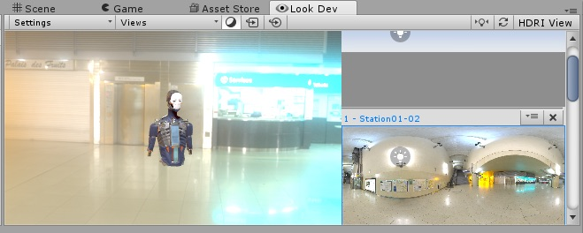

# Look Dev

##简介

Look Dev 是一种基于图像的实验性光照工具，可让您使用查看器检查和比较不同的资源，从而确保正确创作这些资源以适应各种光照条件。该工具还可在需要时用于调试资源。以预制件形式加载资源可获得最佳体验。

## 资源验证

资源验证是确认资源是否正确制作的过程，以便它们在不同的光照环境中按预期运行。

必须使用 HDRI 进行验证。HDRI 是一种极高细节的真实光照。因此，它提供了一种难以通过手工创建的完美光照装置。通过使用这种精确的光照环境来测试资源，就可以确定是资源本身还是游戏的光照导致了任何不良的视觉质量问题。

要了解有关创建 HDRI 环境的更多信息，请参阅 [HDRI 视图](LookDevHDRIView.html)文档。

Look Dev 允许在两个不同的视图中加载两个不同的资源。因此，便于进行比较。例如，美术总监可以通过此功能检查新资源是否符合参考资源的艺术指导准则。

## 谁应该使用 Look Dev？

Look Dev 主要面向纹理设计师、建模师、灯光师、美术总监、外包经理以及参与项目视觉艺术风格设计的任何其他人。

无需使用多个工具来可视化和验证新内容，Look Dev 允许每个人以相同的方式实现资源可视化。这意味着您可以立即验证资源，因为资源在工具中的显示方式与在完成项目中的显示方式相同。

请注意，虽然 Look Dev 适用于艺术家，但它并不是一种艺术创作工具。它仅用于资源可视化和验证。

## 初始设置

在使用 Look Dev 之前，需要确保 Unity 已设置为最佳状态：

* 选择 __Player Settings__（菜单：__Edit__ > __Project Settings__ > __Player__）并导航到 __Other Settings__。
* 将 __Rendering Path__ 设置为 __Deferred__，并将 __Color Space__ 设置为 __Linear__。

Look Dev 始终使用这些设置（无论项目设置如何），因此更改项目中的这些设置可确保在 Look Dev 查看器中看到的内容与在 Scene 视图中看到的内容相匹配。

##已知问题

当天空盒 (skybox) 使用具有镜面卷积类型的立方体贴图时，它在较小的渲染窗口中会生成模糊结果。在此情况下使用 Look Dev 时应采用大窗口。

