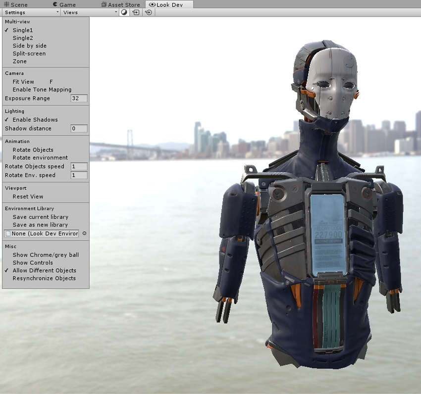
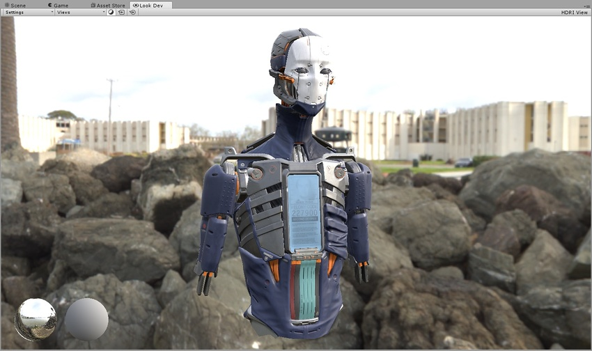

#Settings 菜单

__Settings__ 菜单位于 Look Dev 视图的左上角。此菜单包含 Look Dev 的所有全局选项。

 

__Multi-view__

|**属性** |**功能** |
|:---|:---|
| __Single__ |Look Dev 的单屏幕视图。|
| __Side by side__ |并排显示的重复视图。|
| __Split-screen__ |在水平方向将视图拆分为两个。一个橙色/蓝色操作辅助图标表示两个视图之间的分离面板。|
| __Zone__ |将视图拆分为两个，通过橙色/蓝色操作辅助图标的位置来定义圆形分割。|

__Camera__

|**属性** |**功能** |
|:---|:---|
| __Fit View__ |单击此选项可将对象的位置重置为视图的中心（如果有多个视图，则重置为所有这些视图的中心）。|
| __Enable Tone Mapping__ |单击此选项可切换内置的色调映射器。此色调映射器不是艺术色调映射器，而是中性色调映射器，它保留了色调范围，但不包括任何电影效果。|
| __Exposure Range__ |使用此选项可定义 [Control Panel](LookDevControlPanel.html) 和 [Views 菜单](LookDevViewsMenus.html)中的 Exposure Value (EV) 滑动条的最小和最大范围（最大值为 32）。用于测试 HDRI 中的极端光源。|

__Lighting__

|**属性** |**功能** |
|:---|:---|
| __Enable Shadows__ |单击此选项可关闭和打开环境阴影 (Environment Shadow)。|
| __Shadow distance__ |使用此选项可设置环境阴影的最大阴影距离。如果此选项设置为 0，则会根据网格边界定义一个自动编号。|

__动画 (Animation)__

|**属性** |**功能** |
|:---|:---|
| __Rotate Objects__ |启用此选项可在 Look Dev 视图中连续旋转资源或游戏对象。|
| __Rotate environment__ |启用此选项可在 Look Dev 视图中连续旋转 HDRI 环境。|
| __Rotate Objects speed__ |使用此选项可设置游戏对象的旋转速度（如果已启用 __Rotate Objects__）。|
| __Rotate Env. speed__ |使用此选项可设置环境的旋转速度（如果已启用 __Rotate environment__）。|

__Viewport__

|**属性** |**功能** |
|:---|:---|
| __Reset View__ |单击此选项可重置 __Camera__ 设置和 __View__ 设置。|

__HDRI Library__

|**属性** |**功能** |
|:---|:---|
| __Save Current Library__ |选择此选项可保存当前的 HDRI 库 (HDRI Library)。|
| __Save As New Library__ |选择此选项可将当前的 HDRI 库保存到新的资源库 (Asset Library)。|
| __Load Library__ |加载先前保存的 HDRI 库。此处字段显示已加载的当前 HDRI 库资源的名称。|

__Misc__

|**属性** |**功能** |
|:---|:---|
| __Show Chrome/grey ball__ | 启用此选项可在屏幕左下方显示铬球和灰球（请参阅下图）。这对于调试反射和检查平均光照参考都非常有用。|
| __Show Controls__ | 启用此选项可在 Look Dev 视图中显示 [Control Panel](LookDevControlPanel.html)。|
| __Allow Different Objects__ |启用此选项可在多视图模式下加载两个不同的游戏对象。|
| __Resynchronise Objects__ |使用此选项可将所选视图中的当前游戏对象分配给另一个视图。|

