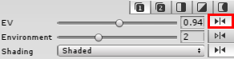
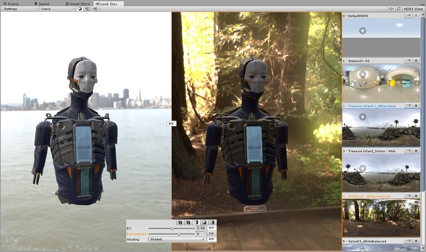
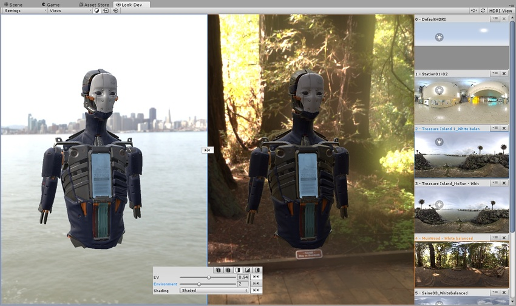

# Control panel

__控制面板 (Control Panel)__ 汇集了 Look Dev [Views 菜单](LookDevViewsMenus.html)中所有最常用的设置，方便快速访问。

## Split-screen 和 Zone 模式

在 __Split-screen__ 和 __Zone__ 模式中，默认下会同步两个视图间的所有属性。使用__锁定__按钮（在下图中高亮显示）可使属性独立并仅应用于选定的视图（由视图边框周围的蓝色或橙色边框表示）。

__Control Panel__ 中仅适用于一个窗口的属性会以所选视图的颜色高亮显示，便于进一步区分。

