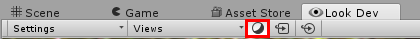
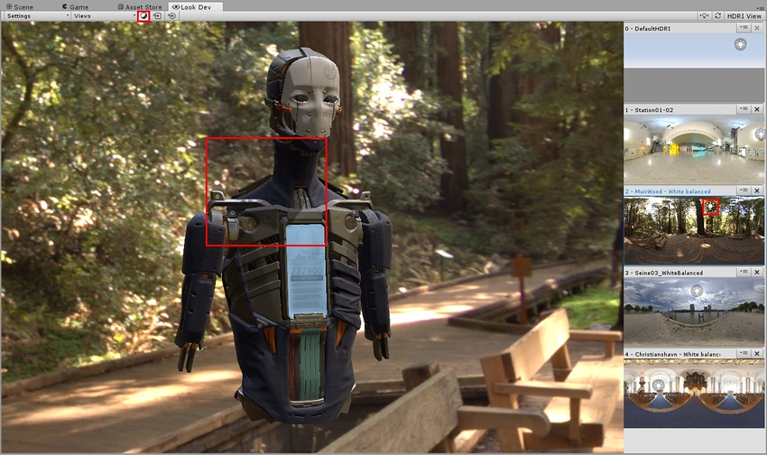
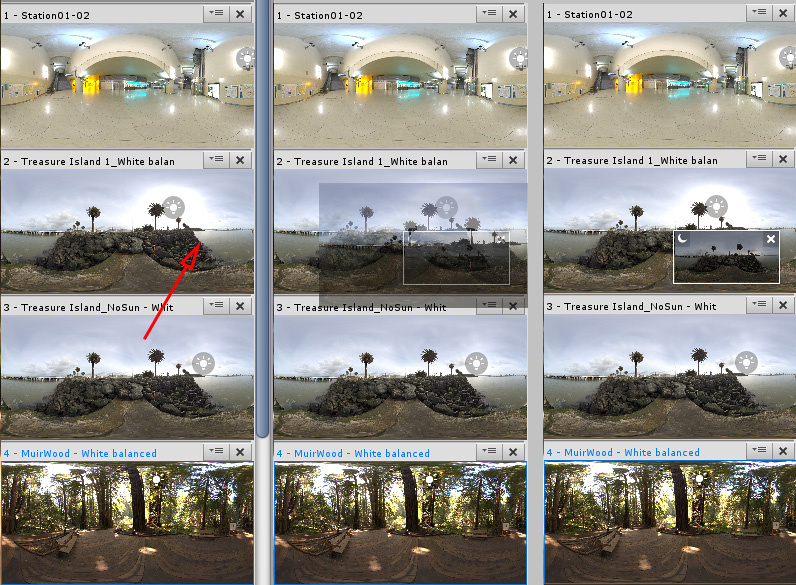
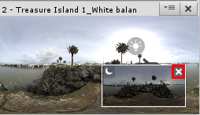

# 环境阴影 (Environment Shadow)

可以使用 Look Dev 来模拟环境阴影。请注意，此模拟不完全准确，仅显示粗糙的阴影。

要模拟环境阴影，请单击 Look Dev 窗口顶部菜单中的 __Environment Shadow__ 按钮（在下图中突出显示）。

使用 HDRI 视图可以控制阴影的方向。打开 __Environment Shadow__ 后，浏览器中的选定 HDRI 上方会出现一个太阳图标。单击并拖动此图标可进行阴影定向，而按住 Shift+左键单击可控制阴影方向。

 HDRI 中有关键光源时（如太阳或灯），__Environment Shadow__ 效果最佳。要创建光源，请将太阳图标拖放到 HDRI 上。默认情况下，光源建立在 HDRI 的最亮纹理像素上。对于更均匀分布的光源（如阴天），这种做法可能无法带来准确或预期的结果。

启用 __Environment Shadow__ 后，Look Dev 对被关键光源照亮的预制件使用一个 HDRI（称为 __Lit HDRI__），并对处于关键光源阴影下的预制件使用另一个 HDRI（称为 __Shadow HDRI__）。__Shadow HDRI__ 中的阴影基于光源图标的光线方向。默认情况下，__Shadow HDRI__ 与 __Lit HDRI__ 相同，但光度有所降低。

要获得更准确的结果，请提供您自己的 __Shadow HDRI__。为获得最佳效果，请确保其与 __Lit HDRI__ 相同，但不要使用关键光源（例如，从图像中移除太阳）。

要配对 __Shadow HDRI__ 和 __Lit HDRI__，请将 __Shadow HDRI__ 拖放到 __Lit HDRI__ 上。__Shadow HDRI__ 将出现在 __Lit HDRI__ 上，并带有月亮图标，如下图所示。

启用 __Environment Shadow__ 后，__Lit HDRI__ 将切换到分配的 __Shadow HDRI__。

要删除 __Shadow HDRI__，请单击叉号。

 __注意__：可与库中的任何其他 HDRI 一样操作 __Shadow HDRI__。
