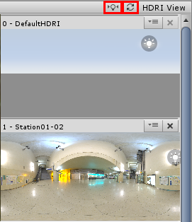
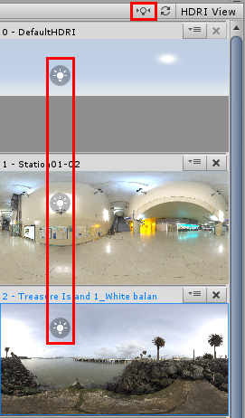
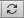
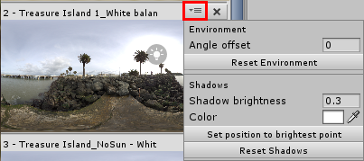
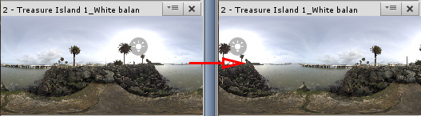
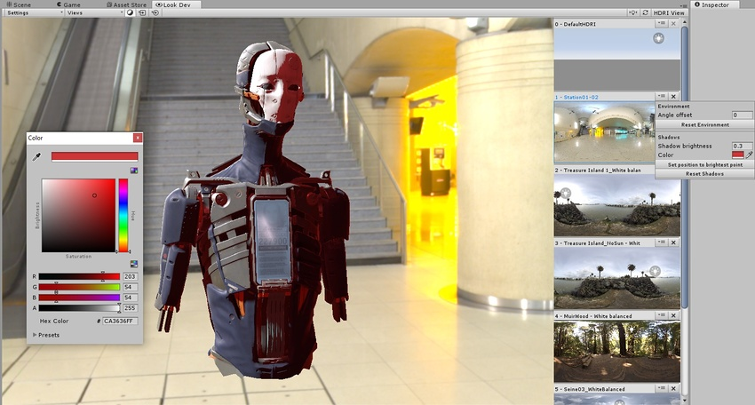

# HDRI 菜单

## HDRI 主设置

通过使用这些设置，只需一个操作即可将光照和阴影更改应用于 [HDRI 视图](LookDevHDRIView.html)中的所有 HDRI。

使用灯泡按钮可在所有 HDRI 环境中垂直同步光照位置。如果要从一个环境切换到另一个环境，并希望保持阴影方向类似以便进行比较，此功能将非常有用。

：使用此按钮可重置所有 HDRI 的光照位置。

##HDRI 各项设置

每个 HDRI 都有自己的菜单来控制其属性。要访问菜单，请单击 __Environment__ 按钮下面的三条横线按钮（表示三个滑动条区域）。

### Environment

|**菜单项**|	**属性**|
|:---|:---|
| __Angle Offset__ | 提供一个数字来表示 HDRI 的偏移角度（快捷方式：在 HDRI 视图中按住 Ctrl 并左键单击 HDRI 缩略图）。此偏移对于所选 HDRI 是唯一的，不同于 Look Dev [Views 菜单](LookDevViewsMenus.html)中的 __Rotation__ 滑动条，后者的作用独立于 HDRI 偏移。|
| __Reset Environment__ | 将 Angle offset 重置为默认值 (0)。|

### Shadows

此选项仅在启用 __Environment Shadow__ 的情况下才适用。

|**菜单项**|	**属性**|
|:---|:---|
| __Shadow brightness__ |控制阴影的亮度。|
| __Color__ |控制阴影的颜色。这对于满足特定光照条件非常有用（例如，光照全部为蓝色）。|
| __Set to brightest__ |将阴影方向的位置设置为 HDRI 缩略图的最亮纹理像素。|
| __Reset Shadows__ |将所有阴影控制值重置为默认值。|

